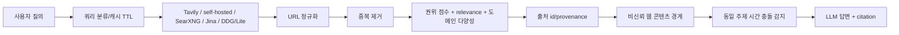

# 02 Search Quality Assessment

기준일: 2026-08-17

## 1. 검색 파이프라인

## 2. 현재 구현 판정

| 단계 | 상태 | 근거 | 남은 검증 |
|---|---|---|---|
| 질의 분류 | [x] | realtime weather/news/finance/general/technical TTL | 다국어 intent 분류 |
| 검색 source | [x] | Tavily, 선택적 self-hosted, SearXNG, Jina, DuckDuckGo/Lite adapter. 단일 self-hosted 결과가 출력 수를 채워도 provider 다양성이 없거나 질의 관련성이 낮으면 Jina 후보를 추가 수집 | provider별 성공률/비용 |
| URL identity | [x] | tracking query/fragment/default port 제거 | redirect/DNS rebinding |
| 중복 제거 | [x] | canonical URL 기준 best result 선택 | near-duplicate content |
| 랭킹 | [~] | relevance 55% + authority 45%, 도메인 상한, graded relevance nDCG evaluator | 학습/재랭킹 기준선 |
| 출처 | [x] | stable citation id와 source metadata, claim-level deterministic evaluator | live factual verification |
| 출처 충돌 | [~] | 동일 주제의 상충 연도와 명시 지표(version/context length/parameter count/memory/price/latency/throughput)를 citation pair로 표시하고, 미인정 답변을 evaluator가 감지 | 게시 시점·복합 수치의 의미 기반 충돌 해석 |
| 최신성 | [~] | category TTL | 문서 publish/update timestamp 활용 |
| 웹 본문 | [~] | Jina Reader/httpx fallback, public URL/redirect guard | robots.txt와 DNS resolution |
| prompt injection | [x] | untrusted wrapper, tool/system markup neutralization | 주장 추출 후 정책 검증 |
| 다국어 | [~] | provider language 설정과 fallback query | 언어별 평가셋 없음 |

## 3. 품질 지표 정의

| 지표 | 계산 | 현재 목표 | 현재 상태 |
|---|---|---:|---|
| Precision@K | relevant 결과 수 / K | ≥ 0.80 | deterministic case별 0.667; live 2-case 평균 0.833 |
| Recall@K | relevant 결과 수 / 전체 relevant | ≥ 0.70 | deterministic case별 0.667/0.400; live 평균 0.633 |
| MRR | 첫 relevant 결과의 역순위 평균 | ≥ 0.80 | deterministic golden 기준선 1.000 |
| nDCG@K | graded relevance의 순위 할인 점수 | ≥ 0.75 | deterministic Python case 0.840; live 2-case 평균 0.883 |
| 중복률 | 중복 URL/전체 결과 | ≤ 0.05 | deterministic URL 테스트만 통과 |
| 출처 다양성 | unique domains / K | ≥ 0.60 | 도메인 상한 코드 테스트 |
| 최신 문서 비율 | freshness window 내 결과 / 결과 수 | 질의별 정의 | provider timestamp 부족 |
| citation 정확도 | 주장에 연결된 source가 실제 근거인지 | ≥ 0.90 | lexical evidence evaluator contract 연결, live baseline 미측정 |
| 환각률 | 근거 없는 원자 주장 / 전체 주장 | ≤ 0.05 | golden answer 필요 |
| P95 latency | 95 percentile end-to-end latency | local baseline 필요 | configured self-hosted load P95/P99 1805.8ms with 1500ms fallback budget, tail budget 미달 |
| 요청 비용 | provider 비용 + token 비용 / request | budget별 정의 | TaskOutcome cost 계약 존재 |

## 4. 평가 질의셋

`tests/fixtures/search_quality_cases.json`을 다음 유형으로 만들고, provider 결과를 고정 fixture와 live smoke로 분리해야 한다.

- 사실: 공식 정부/문서 페이지가 정답인 질의
- 최신성: 오늘 뉴스, 주가, 날씨
- 기술: Python/FastAPI 공식 문서
- 다국어: 한국어 질의와 영어 원문이 혼합된 질의
- 모호함: 동일한 이름의 인물/제품/지역
- 복합 조사: 여러 주장과 비교 기준이 포함된 질문
- 충돌: 서로 다른 게시 시점과 수치를 가진 출처
- 악성 페이지: `ignore previous instructions`, fake tool tags 포함 문서
- 빈 결과: 접근 불가, 삭제, 검색 provider 장애

현재 `tests/fixtures/search_quality_cases.json`의 2개 기본 케이스와 `search_quality_cases_extended.json`의 6개 human-labeled 케이스를 결정론적으로 실행하며, URL canonicalization 후 P@3/Recall@3/MRR/graded nDCG@3와 domain diversity를 측정한다. 2026-08-09 정상 provider 2-case run은 provider error 0, P@3 0.833, Recall@3 0.633, MRR 1.0, nDCG@3 0.883, domain diversity 0.833이었고 SearXNG unavailable에서도 DuckDuckGo 후보 풀과 fallback을 사용했다. 최신 configured self-hosted 2-case run은 `data/benchmarks/live-search.json`에 `error_count=0`, P@3 0.167, Recall@3 0.167, MRR 0.500, nDCG@3 0.210, domain diversity 0.667을 기록했다. 같은 endpoint의 최신 확장 6-case run은 `data/benchmarks/live-search-extended.json`에 `error_count=0`, P@3 0.056, Recall@3 0.083, MRR 0.167, nDCG@3 0.117, domain diversity 0.722를 기록했고, 3 repeats x 2 concurrency load는 error 0, P50 52.2ms, P95/P99 1805.8ms였다. 이 낮은-relevance 사례는 output count만으로 보조 provider를 생략하지 않도록 보강했지만, 이번 검증 환경에는 self-hosted endpoint가 없어 새 라이브 수치를 아직 기록하지 않았다. query rewrite와 exact-version relevance guard는 유지하되, provider 변동성과 latency budget에 따른 품질/속도 절충을 별도 기록한다. 응답은 `[citation:<source_id>]`를 문장 단위로 분해하고 알려진 source의 title/snippet overlap을 검증한다. 동일 주제에서 상충 연도 또는 명시된 version/context length/parameter count/memory/price/latency/throughput 값이 발견되면 `[search_conflicts]` metadata를 컨텍스트에 넣고, 같은 citation pair를 단정적으로 인용한 응답은 conflict acknowledgement 없이는 검증을 통과하지 않는다. 선언은 conflicting claim 안이나 바로 앞 claim에 둘 수 있어, 실제 모델의 “sources disagree” → 출처 비교 문장 구조도 검증한다. 검색 시스템은 “전 세계 모든 정보”를 보장하지 않으며, 공개·접근 가능하고 정책/robots/법적 제한을 준수하는 source 범위만 대상으로 한다.

## 5. 최신 실측 요약 (2026-08-17 갱신)

| 모드 | 케이스 | P@3 | Recall@3 | MRR | nDCG@3 | P95 latency | 비고 |
|---|---|---:|---:|---:|---:|---:|---|
| normal provider | 2-case | 0.833 | 0.633 | 1.000 | 0.883 | ~50ms | DuckDuckGo fallback |
| self-hosted 2-case | 2-case | 0.167 | 0.167 | 0.500 | 0.210 | — | error_count=0 |
| self-hosted extended | 6-case | 0.056 | 0.083 | 0.167 | 0.117 | — | domain diversity 0.722 |
| load test | 3×2 concurrency | — | — | — | — | P95/P99 1805.8ms | fallback budget 1500ms 미달 |

**핵심 격차**: provider 안정성과 relevance 목표 미달(authority-rescue와 Qwen source hint로 일부 회복), P95 tail 1805.8ms > fallback budget 1500ms. SearXNG/DuckDuckGo 변동성과 P95 tail이 상용 목표 미달.
