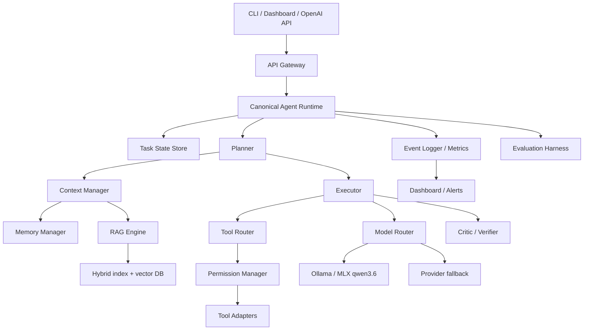

# 03 Target Architecture

기준일: 2026-08-17

## 1. 목표 구성도

## 2. 책임과 인터페이스

| 구성요소 | 현재 구현 | 목표 인터페이스 | 우선순위 |
|---|---|---|---:|
| Agent Runtime | Orchestrator/여러 handler | `run(TaskRequest) -> TaskResult` | P0 |
| Planner | CEO analyzer/state graph/GoalRunner | typed `Plan`/`PlanStep` | P0 |
| Executor | ToolLoop/Max/TaskRunner | `execute(PlanStep, Context) -> StepResult` | P0 |
| Tool Router | ToolRegistry/parser | capability/risk/cost-aware selection | P1 |
| Memory Manager | Session/Vault/GBrain/providers | scope, TTL, delete, conflict policy | P1 |
| Context Manager | ContextShaper/compressor | token budget + provenance-aware build | P1 |
| Model Router | registry/router/manager | local-first policy + calibrated escalation | P0 |
| Critic/Verifier | CoV/QualityGate/confidence | `VerificationResult` linked to task state | P1 |
| RAG Engine | RAGIndexer/VectorStore | `RetrievalResult` with authority/freshness | P1 |
| Task State Store | SQLite state/checkpoint | durable transition + idempotency | P0 |
| Event Logger | event bus/audit/tracing | correlation id on every task/tool/model event | P1 |
| Permission Manager | ToolRegistry/guardrail/approval | one `authorize(invocation)` boundary | P0 |
| Evaluation Harness | BenchmarkHarness/TaskOutcome | task/search golden sets + threshold | P1 |
| UI Layer | FastAPI/CLI/dashboard | one task status/approval/log contract | P2 |
| Plugin System | skills/MCP loaders | manifest, trust, capability, lifecycle | P2 |

## 3. 전환 순서

1. `TaskRequest`, `TaskResult`, `Plan`, `StepResult`의 serializable schema를 먼저 고정한다.
2. 기존 Orchestrator/GoalRunner/MaxEngine을 runtime adapter로 감싼다.
3. side effect tool은 adapter 안에서 permission manager만 호출하도록 이동한다.
4. TaskStateStore와 Event Logger에 공통 `task_id`, `step_id`, `correlation_id`를 기록한다.
5. 기존 API/CLI/UI는 runtime client가 되고 legacy route는 호환 adapter로 축소한다.
6. benchmark threshold가 통과한 경로만 default feature flag로 승격한다.
