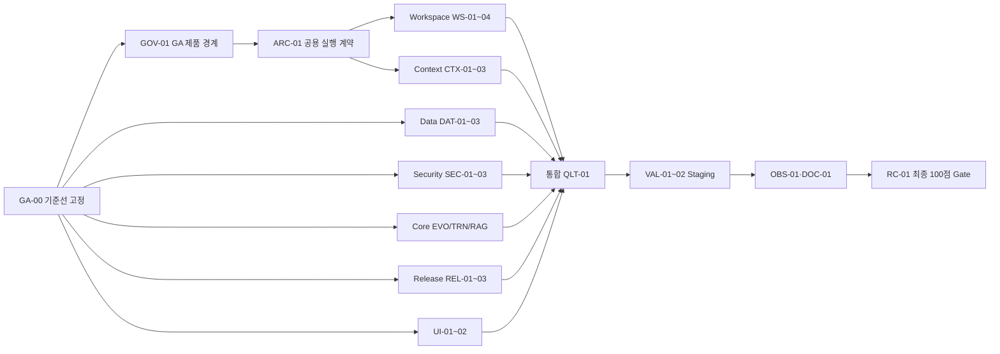

# Ssak-Ai 상용화 준비도 100% 개선 개발 계획

## 1. 목적과 완료 정의

이 계획은 2026-09-05 전체 코드베이스 감사에서 확인된 상용 출시 차단 결함과 검증 공백을 모두 제거하고, 재현 가능한 증거로 상용화 준비도 rubric 100/100을 달성하기 위한 실행 기준이다. 여기서 100%는 결함이 영원히 존재하지 않는다는 뜻이 아니다. 아래에 정의한 제품 계약과 출시 gate가 한 release candidate SHA에서 모두 통과하고, 열린 P1/P2 결함이 없으며, 잔여 위험이 문서화된 상태를 뜻한다.

완료는 다음 조건을 모두 만족해야 한다.

1. 감사 finding `WS-01`, `CTX-01`, `BR-01~03`, `SEC-01~03`, `CORE-01~06`, `OPS-01~05`, `UI-01~02`가 재현 불가 또는 의도된 안전 동작으로 바뀐다.
2. clean checkout에서 Python, dashboard, package, Docker, SBOM, dependency audit, E2E와 접근성 gate가 모두 성공한다.
3. 실제 지원 LLM provider, 영속 Chroma, MLX 또는 CUDA 학습 환경에서 staging 검증이 성공한다.
4. crash, cancel, restart, concurrent writer, project switch, context overflow, 인증 공격 경로가 자동 회귀 시험에 포함된다.
5. 사용자·운영 문서가 실제 동작과 일치하고 복구 rehearsal 증거가 있다.
6. 현재 release candidate 전체에 대해 독립 code review, security review, manual QA, release gate review가 동일 full commit SHA를 승인한다.

기존 `docs/05_MASTER_CHECKLIST.md`와 `.omo/plans/milestone-m0-m6-audit.md`의 완료 표시는 당시 SHA의 증거다. 현재 baseline에서 다시 확인된 회귀를 닫는 증거로 재사용하지 않는다. 이 계획과 대응 [체크리스트](./12_COMMERCIAL_GA_100_CHECKLIST.md)가 이번 개선 작업의 상태 원장이다.

## 2. 기준선과 추적 대상

- 기준 SHA: `35104f4fde5da718f2dd3048dfb1b51a225c23d7`
- 기준 점수: 53/100
- 전체 감사: `/Users/mr.k/.codex/visualizations/2026/09/05/01a0702e-6390-7442-9827-fefa19bb4921/ssak-audit/SSAK_AI_COMMERCIAL_READINESS_AUDIT_2026-09-05.md`
- 프로젝트·컨텍스트 상세 감사: `/Users/mr.k/.codex/visualizations/2026/09/05/01a0702e-6390-7442-9827-fefa19bb4921/ssak-audit/workspace-context-review.md`
- 감사 구조: 약 1,100개 코드 파일, 27만 줄, knowledge graph 39,037 nodes와 162,600 edges
- 기준 검증: backend 5,377 pass/4 fail, frontend 725 pass, mypy pass, Ruff 15 errors, format 115 files 차이, dashboard lint 197 warnings, clean release 경로 실패

## 3. 목표 아키텍처 원칙

### 3.1 요청마다 하나의 실행 문맥

모든 chat, task, tool 실행은 typed `RequestExecutionContext`를 사용한다. 최소 필드는 `request_id`, `task_id`, `project_id`, canonical `project_root`, `conversation_id`, `conversation_revision`, `actor/session identity`, `model_id`다. UI가 raw filesystem path를 실행 권한으로 보내지 않으며 server가 project registry에서 canonical root를 해석한다.

### 3.2 서버가 대화 이력의 authoritative source

dashboard는 전체 message array 대신 `conversation_id`, 예상 revision, 신규 turn을 보낸다. 서버는 revision을 비교해 history를 조립하고 압축 결과를 같은 저장소에 원자적으로 반영한다. `/compact`는 summary, retained range와 새 revision을 반환하고 client projection도 같은 revision으로 바뀐다.

### 3.3 최종 직렬화 프롬프트가 예산 단위

message content뿐 아니라 system prompt, tool schema, skill, pinned memory, recalled artifact, completion reserve를 모두 계산한다. model 호출 직전 최종 serialized input이 hard limit 아래인지 검증한다. 구성요소별 token ledger와 압축 전후 수치를 request telemetry에 남긴다.

### 3.4 상태 전이는 원자적이고 변경 소유권은 task 단위

task terminal transition은 CAS 또는 write transaction으로 단일 winner를 정한다. vault rollback은 repository 전체를 과거 상태로 되돌리지 않고 task가 소유한 worktree/patch만 폐기한다. registry 변경은 process 간 lock, reload-modify-save와 atomic replace 또는 transactional DB를 사용한다.

### 3.5 안전 장치는 fail-closed

인증, sandbox, 경로 검증, mutation validation, model context limit이 준비되지 않으면 관련 side effect를 시작하지 않는다. degrade가 가능한 읽기 기능과 중단해야 하는 변경 기능을 명시적으로 구분한다.

### 3.6 하나의 release artifact 계약

dashboard output, wheel/sdist, container, SBOM, NOTICE, provenance가 같은 lockfile과 산출물을 가리킨다. clean-machine workflow가 개발 환경의 설치 상태나 process cwd에 의존하지 않는다.

## 4. 작업 흐름과 병렬화



`GA-00`, `GOV-01`, `ARC-01`은 기준선, 제품 경계와 공통 계약을 고정하므로 먼저 병합한다. 이후 Workspace, Context, Data, Security, Core, Release, UI lane은 독립 worktree에서 병렬 실행할 수 있다. `QLT-01`부터는 각 lane의 병합 SHA를 기준으로 통합하며, staging과 최종 gate는 모든 기능 lane 이후에 수행한다.

예상 규모는 약 97~117 engineer-days다. 5~7개 병렬 lane과 독립 reviewer를 유지하면 5~8주 범위가 현실적이다. 실제 기간은 GPU/provider 접근, 보안 외부 점검, macOS/Linux/Windows 지원 범위에 따라 달라진다.

## 5. 협업 운영 규칙

### 5.1 작업 할당

- coordinator는 체크리스트의 `Owner`, `Reviewer`, `Branch`, `Status`를 먼저 채운다.
- branch는 `codex/<task-id>-<short-name>` 형식을 사용하고 task별 worktree를 분리한다.
- 각 task의 “주 소유 파일”만 수정한다. 공용 contract 변경은 `ARC-01`에 집중하고, 다른 lane은 그 contract를 소비한다.
- 동일 파일을 여러 task가 수정해야 하면 공용 contract task를 먼저 병합하거나 coordinator가 순서를 정한다.
- 다른 agent의 변경을 되돌리지 않는다. baseline 이후 변경이 보이면 rebase 후 영향 시험을 다시 실행한다.

### 5.2 완료 증거

각 task는 `.omo/evidence/commercial-ga-100/<task-id>/`에 다음을 남긴다.

- `metadata.json`: task ID, baseline SHA, result SHA, owner, reviewer, 시작·종료 시각, 환경
- `red.txt`: 수정 전 실패 재현 또는 기존 감사 재현 링크
- `tests.txt`: 실행 명령, exit code, pass/fail/skip 수
- `manual-qa.md`: 실제 CLI/API/browser/library surface에서 관찰한 결과
- 필요 시 screenshot, HTTP transcript, DB dump, SBOM, benchmark JSON
- `review.md`: 독립 reviewer의 finding과 verdict

로그에 secret, access PIN, token, 사용자 데이터와 절대 개인 경로를 남기지 않는다. `DONE`은 코드 작성 완료가 아니라 acceptance test, manual QA, 독립 review, 증거 저장과 체크리스트 갱신까지 끝난 상태다.

### 5.3 agent handoff 형식

```text
TASK ID: <ID>
BASE SHA: <full SHA>
OWNERSHIP: <수정 가능한 파일/모듈>
DEPENDENCIES: <선행 task와 SHA>
GOAL: <관찰 가능한 동작>
DO NOT CHANGE: <다른 lane 소유 영역>
ACCEPTANCE: <필수 명령·시나리오·수치>
EVIDENCE DIR: .omo/evidence/commercial-ga-100/<ID>/
STOP WHEN: result SHA의 검증과 review artifact가 모두 생성됨
```

## 6. 세부 개발 작업

### GA-00 · 재현 가능한 기준선과 gate manifest

**담당 역할:** release coordinator  
**예상:** 1~2일  
**주 소유:** `Makefile`, `pyproject.toml`, `dashboard/package.json`, 새 `scripts/ga_gate.py`, `.omo/evidence/commercial-ga-100/GA-00/`

현재 실패를 숨기지 않는 machine-readable gate manifest를 만든다. Python, dashboard, package, Docker, accessibility, security, runtime scenario의 명령과 성공 조건을 한 곳에 정의한다. 현재 실패는 baseline으로 기록하고 task ID와 연결한다.

**완료 기준**

- 새 checkout에서 같은 명령 집합을 실행할 수 있다.
- 모든 실패가 finding/task ID와 연결되고 알 수 없는 실패가 없다.
- gate runner는 일부 단계 실패 후에도 나머지 결과를 수집하고 최종 non-zero를 반환한다.
- 결과 JSON은 full SHA, 플랫폼, dependency lock digest와 명령별 exit code를 포함한다.

### GOV-01 · GA 제품 경계·지원 범위·상용 책임 고정

**담당 역할:** product owner, security architect, release coordinator  
**예상:** 1~2일  
**선행:** GA-00  
**주 소유:** 새 product-scope ADR, privacy/data-flow 문서, support matrix, release claim 목록

상용 100%를 판정할 제품 edition을 고정한다. 기본 계획은 local-first desktop과 self-hosted single-tenant 배포를 대상으로 하며, multi-tenant SaaS를 포함하면 tenant isolation, RBAC/SSO, 관리자 감사, data residency, billing과 abuse control을 별도 blocking task로 추가한다. 지원 OS, CPU/GPU, provider, 동시 사용자 수, 데이터 민감도, 보존/삭제/내보내기, SLA와 기술지원 범위를 명시한다.

**완료 기준**

- GA에서 판매·지원할 deployment mode와 제외 범위가 승인됐다.
- OS/hardware/provider별 supported, experimental, unsupported 구분이 있다.
- 사용자 데이터 흐름, 저장 위치, 보존, 삭제, export와 backup 사본 처리 정책이 있다.
- third-party license, 모델/provider 약관, telemetry 고지와 개인정보 문서는 법률 검토 대상과 기술 증거를 연결한다.
- release marketing claim은 자동/수동 gate의 실제 증거와 연결된다.
- multi-tenant/SaaS가 범위이면 필요한 추가 task가 체크리스트에 생성되기 전 RC-01을 시작할 수 없다.

### ARC-01 · RequestExecutionContext와 project/conversation 계약

**담당 역할:** architecture/backend contract agent  
**예상:** 2~3일  
**선행:** GA-00, GOV-01  
**주 소유:** `src/antigravity_k/api/contracts/`, `src/antigravity_k/engine/`의 새 context contract, dashboard shared API schema

request, task, tool, memory, RAG에 전달할 immutable typed context를 정의한다. project registry가 `project_id → canonical root`를 해석하고, 대화 revision 충돌을 명시적 HTTP 상태와 typed error로 반환하도록 API schema를 고정한다. 기존 route 호환이 필요한 범위와 제거할 legacy path를 ADR에 기록한다.

**완료 기준**

- raw path가 chat/tool 실행 권한의 source of truth가 아니다.
- context 누락, 존재하지 않는 project, root escape, stale conversation revision이 boundary에서 거절된다.
- Python type gate와 dashboard schema test가 통과한다.
- WS-01과 CTX-01 agent가 구현을 시작할 수 있는 frozen contract fixture가 있다.

### WS-01 · backend request scoped 프로젝트 해석과 의존성 주입

**담당 역할:** workspace backend agent  
**예상:** 3~4일  
**선행:** ARC-01  
**주 소유:** `src/antigravity_k/api/routes/chat.py`, `src/antigravity_k/api/routes/filesystem.py`, `src/antigravity_k/api/dependencies.py`, project API contracts

chat과 task 생성마다 project ID를 요구하거나 session의 명시적 active project revision을 사용한다. singleton 전역 root를 변경하는 방식 대신 request context로 orchestrator/runtime dependency를 해석한다. 프로젝트 삭제·전환 중 진행 task의 의미도 고정한다.

**완료 기준**

- project A와 B의 동시 요청이 서로의 root, memory, RAG, artifact를 참조하지 않는다.
- active project 변경이 이미 실행 중인 task의 root를 바꾸지 않는다.
- 존재하지 않거나 삭제된 project request는 side effect 전에 거절된다.
- API integration test가 실제 route부터 runtime capture까지 project ID를 보존한다.

### WS-02 · 파일·셸·Git·검색 도구의 canonical root 적용

**담당 역할:** tool runtime/security agent  
**예상:** 4~5일  
**선행:** ARC-01, WS-01  
**주 소유:** `src/antigravity_k/engine/tool_executor.py`, `src/antigravity_k/tools/system_tools.py`, `src/antigravity_k/tools/tool_registry.py`, sandbox adapters

모든 파일 관련 tool이 request context의 canonical root 아래에서만 절대 경로를 실행하도록 만든다. PermissionGate가 검사한 정확한 resolved path를 실제 tool에 전달한다. shell, Git, subprocess는 명시적 cwd를 사용한다.

**완료 기준**

- server cwd=A, project=B에서 read/write/search/shell/Git은 B만 사용한다.
- symlink, `..`, mixed separator, deleted cwd, concurrent project switch escape가 모두 거절된다.
- 검사 경로와 실제 open/subprocess 경로가 동일하다는 audit event가 남는다.
- 기존 [workspace 재현](/Users/mr.k/.codex/visualizations/2026/09/05/01a0702e-6390-7442-9827-fefa19bb4921/ssak-audit/workspace-context-repro.py)이 `PROJECT_ROOT` 결과로 바뀐다.

### WS-03 · project scoped runtime·memory·RAG·artifact·compressor lifecycle

**담당 역할:** runtime state agent  
**예상:** 4~5일  
**선행:** WS-01  
**주 소유:** `src/antigravity_k/engine/orchestrator/agent.py`, `engine_context.py`, memory/RAG/artifact factories, dependency caches

orchestrator와 내부 서비스 cache를 project ID로 keying한다. project switch 시 기존 객체의 일부 field만 바꾸지 않는다. project별 persistence directory와 lifetime, eviction, shutdown을 명시한다.

**완료 기준**

- A→B→A 전환 후 summary, episodic/project memory, RAG index, artifact가 각 프로젝트에만 존재한다.
- cache eviction과 server restart 뒤 동일 격리가 유지된다.
- 한 project 초기화 실패가 다른 project runtime을 손상시키지 않는다.
- resource cleanup에서 watcher, DB handle, subprocess가 남지 않는다.

### WS-04 · dashboard 프로젝트 전환과 request identity 동기화

**담당 역할:** frontend state agent  
**예상:** 2~3일  
**선행:** ARC-01, WS-01  
**주 소유:** `dashboard/src/components/Editor/FolderBrowser.tsx`, `dashboard/src/components/Chat/ChatPage.tsx`, project/chat stores, `dashboard/src/api/client.ts`

project store를 단일 source로 만들고 ChatPage가 project change를 구독한다. 모든 chat/task/file request가 project ID와 project revision을 보낸다. project 전환 중 pending request 취소와 사용자 표시를 구현한다.

**완료 기준**

- 열린 ChatPage에서 B→C 전환 시 context와 후속 request가 C로 바뀐다.
- 이전 project의 메시지·파일 선택·loading result가 새 project 화면에 합쳐지지 않는다.
- stale response는 store에 반영되지 않는다.
- desktop/mobile browser E2E가 request payload와 화면 project label을 함께 검증한다.

### CTX-01 · authoritative conversation store와 revision protocol

**담당 역할:** conversation/session agent  
**예상:** 4~5일  
**선행:** ARC-01  
**주 소유:** session manager, chat route, slash command session, dashboard chat store/API client

서버 conversation store를 authoritative history로 정하고 append와 compact를 revision CAS로 처리한다. dashboard는 신규 turn과 예상 revision만 보낸다. offline/reconnect와 fork 동작을 정의한다.

**완료 기준**

- `/compact` 후 다음 chat request의 history token이 실제 감소한다.
- 두 탭의 동시 append와 compact는 한쪽이 명시적 revision conflict를 받고 자동 덮어쓰지 않는다.
- refresh/reconnect 후 client와 server revision이 일치한다.
- compact summary, retained message IDs, provenance와 새 revision이 응답에 포함된다.

### CTX-02 · 최종 프롬프트 예산과 결정적 압축 pipeline

**담당 역할:** model context agent  
**예상:** 4~6일  
**선행:** ARC-01, CTX-01  
**주 소유:** `context_budget.py`, `context_budget_enforcer.py`, `context_compressor.py`, `context_shaper.py`, `tool_loop.py`, orchestrator stream

모델 호출 직전 최종 serialized prompt를 계산한다. system, tools, skills, pinned/recalled context, messages, output reserve별 token ledger를 만들고, 정해진 우선순위로 축약한다. provider tokenizer 차이는 conservative adapter로 처리한다.

**완료 기준**

- 5-token message와 1,005-token 부가 prompt 재현이 설정 limit 아래로 압축된다.
- final input + completion reserve가 declared/empirical/operator limit의 최솟값을 넘지 않는다.
- structured tool evidence, user 최신 제약, citation provenance, prompt-cache prefix가 보존된다.
- 동일 입력은 동일 summary/selection digest를 만든다.
- oversized 단일 tool result와 summary 자체 초과도 bounded 결과 또는 typed error로 끝난다.

### CTX-03 · 압축 실패 정책과 관측성

**담당 역할:** context/observability agent  
**예상:** 2~3일  
**선행:** CTX-02  
**주 소유:** tool loop/orchestrator telemetry, event schemas, dashboard execution diagnostics

모든 예외를 원문 prompt로 되돌리는 현재 fail-open을 제거한다. 읽기 작업의 제한적 degrade와 hard-limit 초과 중단을 구분하고 운영 지표를 제공한다.

**완료 기준**

- telemetry에 component tokens, trigger, strategy, before/after, summary digest, elapsed, failure code가 남는다.
- 압축 실패 후 final prompt 초과 시 model provider가 호출되지 않는다.
- UI는 압축 성공, 제한적 degrade, 중단을 실제 server 상태와 일치하게 표시한다.
- 압축 실패율과 budget headroom 경보 threshold가 운영 문서에 있다.

### DAT-01 · task transition CAS와 terminal winner

**담당 역할:** persistence concurrency agent  
**예상:** 2~3일  
**선행:** GA-00  
**주 소유:** `src/antigravity_k/engine/task_state_store.py`, transition callers/tests

generic transition을 expected status/version 기반 conditional update로 바꾼다. cancel, completion, timeout, crash recovery의 우선순위를 문서화한다.

**완료 기준**

- cancel과 completion 경쟁에서 정확히 하나만 성공한다.
- loser는 typed conflict를 받고 terminal 상태와 이유를 덮어쓰지 않는다.
- SQLite multi-thread와 multi-process stress에서 invalid transition 0건이다.
- task event와 state의 관찰 순서가 정의돼 UI가 반대 terminal 결과를 표시하지 않는다.

### DAT-02 · task별 vault 변경 격리와 안전한 rollback

**담당 역할:** Git/vault agent  
**예상:** 5~7일  
**선행:** GA-00  
**주 소유:** `src/antigravity_k/engine/task_runner.py`, `vault.py`, worktree/patch lifecycle

task mutation을 독립 worktree 또는 task-owned patch/staging 영역에서 실행한다. 성공 시 충돌 검증 후 merge하고 실패·취소 시 해당 영역만 폐기한다. `git reset --hard`와 `git clean -fd`를 공유 vault rollback으로 사용하지 않는다.

**완료 기준**

- task A 실패/취소 뒤 task B의 committed·uncommitted·untracked 파일이 모두 보존된다.
- task A가 소유한 변경만 제거된다.
- merge conflict는 원본을 보존한 명시적 상태로 남고 자동 overwrite하지 않는다.
- crash 뒤 orphan worktree 복구/정리 runbook과 rehearsal이 있다.

### DAT-03 · ProjectRegistry 원자성·내구성

**담당 역할:** persistence agent  
**예상:** 2~4일  
**선행:** GA-00  
**주 소유:** `src/antigravity_k/engine/project_registry.py`, registry API/tests

process 공유 lock 아래 reload-modify-save와 temp file fsync/atomic replace를 구현하거나 SQLite로 이동한다. 저장 실패를 성공으로 반환하지 않고 손상 파일을 격리 보존한다.

**완료 기준**

- 2개 process가 각 100개 project를 추가해도 200개가 모두 존재한다.
- disk-full, permission error, interrupted write가 typed failure를 반환한다.
- truncated primary에서 마지막 정상 backup을 복구하고 손상본을 보존한다.
- registry API 응답과 재시작 후 상태가 일치한다.

### SEC-01 · 단일 인증 정책과 저장 PIN 상태 일치

**담당 역할:** security/auth agent  
**예상:** 2~3일  
**선행:** GA-00  
**주 소유:** `startup_security.py`, `auth_routes.py`, `session_state.py`, auth middleware/tests

startup, HTTP, SSE, WebSocket이 같은 `AuthPolicy`를 사용한다. 저장된 PIN hash가 있으면 loopback 개발 모드도 보호 상태로 처리한다. UI 표시도 같은 status endpoint를 사용한다.

**완료 기준**

- 저장 hash만 있는 조건에서 무자격 HTTP/SSE/WS가 각각 401/401/4401 또는 정의된 equivalent로 거절된다.
- dev no-PIN 허용은 명시적 설정과 loopback 조건이 모두 충족될 때만 가능하다.
- PIN 변경/삭제/재시작 후 표시와 실제 인증이 일치한다.
- auth policy truth table 전체가 자동 테스트에 있다.

### SEC-02 · PIN 교환 제한과 credential 표면 축소

**담당 역할:** security agent  
**예상:** 2~3일  
**선행:** SEC-01  
**주 소유:** auth middleware/routes, rate limiter, audit events

보호 resource middleware에서 legacy raw PIN 검증을 제거하고 rate-limited login/token route에서만 PIN을 받는다. 마이그레이션 기간이 필요하면 모든 경로에 동일 실패 제한, backoff와 audit를 적용한다.

**완료 기준**

- 임의 보호 URL에서 PIN 후보를 보내도 PBKDF2 검증이 실행되지 않는다.
- IP와 계정/session 기준 burst 및 sustained limit이 적용된다.
- 성공/실패/lockout audit가 secret 없이 남는다.
- 부하 시험에서 공격 요청이 정상 인증 latency와 CPU를 허용 threshold 이상 악화시키지 않는다.

### SEC-03 · WebSocket Origin과 단기 ticket

**담당 역할:** WebSocket security agent  
**예상:** 2~3일  
**선행:** SEC-01  
**주 소유:** WebSocket auth helpers/routes, dashboard WS client

query의 PIN/token 전달을 제거한다. authenticated HTTP session에서 짧은 수명의 1회성 WS ticket을 발급하고 Origin allowlist를 적용한다.

**완료 기준**

- 잘못된/missing Origin, 재사용·만료 ticket, query PIN/token이 거절된다.
- ticket은 로그와 browser history에 credential을 노출하지 않는다.
- 정상 reconnect와 task event replay가 유지된다.
- cross-site browser E2E가 side effect와 event read 모두 차단됨을 확인한다.

### EVO-01 · 자기 진화 sandbox fail-closed

**담당 역할:** self-evolution safety agent  
**예상:** 2~3일  
**선행:** GA-00  
**주 소유:** `self_evolution_coordinator.py`, RSI sandbox integration/tests

sandbox 또는 필수 validator 초기화 실패 시 mutation을 실행하지 않는다. validation, commit, rollback의 상태 machine과 audit evidence를 명확히 한다.

**완료 기준**

- sandbox init 예외 fixture에서 mutation call 0회, 파일 diff 0이다.
- validation 실패와 timeout에서 정확한 task-owned rollback이 실행된다.
- unsafe fallback flag가 기본/production 설정에 존재하지 않는다.
- 승인, 적용, 검증, rollback 단계가 event ledger에 남는다.

### EVO-02 · 기대 개선과 실측 평가 분리

**담당 역할:** evaluation agent  
**예상:** 2~4일  
**선행:** EVO-01  
**주 소유:** self-evolution result schema, evaluator, history/UI projection

`expected_improvement`와 `measured_after_metric`을 별도 field로 만들고 held-out task 재평가 전 상태를 `pending_evaluation`으로 유지한다. 실측 없는 개선 주장을 금지한다.

**완료 기준**

- mutation 적용 직후 measured metric은 비어 있고 예상값과 혼합되지 않는다.
- frozen benchmark 재실행 결과와 환경/provenance hash가 저장된다.
- regression이면 promotion이 거절되고 task-owned rollback 또는 disabled 상태로 전환된다.
- UI와 API가 예상·실측·신뢰구간·평가 시각을 구분한다.

### TRN-01 · 학습 recipe 단일 source와 실행 인자 일치

**담당 역할:** training pipeline agent  
**예상:** 3~5일  
**선행:** GA-00  
**주 소유:** `lora_pipeline.py`, `finetune/training_recipe.py`, `training_jobs_api.py`, training result schema

legacy 문자열 command 생성과 typed recipe를 통합한다. iterations, batch, layers, learning rate를 validation 후 한 번 resolve하고 동일 구조에서 argv, progress, recipe digest와 결과 metadata를 만든다.

**완료 기준**

- 요청 recipe, dry-run argv, 실제 child argv, progress denominator, 결과 record가 일치한다.
- 0/음수/과대 값, backend 미지원 option은 실행 전에 거절된다.
- MLX와 Unsloth 지원 차이가 capability schema에 정확히 표시된다.
- deterministic recipe digest와 재실행 provenance가 있다.

### TRN-02 · 학습 timeout·취소·자원 반환

**담당 역할:** process/resource agent  
**예상:** 2~4일  
**선행:** TRN-01  
**주 소유:** training subprocess runner, resource admission, API cancellation/tests

`timeout_sec`를 실제 supervised process group에 적용하고 stdout 정체와 child descendant까지 종료한다. timeout/cancel/crash에서 checkpoint와 resource lease 상태를 정의한다.

**완료 기준**

- 무출력 hung process가 timeout 허용 오차 안에 종료된다.
- cancel이 parent/descendant 모두 종료하고 GPU/메모리 reservation을 반환한다.
- checkpoint가 있으면 명시적 resume 가능, 없으면 실패 원인을 보존한다.
- 중복 cancel과 late child registration이 idempotent하다.

### RAG-01 · 충돌 없는 chunk identity와 재색인

**담당 역할:** RAG indexing agent  
**예상:** 2~3일  
**선행:** GA-00  
**주 소유:** `rag_indexer.py`, vector-store adapter/tests

canonical file ID, structural ordinal, normalized heading path와 content digest를 사용해 stable unique chunk ID를 만든다. 동일 내용 이동/수정/삭제 시 재색인 정책을 명시한다.

**완료 기준**

- 반복 heading, 60자 공통 prefix, 여러 intro, 표 혼합 문서의 모든 ID가 고유하다.
- 동일 파일 무변경 재색인은 ID가 안정적이고 duplicate가 없다.
- 수정/삭제 시 stale vector가 남지 않는다.
- 실제 Chroma upsert와 reopen 검색에서 모든 chunk가 보존된다.

### RAG-02 · 정확한 source line과 citation provenance

**담당 역할:** RAG provenance agent  
**예상:** 2~3일  
**선행:** RAG-01  
**주 소유:** Markdown chunker, citation formatter/validator/tests

strip 전 원문 offset을 유지하고 prose/table/code block 모두 absolute line range를 계산한다. 검색 응답 링크가 원문을 정확히 가리키게 한다.

**완료 기준**

- 표 전후, 빈 줄, Unicode, CRLF, 긴 heading fixture의 line range가 원문과 일치한다.
- citation validator가 잘못된 range와 stale file digest를 거절한다.
- UI/CLI 링크를 열었을 때 인용 문장이 보인다.
- 실제 Chroma reopen 후에도 provenance가 유지된다.

### REL-01 · clean build 순서와 SBOM 실행 가능성

**담당 역할:** release engineering agent  
**예상:** 2~3일  
**선행:** GA-00  
**주 소유:** `.github/workflows/ci.yml`, `.github/workflows/release.yml`, packaging scripts

프로젝트 설치 또는 명시적 build backend 환경 이후 SBOM 모듈을 실행하도록 순서를 고친다. wheel/sdist 내부의 SBOM/NOTICE/provenance 일치를 검증한다.

**완료 기준**

- empty venv/clean checkout에서 SBOM 생성과 verify가 성공한다.
- wheel과 sdist 설치 후 CLI/API import smoke가 성공한다.
- lock digest와 SBOM dependency set이 일치한다.
- release job은 artifact 검증 실패 시 publish 전에 중단한다.

### REL-02 · frontend lock/output와 Docker runtime 계약

**담당 역할:** frontend build/container agent  
**예상:** 3~5일  
**선행:** GA-00  
**주 소유:** dashboard lockfiles/Vite config, CI provenance step, Dockerfile, package data config

package manager와 lockfile source를 하나로 정하고 frozen install을 복구한다. dashboard output path를 한 상수/manifest로 통일한다. container에서 Vault Git 기능을 제공하거나 기능을 명시적으로 비활성화한다.

**완료 기준**

- `pnpm --frozen-lockfile` 또는 채택한 단일 manager의 frozen install이 clean 환경에서 성공한다.
- build output, wheel package data, CI provenance, Docker COPY가 같은 directory를 가리킨다.
- container health, dashboard load, Vault create/commit/read smoke가 성공한다.
- 비루트 사용자와 persistent volume 권한이 restart 후 유지된다.

### REL-03 · 실제 배포 의존성 보안 audit

**담당 역할:** supply-chain security agent  
**예상:** 2~3일  
**선행:** REL-01, REL-02  
**주 소유:** dependency audit workflow, release policy, exception registry

pip-audit/npm 또는 pnpm audit가 tool 환경이 아니라 exact production dependency set을 검사하도록 한다. 취약점 예외는 owner, 근거, 만료일과 대체 통제를 요구한다.

**완료 기준**

- Python/frontend production lock에서 high/critical 미해결 0건이다.
- dev dependency 결과는 별도 보고하되 숨기지 않는다.
- license/NOTICE/prohibited package gate가 artifact에 대해 실행된다.
- 예외 만료 시 CI가 실패한다.

### UI-01 · 실제 BrowserRouter 접근성 gate

**담당 역할:** frontend QA agent  
**예상:** 1~2일  
**선행:** GA-00  
**주 소유:** `dashboard/e2e/tests/accessibility.spec.ts`, Playwright config/fixtures

hash URL을 제거하고 실제 16개 BrowserRouter URL을 desktop/mobile에서 연다. 검사한 pathname과 route marker를 결과에 기록해 거짓 통과를 방지한다.

**완료 기준**

- 각 case가 예상 pathname과 고유 route marker를 assertion한다.
- route load/API error는 axe 결과와 별도로 실패한다.
- critical/serious axe violation 0을 hard gate로 사용한다.
- 결과 JSON과 screenshot이 route/viewport별로 저장된다.

### UI-02 · 대비·label·heading·landmark 개선과 keyboard QA

**담당 역할:** accessibility/frontend agent  
**예상:** 4~6일  
**선행:** UI-01  
**주 소유:** studio/models/start/agent/settings/skills/git/history/plugins/wiki 관련 component와 token/style

감사에서 확인한 contrast, settings/plugins form label, wiki heading order, plugin job main landmark 결함을 design token과 semantic component에서 수정한다. 주요 workflow를 keyboard-only로 검증한다.

**완료 기준**

- 16 route × desktop/mobile에서 axe critical/serious 0건이다.
- WCAG AA contrast와 visible focus가 token 수준에서 검증된다.
- label-name, heading order, landmark uniqueness test가 있다.
- project switch, chat, settings, plugin operation, command palette를 keyboard-only로 완료한다.

### QLT-01 · 정적 품질·master E2E·전체 회귀 gate 복구

**담당 역할:** quality integration agent  
**예상:** 3~5일  
**선행:** 기능 lane 전체  
**주 소유:** `scripts/run_full_system_e2e_test.py`, test/CI orchestration, task-owned lint debt

undefined import/main을 수정하고 명칭이 주장하는 실제 system path를 검증하도록 master E2E를 재구성한다. Ruff/format/dashboard lint를 green으로 만들되 대규모 formatting은 기능 변경과 분리한다.

**완료 기준**

- backend 전체 suite 실패 0, frontend 전체 suite 실패 0이다.
- mypy/basedpyright policy, Ruff, format check, dashboard lint/typecheck가 모두 exit 0이다.
- master E2E가 실제 server process, API, dashboard, task, project switch와 compact scenario를 통과한다.
- flaky test를 quarantine으로 숨기지 않고 반복 3회 안정성을 증명한다.

### OBS-01 · 운영 관측·경보·복구 runbook

**담당 역할:** SRE/operations agent  
**예상:** 3~4일  
**선행:** QLT-01  
**주 소유:** telemetry/event schema, health/readiness, `docs/09_OPERATION_GUIDE.md`, alert rules

request/project/task/conversation correlation을 log와 metric에 연결한다. 압축 실패, auth lockout, registry write, vault merge, task terminal conflict, provider failure를 관측한다.

**완료 기준**

- 구조화 로그에서 한 request의 project/task/tool/model 흐름을 추적할 수 있다.
- readiness가 DB, registry, writable project storage, model/provider 필수 조건을 반영한다.
- SLO와 alert threshold, owner, first-response runbook이 있다.
- backup/restore, DB corruption, orphan worktree, project migration rehearsal 기록이 있다.

### VAL-01 · 실제 provider·RAG·학습 hardware staging

**담당 역할:** staging validation agent  
**예상:** 4~6일  
**선행:** QLT-01, REL-03  
**주 소유:** staging scripts와 evidence만, 제품 변경은 원 task로 환류

지원한다고 표시한 최소 provider matrix와 실제 Chroma persistence, MLX 또는 CUDA 학습을 실행한다. secret은 CI/staging secret store에서만 사용한다.

**완료 기준**

- Ollama/local과 문서상 지원 cloud provider 최소 1개가 streaming/tool/cancel/error 시나리오를 통과한다.
- Chroma index/restart/reindex/delete/citation scenario가 통과한다.
- 실제 학습 recipe→checkpoint→resume→evaluate→promote/rollback lifecycle이 통과한다.
- latency, peak memory, token/cost와 failure mode가 machine-readable artifact에 있다.

### VAL-02 · 동시성·장시간·장애 주입 staging

**담당 역할:** resilience/performance agent  
**예상:** 4~6일  
**선행:** QLT-01  
**주 소유:** load/chaos scenarios와 evidence, 발견 결함은 원 lane으로 환류

다중 project, concurrent task, process kill, disk-full, network loss, provider timeout, browser reconnect를 실제 process 경계에서 검증한다.

**완료 기준**

- 정의한 지원 concurrency에서 데이터 손실·cross-project leak·terminal contradiction 0건이다.
- kill -9/restart 후 durable task와 event replay가 정확히 복구된다.
- P95/P99 latency, error rate, memory/FD/process leak이 release threshold 안이다.
- 8시간 soak 후 orphan process/worktree/DB lock과 지속적인 memory growth가 없다.

### DOC-01 · 사용자·관리자·개발자 문서 동기화

**담당 역할:** documentation agent  
**예상:** 2~3일  
**선행:** 기능/운영 lane 전체  
**주 소유:** README, architecture, API, security, operation, release, migration docs

프로젝트 선택, conversation compact, 인증, backup/restore, container 기능, 지원 provider/hardware와 제한을 실제 UI/API와 맞춘다. 과거 완료 주장 중 현재 동작과 불일치하는 항목을 갱신한다.

**완료 기준**

- 새 사용자가 clean install부터 project chat까지 문서대로 성공한다.
- 관리자 runbook으로 auth reset, backup/restore, upgrade/rollback을 수행할 수 있다.
- API schema/example이 contract test와 동기화된다.
- 모든 제한과 비지원 플랫폼이 명시된다.

### RC-01 · 최종 release candidate 100점 gate

**담당 역할:** release coordinator, 독립 code/security/QA/gate reviewers  
**예상:** 2~4일  
**선행:** 모든 task  
**주 소유:** release evidence와 readiness report만

하나의 immutable candidate SHA를 고정하고 전체 gate를 clean environment에서 실행한다. 중간 fix가 생기면 SHA를 새로 고정하고 모든 영향 gate를 다시 실행한다.

**완료 기준**

- 체크리스트 blocking item 100% 완료, 열린 P1/P2 0건이다.
- 감사 rubric 영역별 만점 증거가 있고 합계 100/100이다.
- code review, security review, manual QA, release gate review가 동일 full SHA에 PASS다.
- wheel/sdist/container checksum, SBOM, provenance, benchmark와 staging report가 release manifest에 연결된다.
- rollback rehearsal 후 release 승인자가 서명한 Go 결정이 있다.

## 7. Finding 대비 작업 추적표

| 감사 finding | 대응 task | 필수 종료 증거 |
|---|---|---|
| WS-01 | ARC-01, WS-01~04 | A→B 전환 실제 read/write/shell/RAG/memory 격리 |
| CTX-01 | CTX-01~03, WS-03 | `/compact` 다음 request 감소, final prompt hard limit 준수 |
| BR-01 | DAT-02 | A rollback 뒤 B committed/uncommitted/untracked 보존 |
| BR-02 | DAT-01 | cancel/completion 경쟁 단일 winner |
| BR-03 | DAT-03 | multi-process 200/200 보존과 atomic recovery |
| SEC-01 | SEC-01 | 저장 hash 조건 HTTP/SSE/WS fail-closed |
| SEC-02 | SEC-02 | resource route raw PIN 검증 0, rate-limit 부하 통과 |
| SEC-03 | SEC-03 | Origin/ticket browser 공격 시나리오 차단 |
| CORE-01 | TRN-01 | request/argv/progress/result 일치 |
| CORE-02 | RAG-01 | duplicate heading 실제 Chroma 보존 |
| CORE-03 | RAG-02 | 원문 absolute line 일치 |
| CORE-04 | EVO-01 | sandbox 실패 시 mutation 0 |
| CORE-05 | EVO-02 | 실측 전 metric pending, held-out 평가 후만 확정 |
| CORE-06 | TRN-02 | hung child timeout과 자원 반환 |
| OPS-01 | REL-01 | clean venv SBOM/package 성공 |
| OPS-02, OPS-03, OPS-04 | REL-02 | frozen install, 단일 dist path, container Vault smoke |
| OPS-05 | REL-03 | exact production lock audit |
| master E2E/Ruff/format | QLT-01 | 모든 품질 명령 exit 0 |
| UI-01 | UI-01 | 실제 pathname 16-route gate |
| UI-02 | UI-02 | 16 route × 2 viewport critical/serious 0 |
| 미검증 provider/hardware/복구 | VAL-01~02, OBS-01 | 실제 staging, soak, DR evidence |
| 제품 edition·지원·개인정보 범위 | GOV-01, DOC-01, RC-01 | 승인된 scope ADR와 claim-to-evidence matrix |

## 8. 점수 회복 기준

| 영역 | 현재 | 목표 | 만점 인정 조건 |
|---|---:|---:|---|
| 기능 범위·제품 골격 | 15/20 | 20/20 | project와 conversation 기능이 UI→API→runtime→persistence로 동작 |
| 정확성·핵심 계약 | 7/20 | 20/20 | context, training, RAG, evolution 계약과 실제 실행 일치 |
| 데이터 무결성·동시성 | 5/15 | 15/15 | vault/task/registry 경쟁·실패 재현 모두 데이터 보존 |
| 보안 | 8/15 | 15/15 | 단일 auth, rate limit, WS Origin/ticket, fail-closed 검증 |
| UX·접근성 | 8/10 | 10/10 | 실제 route accessibility와 keyboard workflow 통과 |
| 테스트·유지보수성 | 8/10 | 10/10 | 전체 test/type/lint/format/master E2E green, flaky 0 |
| 릴리스·운영 | 2/10 | 10/10 | clean artifact, container, SBOM, audit, staging, DR 성공 |
| **합계** | **53/100** | **100/100** | **RC-01의 동일 SHA 증거 승인** |

## 9. 변경 통제와 중단 조건

- 새로운 P1이 발견되면 해당 lane 병합을 중단하고 finding ID, 재현, owner와 task를 체크리스트에 추가한다.
- 공용 schema를 바꾸면 모든 consumer contract test를 같은 PR 또는 명시적 후속 순서로 갱신한다.
- 데이터 migration은 backup, forward migration, rollback 또는 restore rehearsal 없이 배포하지 않는다.
- test 삭제, gate 완화, skip/xfail 추가, threshold 하향으로 완료 처리하지 않는다.
- 실제 provider/hardware를 실행하지 못한 항목은 `BLOCKED`로 남기며 mock 결과로 대체하지 않는다.
- release candidate SHA가 바뀌면 RC-01의 code/security/QA/gate verdict를 새 SHA로 다시 받는다.

## 10. 시작 순서

1. coordinator가 GA-00을 할당하고 체크리스트 baseline을 고정한다.
2. GOV-01에서 판매·지원할 제품 edition과 배포 경계를 승인한다.
3. ARC-01에서 request/project/conversation contract를 frozen fixture와 ADR로 만든다.
4. WS, CTX, DAT, SEC, Core, Release, UI lane을 worktree로 병렬 시작한다.
5. 각 task는 failing reproduction, 최소 수정, targeted test, real surface QA, 독립 review 순으로 완료한다.
6. QLT-01에서 모든 lane을 합친 전체 gate를 복구한다.
7. VAL-01/02와 OBS-01에서 실제 staging, soak, 장애·복구를 실행한다.
8. DOC-01로 문서를 동기화하고 RC-01에서 동일 SHA 100점 gate를 실행한다.
