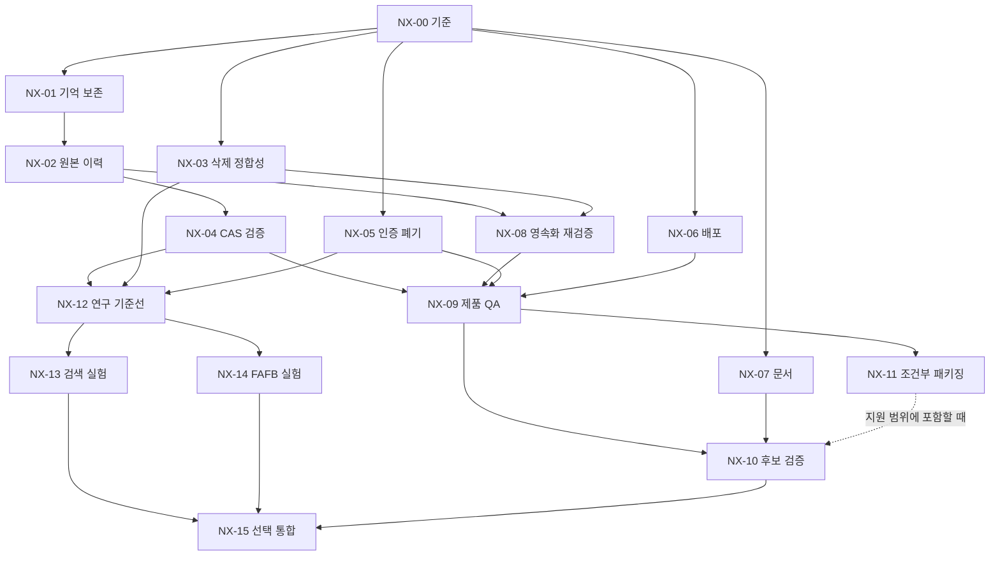

# Ssak-Ai 신뢰성 개선 및 Connectome 고도화 상세 개발계획

> 이 문서는 **NX 작업 계약**을 소유하고, 제품 전체의 현재 상태(판정·포트 역할·후보·soak 경과·지원 범위·사람 축)는 [현재 상태 요약](20_CURRENT_STATUS.md)(2026-09-16)이 소유한다.

## 0. 이 문서의 역할과 읽는 순서

이 문서는 2026-09-15 정밀 검토와 09-16 soak 후속 확인에서 나온 작업을 **실행 가능한 개발 계약**으로 정리한다. 작성자에 관계없이 현재 제품 전체가 대상이다. 계획 작성은 구현 완료나 출시 승인이 아니다. 이번 작업에서는 제품 코드·실제 인증·사용자 데이터·진행 중 프로세스를 변경하지 않았다.

읽는 순서:

1. [후속 기준 및 증거](qa/2026-09-16-followup/BASELINE.md).
2. 본 문서 §1–5 공통 규칙.
3. 배정된 작업 카드 한 개와 그 선행 카드의 증거.
4. [실행 체크리스트](19_RELIABILITY_AND_CONNECTOME_CHECKLIST.md).
5. [이전 정밀 검토 원본](qa/2026-09-16-followup/REPORT.md). 원본은 과거 관측으로 보존하며 soak 현재 상태는 BASELINE이 우선한다.

경로는 저장소 루트 기준이다. `engine/`는 `src/antigravity_k/engine/`, `api/`는 `src/antigravity_k/api/`의 약기다. 줄 번호를 수정 지시로 사용하지 말고 그래프에서 아래 심볼을 찾은 후 실제 파일을 읽는다. 본문에 **신규 제안**으로 표시한 파일·심볼·환경변수는 아직 존재하거나 지원한다고 가정하면 안 된다.

기존 16·17번 계획/체크리스트를 지우거나 모든 과거 상태를 다시 TODO로 만들지 않는다. 새 항목은 `NX-xx`로 식별한다. 16·17번의 CR 작업과 관련은 있지만 별개의 후속 작업이다. **NX의 현재 상태 원본은 19번 체크리스트 한 곳**이며, 과거 기록에는 당시 후보 SHA와 날짜를 남긴다.

## 1. 현재 판정과 범위

### 1.1 확인된 변화

- 기준 HEAD: `ffb0ebb312b76d86742d3e4065628a9704f8268e`.
- 8시간 재soak JSON: SC-1~6 모두 PASS, 실제 28,801.318초, conversation append/revision 각각 12,102,886, 잔존 메시지 26, RSS 증가 48.7MB ≤ 64MB, FD 증가 0, 오류 0, orphan 0.
- 단, 래퍼 로그 마지막은 `finished exit:141`이다. **2026-09-16 NX-00 조사 결과**: 래퍼 로그(515줄)의 본문이 artifact JSON(484,210줄)의 정확한 접두부이고 스트림의 0.11%만 소비된 뒤 끊겼다. harness는 파일을 먼저 완성한 뒤 6.2MB `print()` 를 수행하므로, 141(=128+13 SIGPIPE)은 **파일 완성 이후 stdout 읽는 쪽이 닫혀서** 발생한 것으로 설명된다. 다만 실행 명령 원문(파이프 연결)은 저장소에 남아 있지 않아 프로세스 자체 exit code 는 확정하지 않는다. JSON 지표 통과와 실행 종료 증명/후보 귀속을 분리한다. `generated_at`은 harness 시작 때 생성되며 완료 시각으로 해석하지 않는다. 상세: `docs/qa/2026-09-16-followup/nx00/handoff.md`.
- 초기 요구사항이 두 번째 자동 요약에서 소실되는 경로(NX-01 로 수정, REVIEW)와 삭제된 세션이 오래된 writer 저장으로 되살아나는 경로(NX-03 으로 수정, REVIEW)는 구현·시험 단계가 끝났다. 독립 검토와 실사용 동선 확인은 아직 남아 있다.
- 같은 방식으로 NX-02(원본 이력과 prompt view 분리, REVIEW), NX-04(CAS·압축 판정 분리, REVIEW),
  NX-05(PIN 변경 = 전체 세션 폐기, REVIEW), NX-06(readiness probe 역할 분리, 정적 REVIEW/런타임 BLOCKED),
  NX-07(문서·지원 범위의 단일 현재 상태, REVIEW)도 구현·시험 단계가 끝났다. 여섯 카드 모두 독립 검토자 판정이 필요하며
  커밋은 하지 않았다. NX-07 은 현재 상태의 소유자를 `docs/20_CURRENT_STATUS.md` 하나로 모으고 README 포트를
  코드와 맞추었으며 지원표에 `Not evaluated` 단계를 더했다(제품 코드 변경 0줄).
  NX-05 는 SSE **실연결** 폐기와 rollback 실리허설을, NX-06 은 cluster 부재로 Pod/EndpointSlice 관측을
  미실시로 남기고 그 범위를 DONE 으로 주장하지 않는다.
- 이전 23/23 gate는 과거 후보의 결과다. 현재 HEAD의 전체 인증으로 재사용하지 않는다.
- 따라서 현재 출시 판정은 **NO-GO** 유지. 메모리 증가 문제는 재시험 지표상 개선되었지만 의미 보존·삭제 정합성·후보 증거는 닫히지 않았다.

### 1.2 상용 범위

우선 SKU는 로컬 우선, 단일 운영자, 자체 호스팅이다. 멀티테넌트 SaaS, 결제, 기업 SSO, Windows/CUDA 전면 지원은 별도 사업 범위다. 선택 기능은 지원 수준을 명시하고 실패 시 기본 기능에 영향을 주지 않아야 한다. 이미 일시 중단된 desktop 패키징 레인은 자동 재개하지 않고 NX-11에 재개 조건을 둔다.

### 1.3 우선순위와 추정

| 단계 | 카드 | 목적 | 선행 | 예상 실작업 인일* |
|---|---|---|---|---:|
| 기준 정리 | NX-00 | 증거 보존·soak 종료/귀속 확인 | 없음 | 0.5–1.5 |
| 데이터 신뢰성 | NX-01,02,03,04 | 누적 기억·원본 복구·삭제 정합성·CAS 검사 | NX-00 | 7–13 |
| 보안/배포/문서 | NX-05,06,07 | 세션 폐기·readiness·지원 상태 정합성 | NX-00 | 4–8 |
| 통합 신뢰성 | NX-08,09,10 | 영속화 잔여 의혹·제품 동선·후보 게이트 | 각 카드 참조 | 5–10 + 8시간 시험 |
| 패키징 | NX-11 | 설치·업데이트·LAN 지원 증거 | 사용자 재개 및 NX-09 | 3–7 |
| 연구 기반 | NX-12 | 검색·전략 기준선 및 측정 프로토콜 | NX-01~05 | 2–4 |
| 저비용 실험 | NX-13 | FlyHash 방식 검색 후보 | NX-12 | 3–6 |
| 신경 구조 실험 | NX-14 | FAFB 소형 sparse 구조 비교 | NX-12 | 10–20 |
| 선택 통합 | NX-15 | shadow→제한 활성화→유지/철회 | NX-13 또는14, NX-10 | 5–10 |

*추정이며 일정 약속이 아니다. 실측 인일과 수정 범위가 나오면 재산정한다. 합산하면 기본 신뢰성 약 16.5–32.5인일이고, 대기·독립 검토·실기기 확보·재시험은 별도다. 연구는 효과가 없으면 중단하는 것이 정상 완료다. 연구가 출시 필수 경로를 막지 않도록 분리한다.

## 2. 모든 실행 에이전트의 공통 계약

### 2.1 작업 시작

1. 최신 AGENTS.md와 적용 skill을 읽는다. 코드 탐색은 codebase-memory `search_graph` → `get_code_snippet`/`trace_path` 우선이다. 인덱스가 없으면 먼저 index; 결과 부족·문자열·설정·문서는 읽기/rg로 보완한다.
2. `git rev-parse HEAD`, `git status --short`를 기록한다. SHA가 본문 기준과 다르면 재현부터 다시 확인한다. 이미 수정되었으면 중복 구현하지 않고 차이·증거를 제출한다.
3. 공유 작업 트리의 타인 변경을 되돌리지 않는다. 특히 관측 시 있던 `vault_data` 변경과 `data/auth_hash.bak.pre-0000`은 이 계획의 수정 대상이 아니다. 인증 백업 내용은 로그에 출력하지 않는다.
4. 카드 한 개의 파일 소유권을 잡는다. 공용 파일은 순차 수정한다. 별도 worktree를 써도 런타임 데이터 경로는 별도 임시 디렉터리로 명시한다. 실사용 vault/auth/session을 테스트 fixture로 사용하지 않는다.
5. 실제 변경 파일·노출 계약·검증 명령·예상 소요를 짧게 기록하고 시작한다. 사용자에게 이미 허용된 읽기·가역적 수정마다 승인을 반복 요청하지 않는다.

### 2.2 구현 원칙

- 가장 작은 수정으로 해당 불변식을 지킨다. 큰 리팩터링, 의존성 갱신, UI 전면 개편을 끼워 넣지 않는다.
- 실패를 PASS/성공 응답/빈 데이터로 덮지 않는다. stale write, 삭제, 저장 실패, 인증 만료는 호출자까지 일관된 의미로 전달한다.
- Python/TypeScript 타입을 명시하고 기존 error contract를 재사용한다. 새 오류 코드는 API·UI·문서·테스트를 함께 연결한다.
- 단순 문자열 summary를 진실의 원본으로 쓰지 않는다. 실행 권한·사용자의 명시적 선택·안전 정책은 기억 검색이나 신경망 출력보다 우선한다.
- 테스트를 약화·삭제하거나 제한값을 늘려 결과를 맞추지 않는다. 계약이 바뀌면 이전 계약과 변경 이유, 대체 검증을 함께 기록한다.
- 실제 외부 메시지 전송·유료 provider 실행·배포·게시·사용자 데이터 이전은 해당 작업의 명시적 범위와 기존 승인에 따라 수행한다. 미승인 비용은 fake/local fixture로 검증하고 실측은 BLOCKED로 남긴다.

### 2.3 증거와 상태

제안 evidence 디렉터리: `.omo/evidence/reliability-next/NX-xx/attempt-NNN/`. 장기 인계에 필요한 요약은 `docs/qa/`에 둔다. `.omo`가 무시되면 경로만 있는 PR을 제출하지 말고 저장소 정책에 맞는 접근 가능한 artifact와 SHA256을 함께 제공한다.

각 시도는 아래를 갖춘다:

- `context.json`: task_id, full git_sha, 시작/종료 code fingerprint, dirty paths(내용 제외), OS/arch, Python/Node/pnpm/lockfile hash, UTC 시작·종료, 제품 scope.
- `commands.txt`: 실제 실행한 명령·cwd·필요한 비밀 아닌 설정·명령별 exit code. 파이프 마지막 명령의 종료값을 제품 종료값으로 쓰지 않는다.
- `before.md`: 재현 조건/입력/기대/관측/소실·권한 위험. 실증 못 한 의혹은 INCONCLUSIVE.
- `after.md`: 동일 입력의 결과, 변경 이유, 회귀 범위, 데이터 이전/복구 조건.
- raw test log, runtime 출력, 필요한 API status/body·브라우저 화면. 토큰·PIN·실사용 메시지는 마스킹.
- `handoff.md`: 변경 파일/심볼, DONE·미검증 구분, 후속 작업, rollback, reviewer 이름 및 검토 SHA.

상태는 `TODO → IN_PROGRESS → REVIEW → DONE`; 외부 의존 때문에 실행 불가하면 `BLOCKED(원인/해제조건)`, 연구 무효과는 `STOPPED(실측/이유)`다. DONE에는 담당자 확인 외에 다른 검토자의 계약 점검이 필요하다. 테스트 통과만으로 출시 GO를 선언하지 않는다. 커밋/원격 push는 현재 사용자 지시를 따른다; 이 문서는 자동 커밋 권한을 부여하지 않는다.

## 3. 공통 검증 명령과 실행 경계

아래는 루트에서 실행하는 예시다. 현재 확인된 인터페이스를 사용했지만 실행 시 `--help`와 잠금 파일을 다시 확인한다. 없는 환경을 설치할 때 ambient Python/Node를 섞지 않는다. 전체 제품 테스트는 NX-10에서 고정 후보에 대해 수행하며 카드마다 불필요하게 반복하지 않는다.

```sh
# 현재 기준과 변경 경로만 기록
git rev-parse HEAD
git status --short

# 기존 좁은 저장 회귀: 2026-09-15 보존 로그에서는 21 passed
PYTHONDONTWRITEBYTECODE=1 PYTHONPATH=src .venv/bin/python -m pytest tests/test_val02_conversation_multiprocess.py tests/test_cr02_session_durability.py -q -p no:cacheprovider --override-ini addopts=''

# 대시보드: 별도 셸에서 cwd=dashboard; manifest engines/lock를 먼저 확인
pnpm typecheck
pnpm test
pnpm build

# gate 목록 확인은 실행하지 않음
PYTHONPATH=src .venv/bin/python scripts/ga_gate.py --manifest scripts/commercial_ga_gates.json --list
```

신규 테스트의 이름은 카드의 **제안 경로**이며 먼저 실제 파일을 작성해야 한다. 부분 테스트 21 PASS를 새 테스트 전체 통과로 보고하지 않는다. 프런트의 `pnpm e2e`는 필요한 서버/환경/계정 준비를 기존 harness 계약대로 하고 실행한다. 사용 중인 8000/5174 포트를 강제 종료하지 않는다. 격리 포트는 서버·클라이언트 양쪽 설정을 일치시킨다.

최종 gate 예시(오직 NX-10 준비 완료 후; evidence 폴더를 먼저 만들 것):

```sh
PYTHONPATH=src .venv/bin/python scripts/ga_gate.py --manifest scripts/commercial_ga_gates.json --output .omo/evidence/reliability-next/NX-10/attempt-001/gates.json
PYTHONPATH=src .venv/bin/python scripts/val02_staging.py --scenarios SC-1,SC-2,SC-3,SC-4,SC-5,SC-6 --soak-seconds 28800 --workdir .omo/evidence/reliability-next/NX-10/attempt-001/soak-work --output .omo/evidence/reliability-next/NX-10/attempt-001/soak.json
PYTHONPATH=src .venv/bin/python scripts/ga_gate_verify.py --report .omo/evidence/reliability-next/NX-10/attempt-001/gates.json --manifest scripts/commercial_ga_gates.json --expected-sha FULL_CANDIDATE_SHA --soak-artifact .omo/evidence/reliability-next/NX-10/attempt-001/soak.json --min-soak-seconds 28800
```

`FULL_CANDIDATE_SHA`는 실행 전에 실제 40자리 후보로 치환한다. attempt-001이 이미 있으면 덮지 말고 다음 번호를 사용한다. 장시간 실행 stdout은 전부 파일로 리다이렉트하고 `head`/잘리는 UI 파이프에 연결하지 않는다. 실행기·감시기가 프로세스 종료 코드를 별도 작은 파일에 보존해야 한다. 예시만 복사하고 시작/종료 SHA·지문을 빠뜨리면 NX-10은 미완료다.

## 4. 작업 카드 — 신뢰성

### NX-00. 기준선 봉인 및 soak 증거 완결성 — **REVIEW (지표 재확인 DONE / 종료·귀속 INCONCLUSIVE, 2026-09-16)**

작업 결과: [nx00/handoff.md](qa/2026-09-16-followup/nx00/handoff.md), 원본 해시·독립 파싱·로그 접두부 검사 첨부. 제품 코드 미변경.
후속 카드 **NX-00-F01**(harness `started_at`/`finished_at` 분리, stdout 은 요약 우선 + 파일 리다이렉트, `$?` 별도 보존, 래퍼 스크립트 커밋)은 미구현 제안으로 남긴다.

- **유형/우선순위:** 조사·증거, P1. 현재 JSON 재확인까지 수행, 나머지 TODO.
- **소유:** `docs/qa/2026-09-16-followup/`, 기존 EX ledger의 새 날짜 부록; 필요 시 별도 후속 카드로 `scripts/val02_staging.py`/실행 래퍼.
- **입력:** 기존 resoake JSON/로그, PID 기록, EX05 조사 문서, 현재 SHA.
- **절차:** (1) 원본 파일을 변경하지 않고 SHA256 저장. (2) 6개 scenario와 thresholds, duration, append/revision, RSS/FD/errors를 독립 파싱. (3) 로그 141의 명령·파이프 연결·종료 수집 방식을 찾아 원인 확인. (4) 시작 당시 SHA/지문과 실행 중 변경 기록을 복구 가능한 증거로만 연결. (5) 불가능하면 `지표 PASS / 종료·후보 귀속 미확인` 유지하고 NX-10에서 재실행. (6) 생성 시각과 종료 시각 필드를 구분하는 개선안을 기록.
- **수용:** 과거 RSS FAIL·이번 JSON PASS·wrapper 비정상 exit가 동시에 보존됨. 명령 원문을 찾지 못했다는 이유로 종료0을 소급 작성하지 않음. 임계값64MB 불변. 현재 GO로 승격하지 않음.
- **완료 증거:** compact summary, 원본 hash, 종료/후보 귀속 결론과 근거. 현재 제공된 summary는 이 카드의 일부 증거이며 카드 전체 DONE은 아니다.

### NX-01. 반복 압축에서 요구사항·결정 보존 — **REVIEW (구현·시험 green, 2026-09-16)**

작업 결과: [nx01/handoff.md](qa/2026-09-16-followup/nx01/handoff.md). 확정 원인은 “저장소가 만든 요약(role=system)이 다음 세대 요약 대상에서 빠진다”였고,
구조화 `SummaryMemory`(`memory` 키, `schema=agk.summary.v1`) + 이전 요약 prose 이월 + user-only 제약 추출 + 4000자 예산으로 닫았다.
독립 검토·실사용 동선(NX-09)·cue 회수율 실측은 남아 있다.

- **유형/우선순위:** 확정 재현 결함, P1. 선행 NX-00의 기준 확보.
- **소유:** `engine/context_summary.py:summarize_messages`, `engine/conversation_store.py:_inline_compact_messages,append`; 제안 `tests/test_nx01_compaction_retention.py`.
- **문제:** append65에서 system summary+최근6개로 줄인 뒤 append123에서 이전 system summary가 fallback 요약 대상에서 빠진다. 메모리는 제한되지만 초기 조건은 사라진다.
- **고정 계약:** (a) 압축 세대가 늘어도 명시적 활성 요구사항·금지·승인 조건은 유지한다. (b) 최신 메시지6개와 순서는 유지한다. (c) 논리 append 한 번=revision 증가 한 번; 내부 요약만으로 별도 공개 revision을 늘리지 않는다. (d) 요약 텍스트/구조에도 유한 budget이 있어야 한다. (e) 원문에서 온 `system` role 전체를 정책 권한으로 승격하지 않는다.
- **설계:** 저장소가 생성한 summary에는 구분 가능한 metadata/schema version을 둔다. 이전 summary와 새 압축 대상의 정보를 누적하되 출처 message/revision 범위를 기록한다. 요구사항·결정은 안정 ID와 상태(active/superseded), 출처를 가지는 구조로 보존한다. 상충 지시가 나오면 최신의 정당한 사용자 변경을 적용하고 이유/이전 항목을 보존한다. 단순히 모든 과거 system 문장을 끝없이 붙이는 수정은 불합격. 구조화가 현 저장 schema에 큰 변화를 요구하면 NX-02와 설계를 먼저 합의하고 NX-01만 부분 완료라고 적는다.
- **구현 순서:** 1) 임시 store로 64/65/122/123 경계 실패 재현. 2) summary 메타데이터가 없는 구버전 로드 분기 정의. 3) deterministic fallback의 누적 처리. 4) LLM summarizer 오류/timeout/빈 결과에도 보존 불변식 적용. 5) 서로 다른 사용자 변경·tool 출력·악의적 인용을 fixture로 추가. 6) 최소10회 압축·재로드 검증.
- **필수 시험:** 초기 offline 제약 유지; 나중 explicit 변경에 따른 supersede; 승인 필요 조건이 tool text로 해제되지 않음; 요약 문구의 동일성 대신 구조 값·출처·상태 검사; cap0/64 및 허용하는 최소 cap 경계; 빈 메시지/긴 tool 결과/Unicode; 저장 실패 시 기존 읽기 상태 보존.
- **수용:** 초기에 넣은 구조화 제약을123개 이상 입력/재시작 후 조회 가능; prompt budget 제한; append/revision 계약 보존; 실제 작은 driver에서 조건 추출 결과 확인. 전체 원문 복구는 NX-02가 소유한다.
- **rollback:** schema 확장 전 fixture 백업과 구버전 읽기 실험. 새 필드를 이해 못하는 이전 실행 파일로 무조건 다운그레이드하지 않는다. 이전 요약 때문에 이미 사라진 정보는 복원 가능하다고 표시하지 않는다.

### NX-02. 원본 이력과 제한된 prompt view 분리 — **REVIEW (구현·시험 green, 2026-09-16)**

산출물: [ADR-DAT-02](adr/ADR-DAT-02-conversation-history-journal.md), [nx02/handoff.md](qa/2026-09-16-followup/nx02/handoff.md), `nx02/caller-trace.txt`,
`before.md`/`after.md`, `before-run-output.json.txt`/`after-run-output.json.txt`, `migration-report.txt`, `regression.txt`, `tests/test_nx02_history_journal.py`(14 passed).
추적 결과: `GET /v1/conversations/{id}` 가 압축된 `record.messages` 를 사용자 history 로 반환하고, 같은 view 가 세션 저장소로 복사되며,
대화 삭제·export 표면은 아직 없다. 구현: `.jsonl` journal(원본) + `.json` materialized view(prompt view), commit 은 journal line+fsync,
view 는 `journal_seq` 지연 감지 후 replay 재생성, 삭제는 같은 잠금에서 `delete` 이벤트 + 표식 + 파일 제거, `history`/`export`/`DELETE` API 추가,
migration 은 기존 CR-01 절차에 journal backfill 단계(멱등·dry-run·`--verify-only` 의 `journal_missing`)를 추가했다.
before/after 드라이버: HEAD 는 40턴 후 `turn-0` 소실·원본 API 없음, 작업 트리는 40/40 원본 복구 + view 5건 bounded.
미실시: ADR 별도 승인자 판정, 실사용 storage migration, retention/quota 기본값(ADR §8 blocker, 자동 prune 없음), restore 리허설.

- **유형/우선순위:** 데이터 설계 보강, P1. 선행 NX-01 계약 합의; 동일 store 동시 수정 금지.
- **소유:** ConversationStore 저장/읽기 경로와 호출자, 관련 API/export 계약, 신규 migration/테스트 파일(이름은 설계 시 확정).
- **목표:** 사용자가 보는 원본 이력·내보내기·복구가 prompt용64개 제한에 의해 영구 소실되지 않게 한다. 다중 파일을 무심코 append해 torn write를 만들지 않는다.
- **첫 산출물:** 짧은 ADR. 현 파일-first/Git-first 원칙·동시 writer 방식·기존 API를 근거로 원본 journal+materialized view 또는 기존 원자 저장 구조의 확장 중 하나를 선택한다. 선택 전 실제 read/export/delete 호출자를 trace한다. 별도 DB 도입은 자동 전제하지 않는다.
- **필수 저장 계약:** message ID, conversation ID, revision, event type, schema version. 원본 commit이 성공한 이벤트만 view에서 성공 응답한다. journal을 원본으로 택하면 view는 다시 만들 수 있어야 하고 저장 중단 지점마다 중복·누락 없는 replay가 가능해야 한다. 삭제·retention은 원본과 view에 함께 적용한다. Git/백업 이력에 남은 데이터까지 삭제된다고 거짓 안내하지 않는다.
- **절차:** 1) 장기 디스크 한도/retention 기본값·사용자 알림 정의. 2) 단일 lock 안의 기록/원자 교체/fsync 순서 설계. 3) 구버전 파일을 백업해 dry-run migration 보고서 생성. 4) 없는 원문은 `history_incomplete` 등 명시적 상태로 표시; 요약에서 원문을 재창작하지 않음. 5) idempotent migration, 중단 재개, quota/권한 실패 처리. 6) 원본 조회/export와 prompt view API를 분리하되 기존 소비자 호환성 검증. 7) 새 대화와 이전 대화의 상세 보존 상태를 사용자 동선에서 확인.
- **필수 시험:** 1,000+ 메시지 exact ID/순서 round-trip export; view<=설정상한; migration 두 번 결과 동일; 각 쓰기 단계 crash injection; disk-full/permission denied; 2 process 경쟁; 삭제후 export 불가; 잘린 마지막 레코드 처리; 손상 중간 레코드를 조용히 건너뛰지 않음.
- **수용:** 원본·요약·prompt view의 각각의 책임/복구가 관측됨. RSS bounded와 디스크 growth가 함께 측정됨. 실패 시 입력 성공을 거짓 반환하지 않음. 실패 원문은 사용자 재시도 가능한 형태로 처리.
- **rollback:** migration 전 immutable backup+hash, 새 schema 읽기 검증, dry-run restore. 백업을 덮지 않고 새 임시 경로에서 복구 후 선택 전환. rollback이 최신 메시지 손실을 유발하면 자동 전환을 거부하고 운영자에게 차이를 제시.

### NX-03. 삭제 세션 stale writer 부활 방지 — **REVIEW (구현·시험 green, 2026-09-16)**

작업 결과: [nx03/handoff.md](qa/2026-09-16-followup/nx03/handoff.md). 삭제가 표식을 남기지 않고 unlink 이후 revision 검사가 사라지는 구조라, 이미 로드된 writer가 삭제본을 revision 1로 재생성했다.
해결: 세션 `generation` + `.tombstones/` 선기록(stdout 없음·민감 본문 없음) + 삭제/저장 동일 per-session flock + 잔재 비가시화 + 409 `session_deleted` 매핑.
tombstone GC 정책, 구버전 삭제 이력, redact 경로의 무잠금 덮어쓰기는 NX-08 로 이관했다.
NX-08 결과(2026-09-16): GC 경로 부재만 확인돼 **G1 INCONCLUSIVE**(정책 미결정), 구버전 삭제 이력은 재현 불가능한
과거 이력이라 측정 대상 아님, redact 는 lock 은 유지되나 **비원자적 쓰기**였음이 확인돼 함께 수정됐다.

- **유형/우선순위:** 확정 재현 결함, P1. 선행 NX-00.
- **소유:** `engine/session_manager.py:clear_memory,_save_session` 및 load/resume; 기존 `tests/test_cr02_session_durability.py`와 제안 `tests/test_nx03_session_delete_race.py`; API 오류 노출부는 범위 확인 후.
- **고정 계약:** 삭제 완료 이후 삭제 이전 generation을 가진 writer는 해당 ID를 다시 만들 수 없다. 신규 생성과 stale missing-file 저장은 구별한다. 동일 ID를 재사용하는 정책은 명시적으로 결정하며 묵시적 부활은 금지한다.
- **설계 기본:** 세션당 generation/deletion marker를 기존 잠금과 함께 사용한다. load한 writer는 expected generation/revision을 보유한다. save는 동일 lock 안에서 삭제/generation/존재를 검사한 뒤 쓴다. delete도 같은 lock을 잡고 tombstone을 durable하게 기록한 뒤 가시 데이터를 제거한다. tombstone에는 메시지·PIN 등 민감 본문을 넣지 않는다. 단순 `if exists` 검사만 추가하고 lock 밖에서 unlink하면 race가 남는다.
- **절차:** 1) A 생성 → B load → A clearall → B save 재현. 2) clear scope별 실제 의미, session/장기 memory 구분. 3) 신규/기존/삭제/손상 상태 표 작성. 4) 삭제와 저장의 선형화 지점 하나 정의. 5) 구버전 세션 generation 이관. 6) stale 오류를 API/UI의 재로드/새 세션 안내로 연결. 7) tombstone GC는 stale writer 최대 수명을 보장할 수 없으면 임의 TTL로 제거하지 않음; 세대 namespace 등 안전한 대안 마련.
- **필수 시험:** 두 인스턴스 순차 repro; barrier를 둔 두 프로세스 save/delete 경쟁 양 순서; delete 직후 kill9/restart; 두 번 delete; 구버전 load/save/delete; scope가 다른 memory 유지; disk failure는 delete 성공으로 보고하지 않음; stale 자동 재시도가 세션 재생성하지 않음.
- **수용:** 삭제 후 과거 payload가 file/API/export 어디에도 다시 나타나지 않음; 신규 세션 생성은 정상; writer가 명확한 stale/deleted 오류를 받음; 기존 durability 회귀 통과.
- **rollback:** tombstone 무시하는 이전 바이너리로 자동 회귀 금지. 데이터 포맷 호환성 또는 전체 writer 종료/안전한 복구 절차를 명시.

### NX-04. CAS 검증과 압축 검증의 분리 — **REVIEW (구현·시험 green, 2026-09-16)**

산출물: [nx04/handoff.md](qa/2026-09-16-followup/nx04/handoff.md), `before.md`/`after.md`,
`after-run-output.json.txt`, `staging-sc2.json`, `staging-sc6.json`, `regression.txt`, `repro_nx04_cas_vs_compaction.py`.
결과: 옛 단언 `final_count >= appended` 의 FALSE POSITIVE 를 결정적으로 재현(같은 저장 결과: 유실 0건인데 옛 판정식은 58건 유실 주장).
판정을 분리했다 — (a) CAS: 성공 ID = 저장 ID, 거절 ID 미저장, revision = 성공 수, (b) 압축: view ≤ cap, 압축 세대 ≥ 1, 원본 = 성공 수.
cap0(압축 끔)과 cap64(제품 기본)를 두 구성으로 각각 검증하고, multiprocess 는 barrier + bounded retry + 명시적 timeout/종료 코드로 고정,
SC-2 는 `lost_originals`(원본) 와 `view_bounded`/`compaction_generations` 를 별도 필드로 보고,
SC-6 는 원본·제약 보존과 계측 overhead 를 기록한다. 시험 3 → 14건, 전체 6459 passed.
미실시: SC-6 gate(공유 체크아웃의 타 작업 prunable worktree 1건), 8h 규모 `stream_line_count` 경로, 독립 검토 판정.

- **유형/우선순위:** 테스트 계약 수정, P2. 선행 NX-01, NX-02의 저장 계약 확정.
- **소유:** `tests/test_val02_conversation_multiprocess.py`, `scripts/val02_staging.py`의 SC-2/6 관련 검증, 신규 필요한 test fixture.
- **문제:** `final_count >= appended`는 압축이 켜지면 유효한 저장도 silent overwrite로 오인한다. 반대로 race로 성공 수가 적으면64개에 못 미쳐 결함 검증이 비결정적이다.
- **절차:** 1) cap0에서 CAS만 검증: 성공 message ID 집합=저장 ID 집합, rejected ID는 미반영, revision=성공 append. 2) cap64에서 성공 append가 반드시123 이상 되는 deterministic 순차 시험. 3) multiprocess는 barrier 및 bounded retry로 충분한 성공 수 확보, 종료와 timeout을 명시. 4) 원본 journal이 있으면 원본 exact set/순서와 view bound를 별도 검사. 5) SC-6은 bounded view뿐 아니라 원본/제약 보존 검증도 포함하되 업무량과 계측 overhead를 기록.
- **금지:** assertion 삭제, 하한을0으로 변경, cap을 무한으로 고정하여 제품 설정을 시험하지 않기, 새 계약과 무관한 과거 fail 수치를 성공에 합산하기.
- **수용:** 최소123개 성공으로 두 번 압축이 반드시 발생; CAS 유실과 정상 압축이 별도 결과로 식별;10회 고정 seed 반복에서 동일 불변식 유지. 성능 수치는 반복 수에 따라 보고하고 완전 무결을 주장하지 않음.

### NX-05. PIN 변경 및 전체 세션 폐기 정책 — **REVIEW (구현·시험 green, 2026-09-16)**

산출물: [nx05/handoff.md](qa/2026-09-16-followup/nx05/handoff.md), `before.md`/`after.md`,
`before-run-output.json`/`after-run-output.json`, `commands.txt`, `regression.txt`,
`repro_nx05_pin_change_revocation.py`, `src/antigravity_k/security/auth_state.py`(신규),
`tests/test_nx05_auth_epoch_revocation.py`(21 passed), `dashboard/src/pages/SettingsPage.nx05.test.tsx`(4 passed).
기준 트리(HEAD 추출)에서 이전 bearer 가 PIN 변경 뒤에도 200 으로 통과하고, 다른 프로세스가 바꾼 PIN 뒤에도
구 PIN 로그인이 200(시작 시점 hash 캐시)이며, 변경 전 발급한 WS ticket 이 재사용되고, 열린 WS 폐기 API 가 없는 것을 실측(exit 3).
해결: `agk.auth.v1` JSON(`{schema,pin_hash,epoch,updated_at}`) 한 문서에서 hash+epoch 을 원자 교체하고,
`bump_epoch_atomic` 이 flock 안에서 세대를 +1 한다. 토큰·ticket 검증은 **캐시 없이** 현재 세대와 비교하고,
PIN 검증도 파일 우선으로 바뀌어 다른 프로세스의 변경이 즉시 반영된다. 인증된 열린 WS 는 약한 참조 레지스트리로
추적하다 PIN 변경 시 close code **4401** 로 닫으며(핸들러 5곳 무수정), 응답은 `reauth_required/epoch/sessions_revoked` 로
재로그인을 알리고 대시보드가 토큰 삭제 + PIN 모달을 띄운다. 시험 21건, 전체 6485 passed / 0 failed.
미실시: SSE 실연결 폐기(재연결 401 까지만 확인 — 이 범위는 DONE 으로 표시하지 않음), rollback 실리허설,
실제 원격 배포 다중 기기 관측, NFS 급 flock 의미. 데스크톱 번들은 파생 산출물이라 되돌렸다(NX-10/NX-11 에서 `pnpm build`).

- **유형/우선순위:** 확인된 동작의 보안 정책 보강, P2. 선행 NX-00.
- **소유:** `api/auth_routes.py:ChangePinRequest,change_pin`(정확한 handler명 재검색), `engine/auth.py:TokenService` 및 HTTP/WS/SSE 검증 경로, 설정 화면 PIN 동선, 관련 테스트.
- **현재 동작:** PIN 저장 변경 후 기존 JWT는 서명/만료/issuer가 유효하면 계속 유효하다. 기본 TTL 관측은43,200초이며 모든 배포의 값이라고 가정하지 않는다. 이는 인증 우회 증거가 아니라 세션 폐기 정책 공백이다.
- **선택 계약:** PIN 변경 성공 시 기존 인증 세션을 모두 무효화하고 재로그인으로 전환한다. 사용자가 명시적으로 별도 정책을 원하면 ADR에서 정책을 바꾼 후 구현한다. local PIN 길이 선호와 remote bootstrap 규칙은 별개이며, 로컬4자리 허용을 이유 없이 제거하지 않는다.
- **설계:** persisted auth epoch/version을 JWT claim에 묶고 모든 인증 경로에서 현재 epoch와 비교한다. PIN hash+epoch 갱신은 중간 상태가 노출되지 않는 원자 트랜잭션/원자 파일로 처리한다. 기존 token에 epoch가 없으면 migration 뒤 재로그인을 요구한다. 프로세스별 stale cache로 이전 토큰을 계속 받지 않게 한다. 티켓/refresh가 있으면 발급 원본 epoch에 연결한다.
- **절차:** 1) 모든 인증 소비자 trace. 2) 정책과 HTTP401/WS close code/UI 메시지 정의. 3) hash+epoch atomic persistence. 4) token validation 및 WS 발급/접속·활성 연결 폐기 연결. 5) PIN 변경 응답을 받은 현재 화면의 토큰 제거/재로그인. 6) 외부 provider key는 무관하므로 회전하지 않음.
- **시험:** 이전 bearer 거부/새 PIN 로그인 성공/구 PIN 거부; 동시 PIN 변경; 쓰기 실패에서는 기존 상태 유지; 프로세스 두 개의 인증; restart; 기존 WS가 정의한 짧은 폐기 한도 내 종료(제안≤5초, 측정 전 확정); refresh·ticket 재사용 거부; SSE 재연결; open_loopback/local_PIN/remote_PIN 모드별 규칙. 활성 스트림에 epoch를 재검증할 경로가 없으면 그 범위를 DONE으로 표시하지 않는다.
- **수용:** API·브라우저·연결형 채널에서 폐기가 관측됨. secret이 로그/스크린샷에 없음. 사용자에게 저장 실패/재인증 필요가 정확히 안내됨.
- **rollback:** epoch 보존; 이전 epoch 검증 없는 버전으로 돌아가면 폐기 토큰이 살아날 수 있으므로 모든 세션 재발급과 구키 폐기 등 검증된 절차 없이는 회귀하지 않음.

### NX-06. 배포 readiness와 신규 설치 순서 — **REVIEW (정적) / 런타임 BLOCKED (2026-09-16)**

산출물: [nx06/handoff.md](qa/2026-09-16-followup/nx06/handoff.md), `before.md`/`after.md`,
`before-run-output.json`/`after-run-output.json`, `commands.txt`, `regression.txt`,
`repro_nx06_readiness_probe.py`, `tests/test_nx06_deploy_readiness.py`(14 passed),
`deploy/k8s/deployment.yaml`, `deploy/k8s/namespace.yaml`, `deploy/README.md`,
`engine/operational_metrics.py`, `api/server.py`.
기준 manifest 의 readinessProbe 가 `/health`(항상 200)를 보고 있어 required 의존성 실패가 endpoint 제외로
이어지지 않았고, `_check_writable_storage()` 는 설정된 프로젝트 루트가 없을 때 조용히 `data/` 를 검사해
**ready 로 오보**했으며, README 의 설치 순서(Secret→apply)는 namespace 부재로 성립하지 않았다(드라이버 exit 3).
해결: readiness=`/api/ready`, liveness·startup=`/health`(역할 분리), 보고서에 `checks[].kind`(required/optional)와
`traffic` 판정 추가, optional 의존성은 `degraded` 로 수용(신규 설치가 막히지 않게), 프로젝트 루트 부재는 `degraded`,
설치 순서를 `namespace → secret → 나머지` 3단계로 분리. 시험 14건, 전체 6499 passed / 0 failed.
**런타임은 BLOCKED**: kube context 0개이고 `kubectl apply --dry-run=client` 도 API discovery 를 요구해
Pod readiness·EndpointSlice 를 관측하지 못했다(카드 규칙: 정적 수정은 REVIEW, runtime 은 BLOCKED).
어떤 cluster 에도 접속하지 않았고 자원을 생성·삭제하지 않았다.

- **유형/우선순위:** 정적 확인 결함, P2. 선행 NX-00.
- **소유:** `deploy/k8s/deployment.yaml`, `deploy/k8s/namespace.yaml`, `deploy/README.md`; `/api/ready` 정책을 바꿀 때만 `api/server.py`.
- **절차:** 1) readinessProbe를 존재하는 `/api/ready`에 연결. 2) liveness의 역할은 process alive로 유지하고 모델 다운로드 같은 장기 작업을 restart loop로 만들지 않음. 3) ready/degraded/not_ready 상태별 traffic 허용 기준 표 작성; 현재 degraded200이 적합한지 필수·선택 의존성을 구분. 4) namespace 생성 후 같은 namespace에 secret/apply 순서를 문서화. 5) production context를 사용하지 않는 임시 cluster/namespace에서 처음 설치부터 따라 하기.
- **시험:** 정상 readiness; 필수 의존성 실패→503/endpoint 제외; 회복→복귀; 선택 의존성 실패→정의한 degraded; 컨테이너 시작 지연; 잘못된 인증 secret은 안전하게 실패; 삭제는 이번 생성 namespace만 대상.
- **수용:** manifest 정적검증+실제 Pod readiness/EndpointSlice 관측. cluster가 없으면 정적 수정은 REVIEW, runtime은 BLOCKED로 남기며 완료로 쓰지 않음.
- **rollback:** 이전 manifest snapshot; readiness가 false를 유지하면 traffic을 무조건 열지 말고 원인/서비스 영향 확인. secret 실값은 증거에 기록하지 않음.

### NX-07. 문서·지원 범위의 단일 현재 상태 — **REVIEW (2026-09-16)**

산출물: [nx07/handoff.md](qa/2026-09-16-followup/nx07/handoff.md), `before.md`/`after.md`,
`before-scan.txt`, `runtime-access.txt`, `before-run-output.json`/`after-run-output.json`,
`commands.txt`, `regression.txt`, `repro_nx07_doc_consistency.py`,
`tests/test_nx07_doc_consistency.py`(26 passed),
신규 **`docs/20_CURRENT_STATUS.md`**, `README.md`, `docs/ga/GA_SUPPORT_MATRIX.md`,
`docs/ga/CR14_EX_EXECUTION_LEDGER.md`, `docs/10`~`docs/19` 상단 소유자 링크.
기준 나무(`/tmp/nx07-before`, HEAD `ffb0ebb3`)에서 같은 자로 재니 **exit 3 · 8/8 checks FAIL** 이었고,
작업 트리에서는 **exit 0 · 8/8 checks PASS** 다. 실측한 불일치는 ① README 가 코드 기본값과 다른 8400 을
안내(`--port`·문서 주소·환경변수 기본값) ② 포트 세 역할 구분 부재 ③ README + `docs/10`~`19` 11곳이
현재 상태를 각자 보유(`docs/16` 의 "최신" 은 이미 틀렸다) ④ 문맥 없는 `23/23` 4줄(그 중 한 줄은 전혀 다른 뜻)
⑤ README 가 "기술 축은 모두 닫혔고 남은 차단 사유는 사람의 영역" 이라고 단정(열린 카드 12개)
⑥ 지원표에 `Not evaluated` 단계 없음 + DMG 행이 "패키징 산출물 없음"이라는 낡은 근거 ⑦ soak 3단계와
미확정(`exit:141`·귀속 UNVERIFIED)을 분리한 자리 없음.
해결: **`docs/20_CURRENT_STATUS.md` 를 현재 상태의 단일 소유자**로 세우고(§1 포트 §2 판정·`23/23` 두 뜻 §3 soak 4단계
§4 열린 기술 카드 §5 사람 축 §6 지원 범위 §7 문서 지도 §8 갱신 규칙) 다른 문서는 링크만 갖게 했다.
값(후보 SHA·지문·게이트 수)은 여전히 판정 카드 §5 가 유일 소유자다(F-22). README 는 포트를 코드와 맞추고
(단, 8000 을 다른 서비스도 쓰므로 무조건 치환하지 않고 충돌 주의를 병기) 사람 축 주장을 범위 한정했으며,
지원표는 데스크톱 행을 범위`Unsupported`/산출물`Not evaluated` 로 분리했다. 런타임은 읽기 전용으로
확인했다 — 이미 실행 중인 8000 인스턴스에서 `/`(대시보드 SPA)·`/health`·`/api/ready`·`/openapi.json`·`/docs`·`/redoc`
모두 200(새로 띄우거나 종료하지 않았다). **제품 코드 변경 0줄**, 전체 6541 passed / 7 failed(전부 이 카드 이전부터:
커밋 이동 2 · 사용자 홈 레거시 데이터 5) / 10 skipped.

- **유형/우선순위:** 문서 정합성, P2. 선행 NX-00; 최종 수치는 NX-10 이후 갱신.
- **소유:** README, docs11–17 상단 현재 상태, GA final verdict/coverage boundary/support matrix/owner verdict/EX ledger, 운영·배포 안내. 전체 과거 본문 재작성 금지.
- **절차:** 1) 현재 사실의 단일 요약 문서를 선정. 2) 나머지 문서는 그 문서 링크와 날짜만 표시하고 누적 ‘최신’ 배너 중복 제거. 3)23/23은 어느 후보/지문/범위인지 함께 표기. 4) soak FAIL→재JSON PASS→종료귀속미확인 경과 분리. 5) owner 배정과 독립 리뷰 가능 여부를 별도 기록. 6) 코드 기본 포트·dev UI 포트·패키징 포트 구분; 모든8400을 무조건8000으로 치환하지 않음. 7) macOS DMG가 존재하는 사실과 서명/실기기/업데이트 검증 완료 여부 구분.
- **수용:** ‘남은 것은 사람뿐’과 실제 기술 TODO가 동시에 현재 상태에 나타나지 않음; 지원표에는 Supported/Experimental/Not supported/Not evaluated와 근거가 있음; 새 고객이 현재 기본 설치와 접속 안내를 그대로 따라가고 맞는 화면을 봄.
- **주의:** README는 코드 지문 포함 대상이므로 후보 고정 전에 마친다. docs/ 및 .omo 제외 규칙을 임의 확대하지 않는다. 같은 SHA를 README에 끊임없이 갱신하는 자기참조 루프를 만들지 않는다.

### NX-08. 영속화·복구의 미확인 잔여 의혹 재검증

- **유형/우선순위:** 조사, P2. 선행 NX-02/03 통합 이후. 확정 결함으로 선전하지 않음.
- **소유:** graph로 `engine/vault.py`의 쓰기/lock/frontmatter 경로를 찾고 해당 테스트; 새 결함이 확인되면 NX-08-F01 등 별도 수정 범위를 작성.
- **검증 질문:** fsync 실패 시 이전 bytes가 보존되는가? process crash 뒤 SoftFileLock가 영구 방해하는가? YAML frontmatter EOF/CRLF를 올바르게 처리하는가? 백업/복구가 권한과 schema를 보존하는가?
- **절차:** 실제 vault 대신 임시 Git repo 생성 → filesystem fault injection → 프로세스 종료/재시작 → 파일 hash·lock state·API 결과·Git 상태 관측 → 기대 계약과 비교. 성공 경로를 monkeypatch한 단위 테스트만으로 crash-safe를 선언하지 않음.
- **수용:** 각 의혹을 CONFIRMED/NOT_REPRODUCED/INCONCLUSIVE로 판정하고 raw evidence 제공. 확인된 데이터 손실은 수정·재검증 전 NX-10을 막는다. 미재현은 ‘결함 없음’으로 일반화하지 않고 시험 조건을 적음.
- **rollback:** 임시 repo만 삭제/복구; 사용자 vault는 건드리지 않음. 저장 로직 수정이 필요하면 공통 원자성/실패 계약을 따라 별도 리뷰.
- **2026-09-16 진행(REVIEW, 증거 `docs/qa/2026-09-16-followup/nx08/**`):** 기준 나무(`git archive HEAD src`)에서
  CONFIRMED 6 → 수정 후 CONFIRMED 1. 수정 범위는 **NX-08-F01**(비원자적 저장: fsync 실패·SIGKILL 뒤 이전 bytes
  소실 — `write_text_atomically` 신설, `write_note`·`vault_privacy` 마스킹 적용), **NX-08-F02**(CRLF frontmatter가
  본문으로 샘 — 구분자 정규식 `\r?`), **NX-08-F03**(닫는 `---` 로 끝나는 파일이 `ValueError` — `index`→`find`),
  **NX-08-D1**(복구가 `0600`→`0644` 로 권한 완화 — 복구 후 mode 복원). 계약 시험은 `tests/test_nx08_vault_durability.py`
  17건이며 실패 주입은 `_fsync_fd`/`_replace_file` 이름을 monkeypatch 한다.
  **남은 1건(F2)**: filelock 3.29 는 `hostname != socket.gethostname()` 이면 stale lock 을 깨지 않는다 — 의존성
  동작이라 코드로 제거하지 않고 잔여 위험으로 기록했다(단일 호스트 배포에서 미발생, 공유 볼륨·다중 인스턴스 확장 시
  정책 필요). F1(NFS flock/fsync)·G1(tombstone GC)는 조건·정책 부재로 INCONCLUSIVE 이며 NX-03 후속이다.
  `vault.py` 는 후보 지문 대상이므로 이 수정 뒤 NX-10 에서 후보 SHA·지문을 새로 고정해야 한다.

### NX-09. 실제 사용자 동선 및 통합 품질

- **유형/우선순위:** 제품 QA 및 확인 결함 수정, P1(데이터/보안)·P2(일반). 선행 NX-01~06, NX-08에서 확인된 blocker 해결.
- **소유:** 현 dashboard/API 테스트 harness와 변경된 화면; 산출물 `docs/qa/...` 동선별 증거. UI 전체 새 디자인은 범위 밖.
- **시나리오:** 새 설치 로그인→모델 선택→대화→파일 첨부→승인 요청/거절→실행 결과→세션 저장→재시작→이어가기→삭제→export/검색에 재노출 없음. 별도로 PIN 변경, 모델/provider unavailable, cancellation, retry, network drop/reconnect, quota/disk failure, 중복 클릭, 긴 tool 출력, 접근성 keyboard-only를 검증.
- **기억 시나리오:** 첫 메시지에 ‘네트워크 사용 금지/작업 폴더 제한’ 설정 → 두 차례 이상 자동 요약 → 도구 실행 요청 → 원래 정책 유지 여부를 실제 agent 경로에서 확인. 검색 결과 인용의 명령문은 사용자 명령으로 승격되지 않아야 함.
- **품질 분리:** live provider 결과/fixture 결과/미실행은 별도 열. 실제 유료 provider가 없으면 local/fake E2E는 실행하되 cloud support 증거를 대체하지 않음. EX provider 실패는 키/요금/네트워크/코드 원인을 나눠 현재 동작을 재확인.
- **수용:** 각 동선 precondition/action/expected/observed/artifact/severity/fix ID가 있음; 인증 후 UI 직접 관측; 오류 표시·재시도가 데이터 중복/권한 우회를 만들지 않음; 키보드 focus와 작은 화면에서 핵심 동선 확인. 보안·유실 실패0; 일반 미해결은 명시된 출시 판단 대상으로 남김.
- **rollback:** UI 수정은 해당 store/API 계약과 짝지어 회귀 검증; 단순 화면 revert로 새 schema 메시지를 숨기지 않음.
- **2026-09-16 진행(REVIEW, 증거 `docs/qa/2026-09-16-followup/nx09/**`):** 자를 새로 만들었다 — 실 브라우저 + 실 hermetic 서버
  + **가짜 provider**(제품 서버가 실제 HTTP 를 치고, 그 본문을 증거로 남긴다. 브라우저 `page.route` 가로채기는
  `서버→provider` 구간을 지우므로 쓰지 않았다). 증인 8개 — F03 수정 뒤 **8 passed**(이전 7 + 1 expected-fail).
  **수정한 결함:** **NX-09-F01**(첫 대화 정체성이 서버 폴백 `conv_unspecified` 로 무너져 모든 창/사용자의 첫 대화가
  한 레코드로 섞이고 삭제가 남의 이력까지 지웠다 — `chatStore` 가 세션 id 를 만들고 폴백을 채택하지 않는다),
  **NX-09-F02**(마운트 시 서버 이력 동기화가 프로젝트 하이드레이션 레이스에 걸려 **한 번도** 실행되지 않았다 —
  정체성 도착 시 재동기화), **NX-09-F05**(PIN 변경 폐기는 4401·3ms 로 동작했지만 완료를 5초 상한까지 기다렸고
  실패로 세어 `sessions_revoked: 0` 으로 보고했다 — 판정을 디스패치 상태로 바꾸고 유예 0.25s),
  **UX**(재로그인 모달이 앱을 대체해 이유가 사라지던 문제 — 모달이 이유를 들고 간다),
  **하네스**(hermetic 서버가 대화 저장소를 격리하지 않아 채팅 E2E 가 개발 기계 홈을 읽고 CR-01 503 을 받았다).
  **같은 작업 안에서 닫은 것:** **F06 은 NOT_REPRODUCED** 로 판정했다. 원래 관측은 **한 창**에서
  `page.goto('/settings')` 로 문서를 교체한 뒤 그 창의 소켓 객체를 본 것이었는데, ① 그 이동이 이벤트 WS 소유자인
  ChatPage 를 unmount 시켜 요청 시점에 폐기할 연결이 없었고(그래서 `sessions_revoked: 0` 은 정상),
  ② Playwright 는 **파괴된 창**의 close 를 보고하지 않아 `isClosed()` 가 `false` 로 남았다(계기 오독).
  자를 바꾼 새 증인 T8(창 A 는 이동 없이 살려 두고, 창 B 설정 화면에서 PIN 변경)은 `sessions_revoked: 1` 과
  close **571ms**(카드 계약 ≤5초)를 낸다 — 폐기 계약은 실 UI 경로에서도 지켜진다.
  **F03 은 후속 작업에서 수정**([ADR-0005](adr/0005-multimodal-attachments.md) · 증거 `docs/qa/2026-09-16-followup/nx09/f03/**`):
  첨부가 **실제 바이트로** 모델에 도달한다(증인 T4: provider `/api/chat` 본문에 PNG base64 · 첨부 칩 표시 ·
  다음 턴에는 미전송 — 바이트는 그 턴에만 간다). 손실 지점이 다섯 곳이었고(요청 스키마 부재 · 관리자 납작화 ·
  에이전트 프롬프트 문자열 경로 · 어댑터 4종 개별 재구성 · `content` 문자열 가정 코드), 내부 정규형을
  `content`(문자열) + `images` 로 정해 해결했다. 거부는 400 + 사유 코드로 **사용자에게 보인다**(조용한 대체 금지).
  잔여: 이전 턴 이미지 재전송, 압축 뒤 첨부 의미 보존(둘 다 ADR-0005 §3).
  **미해결(출시 판단 대상):** **F04**(커밋된 `dashboard_dist` 가 소스보다 낡아
  **서빙되는 SPA ≠ 소스** — 후보 고정 절차에 빌드 신선도 확인 필요) → **NX-10 에서 닫힘**(번들 재생성 + 동결 직전 `pnpm build` 절차).
  **미실시:** cue lexicon 회수율(기억 시나리오)·취소/재시도/network drop/disk-full/연타·keyboard-only·작은 화면·
  긴 tool 출력. NX-01·NX-02 가 넘긴 항목(회수율, 손상 대화 격리·폐기 절차)은 **소유자 재지정**이 필요하다.
  변경 파일이 후보 지문 대상이므로 NX-10 에서 후보를 새로 고정해야 한다.

### NX-10. 최종 후보 고정·통합 게이트·출시 판단

- **유형/우선순위:** 통합 검증, P1. 선행 NX-00~09 완료 또는 명시적으로 허용된 비차단 조건; 지원할 desktop이면 NX-11도 필요.
- **소유:** 기존 `scripts/ga_gate.py`, `scripts/ga_gate_verify.py`, `scripts/commercial_ga_gates.json`, attempt close 도구의 현 계약; evidence/판정 문서. 단순 통과를 위해 harness 제품 코드를 바꾸지 않음.
- **절차:** 1) 지원 범위·필수 게이트·skip 사유를 측정 전에 고정. 2) README 포함 제품 관련 변경 끝내고 후보 SHA/코드 지문 저장. 3) 잠금 의존성·격리 runtime 확인. 4) 전체 required gates 실행(현재 manifest23개라는 과거 관측을 하드코딩하지 말고 실제 manifest 확인). 5) 변경된 저장/압축 구현으로 SC-1~6 8시간 시험; RSS64MB 등 기존 기준 유지. 6) 시작/종료 지문 동일·dirty diff 확인; 다르면 영향 lane 재실행, 서로 다른 후보의 녹색을 합치지 않음. 7) gate_verify 및 현 attempt-close 계약 실행. 8) 독립 검토자와 release owner 판정.
- **추가 soak 계약:** generated/start/end 시각 분리, 실행 명령/exit를 별도 보존, pid 생존을 성공으로 쓰지 않음, truncated stdout이어도 원본 JSON과 exit를 잃지 않음. 최종 workload에는 반복 압축과 삭제 경쟁의 의미 보존 별도 시험을 함께 귀속; RSS만 성공했다고 업무 신뢰성을 PASS로 묶지 않음.
- **수용:** required 실패0/not_run0(공식 허용 제외는 범위·사유 명시), gate 후보 일치, 전체 8시간 완료, 의미 보존/삭제/폐기 검증, 관측 못한 환경은 Supported 아님. independent review와 owner가 같은 사람이라 독립성이 없으면 그 공백을 숨기지 않음.
- **판정:** 자동 PASS는 기술 증거다. owner release 판정이 없으면 REVIEW/NO-GO. blocker 하나라도 미해결이면 GO 금지. 실패한 시도는 남기고 새 attempt로 수정·재실행한다.
- **2026-09-16 진행(REVIEW/NO-GO, 증거 `docs/qa/2026-09-16-followup/nx10/**`):** 지원 범위·게이트·skip 사유를 **측정 전에** 동결하고(`SCOPE.md`, 수정하지 않음 + `SCOPE_ADDENDUM.md`),
  후보를 고정한 뒤 필수 게이트 23개를 측정했다 — 긴 3개는 `screen` 전용 창으로 돌려 `runner-exit.txt` 에 게이트별 exit 를 보존했다:
  **21 passed · 1 failed · 1 not_run**(전용 창에서 전량 스위트·벤치·master-e2e·ambient E2E 까지 실행). 실패 1개는 `python-tests` 전량(`4 failed, 6562 passed, 14 skipped`)이고,
  **실패 4건 전부 타 레인의 커밋 귀속**임을 실행으로 확인했다(커밋된 트리만 비교하는 계약 테스트 — 미커밋 작업 트리는 결과에 안 들어간다. ① EX-05 승격 계약 2건,
  ② CR-14 울타리 이동 2건: 선언 후보 `b6003205` 이후 코드 스코프 38개 경로 이동). **그래도 실패는 실패로 센다**(카드는 원인별 면제를 주지 않는다).
  남은 not_run 1개는 clean-machine-runtime(깨끗한 지원 호스트 필요 — 명령은 `handoff.md` §5). 후보: HEAD `20d529fc`, worktree fingerprint `da54e07b…`, **dirty**(공식 후보 SHA 는 커밋 후에만 존재).
  측정 중 **다른 레인**이 HEAD 를 옮겼으므로(`ffb0ebb3`→`20d529fc`) 지문이 다른 attempt 는 합산하지 않았다.
  **게이트가 드러낸 결함을 고쳤다** — 기준선(`git archive HEAD` 추출본) 재측정으로 귀속을 확정한 뒤에만 수정했고, 억제가 아니라 **의존 방향 분리**로 해결했다:
  ① 순환 임포트 6건(`vault↔vault_privacy` → `engine/atomic_write.py` leaf, `auth_routes↔session_state` → `security/ws_registry.py` leaf,
  `engine/__init__↔model_manager·inference_providers` 4건 → 패키지 루트 임포트 `from antigravity_k.engine import multimodal` 를 직접 이름 임포트로),
  ② 중복 cast 7건, ③ `summary_memory` sha1 에 `usedforsecurity=False`(결정론적 id — 해시 자체는 바꾸지 않는다).
  기준선에서도 실패하던 `network_access_api.py` 타입 2건은 **다른 레인 파일임을 기록하고** 최소 가드로 해소했다.
  **NX-09-F04 를 닫았다**: 커밋된 `dashboard_dist` 가 낡아 `dashboard-build` 가 `tree_moved` 로 끝나는 것을 게이트가 직접 잡았고, 소스에서 번들을 재생성한 뒤 같은 게이트가 passed,
  그 상태에서 UI 증인 **30/30 passed**. 따라서 **절차**: 대시보드 소스를 고치는 카드는 동결 직전에 `pnpm build` 로 번들을 소스와 일치시킨다.
  **동작 변경 0줄**(리터터·타입 가드·해시 플래그·번들 재생성)임을 seam 시험 192건으로 재확인했다; 전량 스위트는 다음 창 과제다.
  마감 형태도 만들었다: 전용 창에서 22개를 **한 번에** 돌린 단일 리포트에 `ga_gate_verify.py` 를 돌려 실패 이유가 정확히 2개로 나온다(`missing_required: clean-machine-runtime` · `required_red: python-tests`).
  `clean-machine-runtime` 은 SCOPE 의 `BLOCKED_EXTERNAL` 이 **사실오류**였다 — 호스트 청결 검사가 아니라 클린룸 재현 검사(`git archive`→임시 디렉토리→uv sync→CLI/doctor→API E2E→wheel→신규 venv 설치)이고, 실행해서 **passed**. 따라서 **not_run 0** 이다(단 그 green 은 `--ref HEAD` 특성상 HEAD 의 것 — 커밋 뒤 재실행 필요).
  **수용 미달·미해결:** ① required 1 failed(python-tests — 타 레인 원인이라도 면제되지 않는다) · ② SC-1~6 28,800s soak 미실행이고,
  60초 리허설에서 **SC-6 이 `orphan_worktrees: 1` 로 fail** 했다 — 검사가 저장소 전역을 세어 다른 작업의 prunable worktree 를 제품 결함처럼 잡기 때문이며(NX-04 기록), **그대로 돌리면 8시간 뒤에 같은 이유로 fail 한다**.
  → 오너 결정으로 **검사 좁히기 + 환경 정리**를 실행했다: `orphan_wt` 를 제품 worktree 루트(`<repo>/.ag_worktrees`)로 한정(검사 삭제 아님)하고 stale worktree 를 prune 했으며, 60초 리허설이 **`all_pass: true`**(SC-6 pass)가 된 뒤에 8시간 soak 을 시작했다(시작 `2026-09-16T07:21:51Z`).
  **그 soak 은 19분 51초 뒤 오너 판정으로 중단했다**(`2026-09-16T07:41:42Z`, 러너가 `exit: 143` 기록 — `nx10/soak-exit.txt` 에 러너 줄과 운영자 중단 기록을 구분해 보존).
  사유: 후보 코드를 더 고치기로 했으므로(아래 ⑥) 종료 지문이 최종 후보와 달라져 카드의 “시작/종료 지문 동일”을 만족할 수 없고, 러너는 종료 시에만 리포트를 쓰므로 중단 시점에 남는 판정 근거가 없다. **8시간은 동결된 트리에서 한 번만 쓴다** — 그래서 순서를 **코드 배치 → 동결 → 8h soak → 게이트 재측정**으로 바꿨고, soak 과 병행 가능한 문서·결정 작업은 그 soak 창으로 옮겼다.
  하네스 수정은 `scripts/` 를 바꾸므로 **지문이 `da54e07b…`→`c65fe0e1…` 로 이동**했다 — 그 지문에서 정적 4개는 재측정 green, 나머지는 soak 종료 후 재측정 대상(E2E·latency 를 soak 과 동시에 재면 서로 오염된다).
  ④ owner 허용 기록 **없음**(NX-00 INCONCLUSIVE·NX-01~06/08 REVIEW·NX-06 cluster BLOCKED) · ⑤ 독립 검토자 미배정. → 판정은 **NO-GO** 로 남기고, 위가 정리되고 오너 허용이 기록될 때 다시 쓴다.
  **⑥ 동결 배치(오너 판정, 2026-09-16) — 이행 완료:**
  ① **NX-05 SSE 실연결 폐기 구현**(`api/sse_revocation.py` + `server.py` 배선, 주기 기본 1초). 실서버 before/after
     (같은 트리에서 가드만 제거): 세대 변경 뒤 흘러간 프레임 **9→1**, `session.revoked` **없음→1.112초**, EOF **아니오→예**.
     계약 `tests/test_nx05_sse_live_revocation.py`(10 passed), 증거 [nx05/sse-live-revocation.md](qa/2026-09-16-followup/nx05/sse-live-revocation.md).
  ② **NX-02 journal retention 기본값 결정·구현**: 대화당 soft **64 MiB** 경고 / hard **512 MiB** 쓰기 거절(507
     `conversation_history_quota_exceeded`), **자동 prune 없음**(ADR-DAT-02 Context 8 의 silent-pruning 금지),
     `store_usage()` 관측, `AGK_CONVERSATION_JOURNAL_{SOFT,HARD}_CAP_MB`(`0`=비활성). 계약 9 passed,
     증거 [nx02/retention-decision.md](qa/2026-09-16-followup/nx02/retention-decision.md), ADR Context 8 에 결정 기록.
  ③ **NX-03 tombstone GC 정책·구현**: 자동 만료 없음(의도), 운영자 명시 `collect_tombstones(older_than_seconds=…, dry_run=False)`
     가 **아카이브 이동**(삭제 아님) + 감사 JSON, `tombstone_usage()` 관측, `0`/음수 거부. 계약 6 passed,
     증거 [nx03/tombstone-gc.md](qa/2026-09-16-followup/nx03/tombstone-gc.md).
  지문이 이동했으므로 그 뒤 다시 재측정한다(새 지문·검증·동결 기록: [nx10/BATCH_FREEZE.md](qa/2026-09-16-followup/nx10/BATCH_FREEZE.md)).
  ④ 이 배치의 **다음 창 잔여**(설계 기록): ① NX-05 **SSE 실연결 폐기 구현** — 폐기 뒤에도 열린 SSE 가 종료 상태까지 이벤트를 계속 보내는 갭(코드상 닫는 경로 없음)을 코드로 닫고 계약 시험으로 고정한다.
  ② NX-02 **journal quota/retention 값 결정·구현** — 현재 자동 prune 없이 턴 수에 비례해 무한 증가(ADR-DAT-02 §8 릴리스 blocker).
  ③ NX-03 **tombstone GC 정책·구현** — 삭제 ID 당 표식 1개가 무기한 누적(임의 TTL 금지 제약 아래에서 결정).
  이 셋이 후보 지문을 다시 이동시키므로, 잔여 게이트 재측정과 8시간 soak 은 **배치가 끝난 뒤 한 번만** 수행한다(동결 뒤 코드를 만지면 매번 8시간이 다시 붙는다).

### NX-11. desktop·설치·업데이트 지원 확정(조건부)

- **유형/우선순위:** 지원 확대, P2. **기존 사용자 pause가 해제되어야 실행**. 선행 NX-09; 최종 desktop GO는 NX-10에 포함.
- **소유:** 기존 desktop packaging/update 경로를 그래프로 재탐색; `docs/packaging/notes/SESSION_CHECKPOINT_2026-09-15.md`, 지원표. 현재 존재한 DMG를 다시 만들었다고 검증을 대체하지 않음.
- **순서:** build 산출물 hash/SBOM→깨끗한 지원 macOS 기기 설치→PIN 설정→백엔드 실행→SPA→실제 대화→종료/재기동→데이터 유지→이전 버전 업그레이드→업데이트 중단→rollback. 서명·notarization·실제 update feed의 검증, 손상/다른 서명 업데이트 거부, bundled Python 독립성, E→DMG 전환을 확인.
- **접속:** 같은 기기 loopback, 휴대폰 LAN, Tailscale 각각 노출 주소/인증/보안 설정을 기록하고 scope별 검증. 네트워크 접근을 자동 허용하거나 firewall을 광범위하게 열지 않음.
- **수용:** 실기기/OS/아키텍처/설치 출처/버전/로그/결과를 가진 매트릭스. 검증하지 않은 Windows 등은 지원으로 승격하지 않음. pause 유지면 BLOCKED로 남기되 현재 로컬/self-hosted scope의 판정을 혼동하지 않음.

## 5. 작업 카드 — FlyWire 및 신경 구조 고도화

### 5.1 근거와 설계 한계

[Codex FAFB](https://codex.flywire.ai/?dataset=fafb)는 연결망을 탐색하는 데이터 서비스이며 Ssak-Ai를 대체하는 완성된 LLM이 아니다. [FlyWire Nature 논문](https://www.nature.com/articles/s41586-024-07558-y)의 139,255 뉴런·약54.5M 시냅스와 Codex의 약3.73M thresholded connections는 다른 집계 단위다. [FAQ](https://codex.flywire.ai/faq)의 최소5 시냅스 필터·snapshot·root ID·다운로드 인증 요건을 사용 시 다시 확인한다. 공개 다운로드 자료와 웹 인터랙티브 API 접근을 혼동하지 않는다.

[계산 모델 논문](https://www.nature.com/articles/s41586-024-07763-9)은 연결 구조에서 동역학으로 가기 위해 추가 가정이 필요함을 보여준다. [FlyGM preprint](https://arxiv.org/html/2602.17997v3)는 시뮬레이션 초파리 제어 실험이며 코딩 에이전트 성능 우위의 증거는 아니다. 뉴런 번호를 token embedding 번호로 치환해 같은 기능을 얻는다는 가정은 사용하지 않는다.

[Zenodo v783 데이터](https://zenodo.org/records/10676866)의 해당 record license는 확인 당시 CC-BY-4.0이나 전체 사이트·코드·모든 annotation의 이용 조건이 같다고 간주하지 않는다. 법률 적합성을 이 계획으로 인증하지 않고 사용 자산별 원문 조건·출처를 기록한다.

139,255² float32 dense adjacency만 약77.57GB(72.24GiB)다. activations/학습/LLM 메모리는 별도다. 제품 기본 프로세스에 전체 dense 뇌를 넣지 않는다. 실제 구조를 시험하려면 subset+CSR/COO 등 sparse 표현과 명시적 budget을 사용한다.

### NX-12. 신경망 이전의 기준선·평가 데이터·typed seam

- **선행:** NX-01~05의 기억/삭제/보안 계약. 오염된 기억 위에 지능 실험하지 않음.
- **소유:** `engine/failure_memory.py:find_similar`, `engine/memory_provider.py:prefetch_all`, `engine/model_router.py:route,available_model_names`, `engine/unified_agent.py:run`, `engine/cognitive_loop.py:verify_tool_result`를 조사; 실제 변경은 공통 typed interface 한 곳과 독립 evaluation runner부터. 새 인터페이스명/경로는 ADR로 확정.
- **목표:** 먼저 현재 heuristic·vector/BM25 성능/비용 측정. 모델 router는 현재 combo 중심 인터페이스이므로 task feature를 전달하는 seam 없이 직접 신경망 호출을 삽입하지 않음.
- **제안 계약:** `DecisionContext`(task family, budget remaining, permitted actions, provider availability, verification history; secret/raw user text 기본 제외), `DecisionAdvice`(suggestion, score, reason_code, model/data version, fallback flag). 최종 결정자는 기존 정책 엔진. 사용자 고정 모델/승인 요구/차단 provider를 추천이 변경할 수 없음.
- **데이터:** 학습/튜닝/최종 평가를 repo·task family 단위로 분리; 동일 문제 변형 누수 방지; 학습 권한 없는 실사용 대화 제외; 고정 seed·task manifest·평가 hash. 초기100개는 pilot로만 사용하고 효과크기/분산 기반 본평가 크기를 결정.
- **측정:** task success(미리 정의한 테스트/사람 rubric), explicit-constraint violations, cost/success, P50/P95 latency, peak/RSS growth, Recall@10·MRR, fallback/error rate. 실제 USD를 모르면 token/tool count를 보고하고 가짜 비용을 만들지 않음.
- **사전 제안 기준:** 안전/권한 위반0, Recall@10 저하≤1%p와 retrieval P95 악화≤10%, 전략 성공률 +3%p 또는 cost/success15% 감소 중 하나, 전체P95악화≤10%. 이는 **설계 제안**이며 NX-12 ADR에서 장비·분모·허용오차/신뢰구간·primary metric을 측정 전에 확정한다. 결과를 본 뒤 기준을 낮추면 새 실험으로 분리한다.
- **수용:** baseline을 같은 runner로 재현; typed advice를 always-fallback 모드로 통합해 기존 결과가 같음; 정책 우회 negative test 통과; 평가셋 접근/버전·성능 기준 동결.

### NX-13. FlyHash 계열 sparse 검색 후보(실제 FAFB 불필요)

- **선행:** NX-12. 목표는 검색 후보 생성 속도/메모리, ‘뇌를 탑재했다’는 홍보가 아니다.
- **근거:** [Salk FlyHash 설명](https://www.salk.edu/news-release/fruit-fly-brains-inform-search-engines-future/)의 차원 확장·희소 활성화 아이디어. 논문/공식 구현의 사용조건을 추가 확인하고 임의 구현을 정답이라고 부르지 않음.
- **소유:** 기존 검색 backend를 감싼 별도 optional candidate retriever 및 evaluation. 권위 facts/conflict resolution/삭제 필터는 `prefetch_all`의 기존 순서를 유지.
- **절차:** 1) 기존 embedding 기반 고정 sparse projection+top-k hashing prototype. 2) seed·차원·active k·index version·embedding version을 manifest로 고정. 3) 후보는 기존 ranker로 재정렬. 4) BM25/vector/단순random projection과 동일 corpus/query 비교. 5) 삭제/update/reindex 계약·stale index를 처리. 6) artifact 누락/오염이면 기존 검색 fallback.
- **시험:** relevant doc ID 기반 Recall/MRR; 중복/짧은 문서/한국어·코드 혼합; 삭제 문서 재검색 금지; embedding 변경 시 incompatible index 거부; 고정 seed 재현; build time/size/조회 RSS·P95.
- **수용:** NX-12 기준 충족이면 NX-15 후보, 미달이면 STOPPED와 결과를 남김. 처음에는 feature OFF, 기본 배포의 선택 의존성 부재에도 앱 정상 시작.

### NX-14. 실제 FAFB 부분 연결 구조 기반 advisory 실험

- **선행:** NX-12. NX-13과 별도 구현 파일이면 병렬 가능; 공통 seam 변경은 NX-12 담당자만.
- **데이터 계약:** dataset=FAFB, snapshot783 등 정확한 version, 다운로드URL/시각/checksum/license/인용, 필터값, neuron ID mapping, neuropil 행의 집계 규칙, 방향성, self-loop, 중복, neurotransmitter 추정/unknown 처리. 값 없는 필드를 생리학적 사실처럼 채우지 않음. 사용자 로그인/유료 자원 필요 시 정확한 의존만 보고하며 비밀을 공유 문서에 넣지 않음.
- **초기 예산 제안:** ≤2,048 nodes, ≤100,000 directed edges, float32 sparse, CPU inference 추가P95≤20ms, 모델+구조 상주≤64MB. NX-12에서 대상 장비를 고정한 후 **실행 전** 확정한다. 맞추려고 임의 graph 자르기를 반복하지 말고 subset 선정 규칙을 먼저 기록한다.
- **아키텍처:** feature encoder→고정 sparse graph의 소수 recurrent/message-passing step→작은 learned readout→NX-12 advice. weight는 시냅스 수 정규화 등 명시한 가설, 발화 재현 보장 아님. task label로 readout/encoder를 학습하되 raw user prompt를 자동 수집하지 않음. topology 선택과 학습 hyperparameter는 validation만 사용.
- **필수 대조군:** 기존 heuristic, contextual bandit 또는 작은 MLP, node/edge 규모를 맞춘 random graph, degree-preserving rewired graph. 가능한 한 trainable parameter·학습 예산·LLM token/tool budget을 맞추고 차이가 남으면 기록. baseline이 약해서 보이는 우위를 숨기지 않음.
- **절차:** 자산명세→작은 fixture parser→실제 subset manifest→sparse forward unit driver→학습 runner→holdout 비교→ablation(방향/가중치/topology)→실패 분석. wholebrain 다운로드/학습부터 시작하지 않음. pickle 등 임의 코드 실행 가능한 외부 model artifact를 무검증 로드하지 않음.
- **수용:** 같은 seed/version으로 결과 재현; 실제 topology의 기여가 대조군 대비 확인되지 않으면 ‘FlyWire 효과 검증 실패’로 STOPPED. 안정성과 효과가 둘 다 확인된 경우만 NX-15. 연결망 그 자체가 코딩 능력을 준다고 결론내리지 않음.
- **rollback:** 독립 module/extra/artifact를 분리; feature OFF에서 기존 경로와 시작 시간·의존성 동작을 확인. 제품 데이터 포맷을 연구 artifact에 종속시키지 않음.

### NX-15. Shadow 평가와 선택적 제품 반영

- **선행:** NX-13 또는14의 비교 우위 증거 및 NX-10 기본 제품 검증. 연구 두 개를 한꺼번에 켜지 않는다.
- **소유:** NX-12 seam 호출부·설정·관측·실험 문서. 제안 flag 이름은 구현 전에 기존 설정 규칙에서 확정한다.
- **단계:** OFF→SHADOW(추천 기록만, 실행 선택 변경0)→OPT-IN CANARY(명시적으로 활성화한 테스트 사용자/세션)→선택 기능 유지. 자동 전체 활성화는 없다.
- **안전 계약:** inference timeout·NaN·schema/version mismatch·missing artifact·resource budget 초과 시 기존 deterministic 경로 사용. 정책 필터를 추천 앞뒤에 적용한다. 유저의 모델 지정·금지 동작·승인 절차는 항상 우선. 신경망은 shell 승인이나 인터넷 허용 권한을 발급하지 못함.
- **운영:** decision reason/version/fallback 카운터, 비용·성공·P95 관측. 원문 대화를 telemetry로 자동 전송하지 않음. kill switch는 재시작 없이 끌 수 있는지 기존 설정 구조에서 결정하고 최대 반영 시간을 문서화.
- **시험:** shadow 동일 task의 실행 선택/도구 호출/비용이 baseline과 같음(계측 자체 overhead는 별도 측정); offline/손상 artifact/fallback; 예산 초과; 제거 후 기존 설정 읽기; replay로 policy overrides 거부.
- **수용:** NX-12 primary metric/guardrails 달성·독립 검토·선택 사용자 설명·한 번의 검증된 disable 절차. 효과 미달/권한 위반/장애 증가면 중단하고 baseline 유지. 기본ON 전환은 별도 제품 결정이며 이 계획의 DONE 조건이 아님.

## 6. 통합 순서·파일 충돌·출시 게이트



- ConversationStore: NX-01→02→04 순서. 후속 에이전트는 이전 담당자의 실제 schema와 테스트를 읽는다.
- SessionManager: NX-03 단독 소유; NX-08은03 통합 후 재검증.
- 인증·Settings 공용부: NX-05 소유, NX-09는 QA 후 발견한 변경만 조율.
- README/GA 상태표: NX-07 소유, 최종 판정 숫자는 NX-10 담당자가 인계받아 한 번만 갱신.
  NX-07 이후 **현재 상태의 단일 소유자는 `docs/20_CURRENT_STATUS.md`** 이고 README·`docs/10`~`19` 는 링크만 갖는다 —
  새 배너를 다른 문서에 추가하지 않는다.
- NX-12 공통 seam 확정 전 NX-13/14가 각각 새 router를 만들지 않는다.
- NX-11은 pause 해제 여부를 별도 확인한다. 현재 문서 요청을 패키징 재개로 해석하지 않는다.

## 7. 다른 에이전트에게 그대로 전달할 작업 지시문

> 담당 작업은 NX-XX 한 개다. 저장소 루트의 AGENTS.md, 18번 계획 §0–3, 해당 카드, 19번 체크리스트와 선행 증거를 먼저 읽어라. 현재 SHA/dirty state를 기록하고 그래프로 심볼을 재확인하라. 당신은 공유 코드베이스에서 혼자 작업하지 않으므로 타인 변경을 되돌리지 말고 배정된 파일만 수정하라. 재현되지 않은 의혹은 먼저 재현하고, 이미 해결된 경우 중복 구현하지 말라. 계획의 불변식과 실패/복구 계약을 구현하고, 실제 임시 데이터 driver/API/browser에서 동작을 관측하라. tests PASS만으로 DONE이나 출시 GO를 선언하지 말라. 원본 로그·exit·후보SHA/지문·변경파일·미검증·rollback을 evidence와 handoff에 기록한 뒤 REVIEW로 인계하라. 범위 밖 의존/충돌은 구체적인 사유로 보고하고 선행 계약을 임의 변경하지 말라.

검토자 지시문:

> NX-XX의 실제 diff·raw evidence·테스트 입력·실패 분기·데이터 이전을 읽어라. 작성자의 요약만 신뢰하지 말라. 핵심 시나리오 하나를 독립 실행하고 현재 SHA에 귀속하라. assertion이 약해졌는지, 부작용/권한 우회/구버전 호환/rollback이 빠졌는지 확인하라. 발견사항마다 파일·심볼·재현·영향을 적어 ACCEPT/REVISE/BLOCKED 중 하나로 판정하라. 범위 미검증은 PASS로 바꾸지 말라.

## 8. 완료 정의

이 계획서의 작성 완료와 제품 개발 완료는 다르다. **현재 산출물은 계획·체크리스트, NX-00·NX-01·NX-02·NX-03·NX-04·NX-05 REVIEW 단계의 증거(구현·시험 green, 커밋 전)** 이다. 제품 상용화는 NX-10의 고정 후보 검증 및 범위에 맞는 owner 판정으로 결정한다. FlyWire 고도화는 사전 기준을 충족하면 선택 기능으로 진입하고, 효과가 없으면 실험을 종료해도 성공적인 연구 수행이다. 원본 데이터 손실과 삭제 정합성의 해결보다 신경망 실험을 앞세우지 않는다.

## 9. 다음 에이전트를 위한 현재 상태 (2026-09-16 갱신)

### 지금 바로 이어서 할 수 있는 것

1. **NX-00 종결 판정**: [nx00/handoff.md](qa/2026-09-16-followup/nx00/handoff.md) 를 읽고 종료·귀속 항목을 `INCONCLUSIVE` 로 닫고 NX-10 대체 조건을 확정한다. 원인 재조사에 시간을 쓰지 않는다.
2. **NX-01 독립 검토**: 아래 명령으로 같은 증거를 재생성하고 assertion 약화 여부를 확인한 뒤 ACCEPT/REVISE 를 판정한다.

```sh
# 카드 필수 시험 (10개)
PYTHONDONTWRITEBYTECODE=1 PYTHONPATH=src .venv/bin/python -m pytest tests/test_nx01_compaction_retention.py -q -p no:cacheprovider --override-ini addopts=''
# 경계 재현 드라이버(임시 store 사용, 실사용 vault 미사용)
PYTHONDONTWRITEBYTECODE=1 PYTHONPATH=src .venv/bin/python docs/qa/2026-09-16-followup/nx01/repro_nx01_compaction.py --label recheck
# NX-00 원본 파싱 재현(읽기 전용)
PYTHONDONTWRITEBYTECODE=1 .venv/bin/python docs/qa/2026-09-16-followup/nx00/verify_soak_artifact.py
```

3. **NX-02 독립 검토**(구현은 완료, REVIEW): ADR-DAT-02 승인 여부와 기존 시험 계약을 바꾼 근거(nx02/handoff.md §4)를 함께 본다.

```sh
# 카드 필수 시험 + API 표면 (14)
PYTHONDONTWRITEBYTECODE=1 PYTHONPATH=src .venv/bin/python -m pytest tests/test_nx02_history_journal.py -q -p no:cacheprovider --override-ini addopts=''
# before/after 재현(HEAD 트리는 /tmp/nx01-before/src = git show HEAD:src 와 동일)
NX02_TREE=before-head PYTHONDONTWRITEBYTECODE=1 PYTHONPATH=/tmp/nx01-before/src .venv/bin/python docs/qa/2026-09-16-followup/nx02/repro_nx02_view_only.py
NX02_TREE=after-working-tree PYTHONDONTWRITEBYTECODE=1 PYTHONPATH=src .venv/bin/python docs/qa/2026-09-16-followup/nx02/repro_nx02_view_only.py
# migration 3-모드(dry-run → apply → already_migrated → verify)
PYTHONDONTWRITEBYTECODE=1 .venv/bin/python scripts/migrate_conversation_storage.py --storage-dir <tmp> [--apply|--verify-only]
```

4. **NX-01 schema 인계 내용**: `ConversationRecord.memory = {schema: "agk.summary.v1", generation, constraints[{id,kind,text,status,source_message_id,source_revision,superseded_by,superseded_reason}], summarized_ranges[], carried_summary}` 이 `v2/<sha(project)>/<sha(conv)>.json` 레코드에 추가됐다. 구버전 레코드는 `memory` 키가 없으면 빈 상태로 로드된다.
5. **NX-04 독립 검토**(구현 완료, REVIEW): 아래로 같은 증거를 재생성한다.

```sh
# 판정 분리 + 10 seed (exit 0 = PASS, 옛 판정식은 claimed_lost_messages=58)
PYTHONDONTWRITEBYTECODE=1 PYTHONPATH=src .venv/bin/python docs/qa/2026-09-16-followup/nx04/repro_nx04_cas_vs_compaction.py
# 새 계약 시험 14건
PYTHONDONTWRITEBYTECODE=1 PYTHONPATH=src .venv/bin/python -m pytest tests/test_val02_conversation_multiprocess.py -q -p no:cacheprovider --override-ini addopts=''
# staging SC-2 / SC-6 (SC-6 pass=false 는 공유 체크아웃의 prunable worktree 때문)
PYTHONDONTWRITEBYTECODE=1 .venv/bin/python scripts/val02_staging.py --scenarios SC-2,SC-6 --soak-seconds 20
```

   검토 시 확인할 것: 옛 계약의 두 성질(침묵 덮어쓰기 0 / stale 명시적 거절)이 약해지지 않았는지,
   cap0 이 제품 설정 회피가 아니라 CAS 단독 구성인지, SC-2/SC-6 의 새 필드가 실제로 분리 보고인지.
6. **NX-03 독립 검토**: 아래로 같은 증거를 재생성한다. 삭제·저장 경로를 수정한 카드이므로 "부활 없음"을 직접 재현하는 것이 최소 검토 조건이다.

```sh
PYTHONDONTWRITEBYTECODE=1 PYTHONPATH=src .venv/bin/python -m pytest tests/test_nx03_session_delete_race.py -q -p no:cacheprovider --override-ini addopts=''
PYTHONDONTWRITEBYTECODE=1 PYTHONPATH=src .venv/bin/python docs/qa/2026-09-16-followup/nx03/repro_nx03_session_delete.py --label recheck
# 세션/메모리 회귀(120) 및 관련 스위트(559)
PYTHONDONTWRITEBYTECODE=1 PYTHONPATH=src .venv/bin/python -m pytest tests/test_cr02_session_durability.py tests/test_memory_scope.py tests/test_memory_compliance.py tests/test_project_memory.py tests/test_durable_memory_purge.py tests/test_claw_integration.py tests/test_ws03_project_lifecycle.py -q -p no:cacheprovider --override-ini addopts=''
```

7. **NX-08 착수 시 확인할 실제 상태**: 세션 JSON에 `generation` 필드, 삭제 표식은 `<base_dir>/.tombstones/<lock-name>.json`, `SessionDeletedError.error_code = "session_deleted"`(409). 남은 의혹 4건은 nx03/handoff.md §6에 있다.
8. **NX-10 전에 반드시 처리**: 현재 작업 트리는 커밋되지 않았고, 8시간 soak 재실행은 `stdout 파일 리다이렉트 + exit code 별도 보존`(NX-00-F01)을 만족해야 한다.
9. **NX-05 독립 검토**: 이 카드는 저장 형식과 검증 경로를 바꾸므로, 아래 명령으로 같은 증거를 재생성하고 **구버전 파일·구버전 토큰 호환**을 직접 확인한다.

```sh
# 기준 트리(HEAD) 추출 — 작업 트리는 건드리지 않는다
rm -rf /tmp/nx05-before && mkdir -p /tmp/nx05-before && git archive HEAD src | tar -x -C /tmp/nx05-before
NX05_TREE=before PYTHONDONTWRITEBYTECODE=1 PYTHONPATH=/tmp/nx05-before/src .venv/bin/python docs/qa/2026-09-16-followup/nx05/repro_nx05_pin_change_revocation.py  # exit 3
NX05_TREE=after  PYTHONDONTWRITEBYTECODE=1 PYTHONPATH=src .venv/bin/python docs/qa/2026-09-16-followup/nx05/repro_nx05_pin_change_revocation.py  # exit 0
PYTHONDONTWRITEBYTECODE=1 PYTHONPATH=src .venv/bin/python -m pytest tests/test_nx05_auth_epoch_revocation.py tests/test_auth.py tests/test_auth_policy_truth_table.py tests/test_sec02_pin_rate_limit.py tests/test_sec03_ws_origin_ticket.py tests/test_api_forwarder_security.py -q -p no:cacheprovider --override-ini addopts=''
```

   검토 시 확인할 것: (a) `bump_epoch_atomic` 의 flock 과 `os.replace` 원자성, (b) 동기 라우트에서 다른
   이벤트 루프로 close 를 넘기는 `close_authorized_ws_blocking` 의 데드락 여부, (c) `get_current_pin_hash` 가
   파일 우선으로 바뀌면서 생기는 추가 파일 IO 가 인증 표면에 미치는 영향(로그인은 PBKDF2 지배),
   (d) `test_auth.py::test_change_pin_success` 계약 변경(handoff §4)의 대체 검증이 충분한지.
10. **NX-05 이후 실제 상태**: 저장 문서 `agk.auth.v1`(`{schema,pin_hash,epoch,updated_at}`),
   한 줄 hash 는 epoch 0 으로 읽고 구버전 토큰은 거부, `ChangePinResponse` = `{ok, detail, reauth_required, epoch, sessions_revoked}`,
   WS 폐기 close code **4401**, 인증된 WS 레지스트리는 `api/routes/session_state.py`(약한 참조 — 핸들러 수정 없음).
   대시보드 `src/antigravity_k/dashboard_dist/` 는 파생 산출물이라 이 카드에서 되돌렸다 → NX-10/NX-11 패키징 단계에서 `pnpm build` 로 재생성.

11. **NX-07 이후 실제 상태**: 현재 상태의 단일 소유자는 `docs/20_CURRENT_STATUS.md` 이고 README·`docs/10`~`19` 는
   실재 링크만 갖는다. README 포트는 코드 기본값(8000)과 일치하며(레거시 8400 제거), 지원표는
   `Supported`/`Experimental`/`Unsupported`/`Not evaluated` 네 단계를 정의하고 데스크톱 행을
   범위(`Unsupported`)와 산출물(`Not evaluated`)로 나누었다. 계약은 `tests/test_nx07_doc_consistency.py` 가 소유한다.
   검토 시 확인할 것: (a) `docs/20` §2 의 "이 후보 이후 NX 작업은 미커밋" 이 지금도 참인지,
   (b) 포트를 문서에 복사하지 않고 코드에서 읽는지, (c) DMG 행이 검증 완료로 읽히지 않는지.

12. **NX-08 이후 실제 상태**: vault 저장은 이제 원자적이다 — `engine/vault.py` 의 `write_text_atomically`
   (tmp → fsync → `os.replace` → 디렉터리 fsync)를 `write_note` 와 `vault_privacy` 마스킹이 쓴다. 읽기는
   CRLF frontmatter 와 “닫는 `---` 로 끝나는 파일”을 견디고, 복구는 내용만 되돌리고 파일 권한은 보존한다.
   검토 시 확인할 것: (a) 실패 주입이 성공 경로 monkeypatch 로 축소되지 않았는지(시험이 `_fsync_fd`/`_replace_file`
   을 monkeypatch 하는지), (b) F2(다른 호스트 stale lock)가 “해결”로 읽히지 않는지 — 여전히 열려 있고 단일
   호스트 배포에서만 미발생이다, (c) `vault.py` 를 고쳤으므로 NX-10 의 후보 지문 재고정 대상에 들어가는지.

### 아직 열지 않은 것

- NX-06 의 런타임 절반(임시 cluster 의 Pod/EndpointSlice 관측), NX-08 의 F1(NFS 실측)·F2(공유 볼륨 lock 정책)·
  G1(tombstone GC), NX-09 실사용 동선, NX-11~15 연구 트랙: 모두 TODO 그대로다. NX-07·NX-08 은 REVIEW 로 올라갔지만
  **독립 검토자 판정과 NX-10 이후 최종 수치 동기화**는 남아 있다.
- NX-05 에서 미실시로 남긴 것: SSE **실연결** 폐기(재연결 401 까지만 확인), rollback 실리허설(금지 절차로만 문서화),
  NFS 급 파일시스템의 flock 의미, 실제 원격 배포 다중 기기 관측.
- 후속 카드 2건이 신설됐다: NX-00-F01(harness/래퍼 계약), NX-02-F01(세션 저장소가 prompt view 로 오염되는 경로). 둘 다 계획서 §4 의 후속 항목이지 제품 코드 변경이 아니다.
- 이번 작업에서는 커밋·push·gate 재실행·8시간 재시험·패키징 재개·외부 유료 provider 호출을 **하지 않았다**.

### 증거 위치 요약

| 카드 | 저장소 안 경로(커밋 가능) | 참고 |
|---|---|---|
| NX-00 | `docs/qa/2026-09-16-followup/nx00/**` | 원본 soak artifact는 `.omo/evidence/commercial-reliability/CR-14/ex-2026-09-15/soak/**`(읽기 전용, 해시로 봉인) — `.omo/` 는 `.gitignore` 117행 대상 |
| NX-01 | `docs/qa/2026-09-16-followup/nx01/**`, `tests/test_nx01_compaction_retention.py`, `src/antigravity_k/engine/summary_memory.py`, `engine/context_summary.py`, `engine/conversation_store.py` | §2.3 의 제안 경로 `.omo/evidence/reliability-next/NX-xx/attempt-001/` 은 gitignore 때문에 사용하지 않았다. 후속 카드도 같은 이유로 `docs/qa/` 를 쓸 것을 제안한다. |
| NX-03 | `docs/qa/2026-09-16-followup/nx03/**`, `tests/test_nx03_session_delete_race.py`, `engine/session_manager.py`, `api/error_handler.py`, `api/routes/system_api.py` | 삭제 표식은 실행 시 생성되는 `.tombstones/`(저장소 아티팩트 아님) |
| NX-04 | `docs/qa/2026-09-16-followup/nx04/**`, `tests/test_val02_conversation_multiprocess.py`, `scripts/val02_staging.py` | 제품 코드 변경 없음(판정식·계측 계약만). SC-2 는 `lost_originals` vs `view_bounded` 분리 보고, SC-6 는 원본·제약 보존 + 계측 overhead |
| NX-05 | `docs/qa/2026-09-16-followup/nx05/**`, `src/antigravity_k/security/auth_state.py`(신규), `engine/auth.py`, `security/ws_ticket.py`, `api/auth_routes.py`, `api/auth_policy.py`, `api/startup_security.py`, `api/routes/session_state.py`, `scripts/api_forwarder.py`, `tests/test_nx05_auth_epoch_revocation.py`, `dashboard/src/pages/SettingsPage.nx05.test.tsx`, `dashboard/src/{App.tsx,pages/SettingsPage.tsx,api/client.ts}` | 저장 형식 `agk.auth.v1`(hash+epoch), 구버전 한 줄 hash 호환, WS close 4401, `ChangePinResponse.reauth_required`. 기존 시험 1건 계약 변경 근거는 nx05/handoff.md §4 |
| NX-06 | `docs/qa/2026-09-16-followup/nx06/**`, `deploy/k8s/{deployment,namespace}.yaml`, `deploy/README.md`, `engine/operational_metrics.py`, `api/server.py`, `tests/test_nx06_deploy_readiness.py` | readiness=`/api/ready`(required→503), liveness·startup=`/health`, 보고서에 `checks[].kind`+`traffic`, false ready 제거, 설치 순서 namespace→secret→나머지. 런타임 관측은 cluster 없음으로 BLOCKED |
| NX-07 | `docs/qa/2026-09-16-followup/nx07/**`, `docs/20_CURRENT_STATUS.md`(신규 단일 소유자), `README.md`, `docs/ga/GA_SUPPORT_MATRIX.md`, `docs/ga/CR14_EX_EXECUTION_LEDGER.md`, `docs/10`~`docs/19` 상단 소유자 링크, `tests/test_nx07_doc_consistency.py` | 제품 코드 변경 0줄. 포트는 문서에 값을 복사하지 않고 `config.py`·`vite.config.ts` 에서 읽어 비교한다. 값(후보·지문·게이트 수)의 소유자는 여전히 판정 카드 §5 |
| NX-02 | `docs/adr/ADR-DAT-02-conversation-history-journal.md`, `docs/qa/2026-09-16-followup/nx02/**`, `src/antigravity_k/engine/conversation_journal.py`(신규), `engine/conversation_store.py`, `api/routes/conversation_api.py`, `api/contracts/{conversation,errors}.py`, `scripts/migrate_conversation_storage.py`, `tests/test_nx02_history_journal.py`, ARC-01 fixture 2개(파이썬·대시보드 동일 바이트) | journal 은 원본, `.json` 은 materialized view. 오류 코드 2종(`conversation_history_corrupt` 409 / `conversation_history_unavailable` 503) 추가, `/v1/conversations/{id}/history|export` + `DELETE` 노출. 기존 시험 4건의 계약 변경 근거는 nx02/handoff.md §4 |
