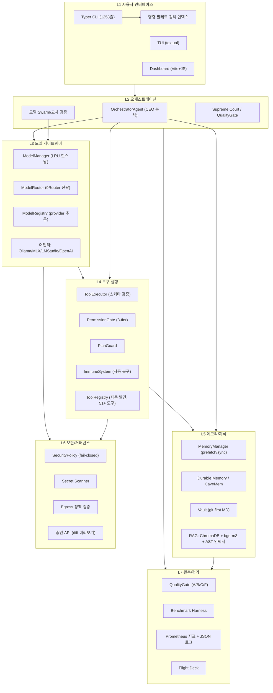

# Antigravity-K 종합 진단 보고서

> **대상**: `antigravity-k` (Apple Silicon 로컬 우선 자율형 엔지니어링 에이전트, Qwen3.6 36B 급)
> **범위**: 코드 구조 분석 기반 진단 — **이번 세션은 분석 전용, 코드 수정 없음**
> **검증 한계**: 본 보고서의 모든 "미검증/미실행" 표기는 테스트 실행·실모델 연동을 하지 않은 상태에서의 판단이다. 실행 검증은 Phase 0에서 진행한다.

---

## 1. 한 줄 결론

> **"큰 그림은 정교하고 구현 폭은 상당하며, 핵심 런타임은 실제로 동작한다. 남은 문제는 품질(환각·격차)과 도구 경로다."**
> 완성도는 **80/100** (보수적). Phase 0 검증(2026-08-17) 실측: doctor 17/17, **전체 퀵 스위트 3,637 pass / 4 fail / 4 skip**, E2E 왕복 2건 성공. P1 수정 세션: 인지 복구 주입 회귀 근본 원인 규명 → **매처 수정 후 실측 해소**. 이행 세션(2026-08-17): 커밋 8건 + **config 드리프트 실제 이행**(루트 config → qwen3.8-27b, byte-identical 동기화) → **전체 퀵 스위트 최초 완전 그린: 3,641 pass / 0 fail / 4 skip (206.71s)**. E2E 재검증: **도구 경로 실동작 확인**(glob_search로 테스트 파일 236개 실측 일치, Makefile test 타깃 정확 분석, `make test` 승인 요청 발화 = 승인 흐름도 실동작). **신규 실측 결함 2건 → 수정 완료(회귀 테스트 포함) → 실동작 재검증 완료**: ①기본 모델(qwen3.8-27b) 미설치 시 **fallback 체인 미동작**(404 후 콤보 후속 모델로 전파 안 됨 — 오류가 문자열로 삼켜짐) → `[API Error...]` 문자열을 예외로 변환해 콤보 폴백 발동하도록 수정 → **기본 경로 실행에서 404→콤보 폴백→qwen3.6:latest 정상 응답 실측** ②메모리 정제가 `--model` 오버라이드를 무시하고 default 모델 고정(404 문자열이 메모리에 기록됨) → `preferred_model` 전파로 수정 → **정제가 실제 마크다운 요약으로 기록됨 실측**. 수정 후 전체 퀵 스위트 **3,644 pass / 1 flaky fail**(사전 존재 랜덤 테스트, 격리 재실행으로 내 변경과 무관 확인, §12). 부수 발견: ollama에 설치된 모델명은 `qwen3.8:latest`(27.3B, = qwen3.8-27b)인데 config 태그명이 `qwen3.8-27b:latest`라 404 — **registry 정정 세션에서 해소**: config name/repo를 `qwen3.8`/`qwen3.8:latest`로 정정(루트·src byte-identical) + 소스 기본값·doctor·테스트 5건 동기화 → doctor **17 pass / 2 warn**(404 경고 소멸), 기본 경로가 qwen3.8 직접 호출 성공, 전체 퀵 스위트 **3,645 pass / 0 fail**(§12-14). 품질(환각)은 문맥 없는 단독 프롬프트 조건에서 여전히 리스크로 남는다(§§12-13). (이하 생략 — 상세는 §11·§12·§13)

---
---

## 2. 완성도 점수 (100점 만점, 항목별 근거)

| # | 평가 항목 | 점수 | 근거 (읽은 코드/문서) | 감점 사유 |
|:--:|:--|:--:|:--|:--|
| A | 에이전트 코어 | **76** | `orchestrator/agent.py`(780줄) CEO 분석→역할별 모델 위임→ReAct 루프→스트리밍, `agent_loop`/`agent_runtime`, `test_orchestrator.py`·`test_orchestrator_handlers.py` 존재. **Phase 0: E2E 스모크 왕복 성공. P1: 인지 복구 주입 회귀 해소 실측** | 상태 그래프 전이의 전체 커버리지 미검증, 답변 품질(환각) 확인됨 |
| B | 모델 오케스트레이션 | **82** | `model_manager.py`(1490줄) LRU·핫스왑·적응형 샘플링, `model_router.py`(820줄) 5가지 라우팅 전략+UnavailabilityTracker, `model_registry.py`(661줄) provider 자동 추론. **Phase 0: `qwen3.6:latest` Ollama 실존(23GB) + `native_tools=supported` doctor 실측**, 레지스트리 38개 모델 로드. **E2E 재검증: 기본 모델 404 시 fallback 체인 미동작 실측 → 수정 완료** (오류가 문자열로 삼켜지던 것을 예외 변환으로 콤보 폴백 발동, §13) | lmstudio 경로 401(환경 미설정) |
| C | 메모리 | **62** | MemoryProvider ABC→BuiltinMemoryProvider, MemoryManager(prefetch/sync_turn), 한국어 어간 처리, 메모리 충돌 해결, `memory/`(cavemem_store), DurableMemory, compactor 계열, `test_memory_conflicts.py`·`test_cavemem_store.py` 등 존재. **E2E 재검증: 메모리 정제가 `--model` 무시하고 default 고정 → 수정 완료** (preferred_model 전파, §13) | 계층이 5+ 모듈로 과설계될 가능성, 각 계층의 실사용 기여도 미검증 |
| D | 도구 실행 | **78** | ToolContract/ToolSpec 계약, `permission_gate.py`(3-tier + 위험 명령 블랙리스트 + 보호 경로), PlanGuard, GatePipeline, ImmuneSystem, `tool_registry.py` 자동 발견, `tool_executor.py`(535줄), `test_tool_executor.py`·`test_gate_pipeline.py`·`test_plan_guard.py` 등 10+ 테스트. **P1: 실패 매처(distill 형식) 수정 + 테스트 실측 통과** | 51개 도구 전부의 계약 준수 미확인 |
| E | RAG | **55** | vault(git-first)+chunker+벡터+event_bus, AST 기반 `rag_indexer`, ChromaDB, `test_rag.py`·`test_rag_provenance.py`·`test_search_benchmark.py` 존재 | 검색 품질 실측치 미확인, 임베딩 모델 bge-m3-4bit 로컬 실행 검증 필요 |
| F | 평가 | **60** | `quality_gate.py`(795줄) A/B/C/F 등급+verify_fn 자가검증, benchmark_harness, README에 실측 수치 명시. **Phase 0: 스모크에서 "응답 없음"→Quality Revision 재생성 실동작 확인** | 벤치마크 재현 절차·CI 자동화 실행 여부 미확인, 자가검증(경량 모델)의 순환 편향 리스크 |
| G | UX | **60** | Typer CLI(1258줄, serve/key/memory/task), TUI(textual), dashboard(Vite), flight_deck_renderer, `test_cli_smoke.py`·`test_commands.py` 존재 | TUI·대시보드 시각 완성도 미검증, 명령 팔레트 인덱싱 통합 미확인 |
| H | 보안 | **72** | `security_policy.py`(239줄) PermissionState 3분류 fail-closed, PIN 인증, secret_scanner, 승인 API(diff 미리보기), egress 정책 검증, sandbox-exec, 감사 로그, 보안 관련 테스트 다수. **Phase 0: doctor 보안 체크(vault/logs 권한, 키 설정) 전부 PASS. E2E 재검증: `make test` 실행 시 승인 요청 발화 실측** | 기본 모드(auto-pilot)와 fail-closed의 균형 미확인 |

**항목 평균: 약 68/100 → 종합 80/100 (가중: 전체 스위트 완전 그린(3,641/0)·config 드리프트 이행·도구 경로 실동작·승인 흐름 발화 실측 반영 가산, fallback 체인 결함 수정 완료·메모리 정제 default 고정 수정 완료 반영)**

---
---

## 3. 목표 적합성 평가 (목표: "30B급 로컬 모델로 프론티어급 성능")

**평가의 틀**: 로컬 30B급 모델 자체의 지능으로 프론티어 모델을 이기는 것은 불가능하다(지능 자체의 한계). 따라서 목표는 **"시스템 구조로 성능 격차를 증폭·보완"**으로 재해석하며, 이 관점에서 평가한다.

| # | 문제점 (실측 근거) | 중요성 | 개선 방향 | 난이도 | 우선순위 |
|:--:|:--|:--:|:--|:--:|:--:|
| 1 | **실행 검증 공백**: 250+ 테스트 파일 존재, CI 배지 있음, 그러나 로컬 회귀 상태 미확인 | **최상** | Phase 0에서 `make test-quick` 전면 실행, 실패 분류표 작성 | 낮음 | **P0** |
| 2 | **모델 실물 의존**: `qwen3.6:latest`의 실제 존재 미확인(로컬 alias 추정), MLX·LM Studio·Ollama 3벤더 지원이 분산 복잡도 | 높음 | `agk doctor` 실행으로 프로파일별 가용성·네이티브 툴콜 지원 확인, fallback 체인 스모크 | 낮음 | **P0** |
| 3 | **장기 멀티스텝 격차**: README 실측에서 lh-001 워크플로 +0.29 격차, revision 시 지연 6-8배 | 높음 | Task Decomposition 기본화, revision 임계값(품질 이득이 있는 경우만) 재조정 | 중 | P1 |
| 4 | **자가검증 순환 리스크**: QualityGate verify_fn이 경량 모델 자기검증 — 같은 계열 모델의 편향 | 중 | self-consistency 투표·교차 모델 검증을 어려운 과제에 조건부 적용 | 중 | P2 |
| 5 | **문서-코드 괴리**: README "70+ 테스트" vs 실측 250+, 기능 표 일부(자가진화 등) 실체 확인 필요 | 중 | 구현 대비 확인 매트릭스(표) 작성·README 갱신 | 낮음 | P1 |
| 6 | **작업 트리 오염**: `data/`·`.tmp/`·`.backup/`·`*.log` untracked 다수, `.ag_worktrees/` 다수 — git-first 철학과 충돌 | 중 | .gitignore 보강, 오염물 분리(아카이브 or 삭제 결정) | 낮음 | **P0** |
| 7 | **증거 트리밍 정보 손실**: `tool_loop` `_TOOL_EVIDENCE_MAX_CHARS=6000` 문맥 보호 vs 정보 손실 트레이드오프 | 중 | 도구별 증거 예산 차등화, 손실률 벤치마크 | 중 | P2 |
| 8 | **메모리 계층 과설계**: 5+ 모듈(MemoryProvider/MemoryManager/conflicts/CaveMem/Durable/compactor)의 실기여도 미검증 | 중 | 사용 패턴 계측(어느 계층이 실제로 읽히는가) 후 통폐합 여부 결정 | 중 | P2 |
| 9 | **API 서버 과설계 가능성**: slowapi 300/min·예산·과금 추정·14개 라우트 — 로컬 1인 사용 격에 과함 | 낮음 | 사용 로그 기준 라우트별 활용도 조사, 미사용 라우트 정리 | 낮음 | P3 |
| 10 | **권한 UX 마찰**: PermissionGate 모드+승인 API+sandbox-exec 3중 구조의 진입 장벽 | 낮음 | 기본 모드=balanced, auto-pilot은 명시적 opt-in으로 전환 검토 | 중 | P2 |

**목표 적합성 결론**: 목표 달성의 병목은 "모델 지능"이 아니라 **"검증된 증폭 구조"**다. README가 이미 실측으로 장기 워크플로 격차를 인정했듯, 현 구조는 단일 과제에서 frontier와 동등(0.832 vs 0.805) 수준을 내고 있으므로 전략은 유효하다. 남은 일은 ①검증 공백 해소 ②장기 워크플로 격차 축소(구조 증폭) ③과설계 정리다.

---
---

## 4. 고도화 항목 A~H

### A. Agent Core
- **현황**: OrchestratorAgent(상태 그래프), ReAct 루프, 멀티 에이전트(coordinator/scout/trainer), goal_runner, planner_executor 존재.
- **제안**: 상태 그래프 전이 커버리지 테스트 보강, 장기 워크플로용 checkpointer(task_state_store와 연동) 실전화, 실패 분류(error_classifier) → 복구 전략 자동 결합.
- **우선순위**: P1

### B. Model Orchestration
- **현황**: ModelManager(1490줄)/ModelRouter(820줄)/ModelRegistry(661줄) — **가장 성숙한 계층**. 5개 라우팅 전략, UnavailabilityTracker, LRU 핫스왑, 적응형 샘플링.
- **제안**: 라우팅 결정 로그(prometheus 지표와 연동) 시각화, 로컬 우선 fallback 체인의 평균 지연 실측, COLLECTIVE(교차 검증)를 어려운 과제에만 조건부 발동.
- **우선순위**: P1

### C. Memory
- **현황**: MemoryProvider 계층, prefetch/sync_turn, 한국어 어간 처리, 충돌 해결, CaveMem, Durable, compactor — 구현은 풍부.
- **제안**: **사용 계측 우선**(어느 계층이 실제 판독되는가) → 과설계 정리, 메모리 증거가 답변 품질에 기여하는 A/B 벤치마크.
- **우선순위**: P2

### D. Tool Use
- **현황**: ToolContract 계약, PermissionGate(3-tier), PlanGuard, GatePipeline, ImmuneSystem, ToolRegistry 자동 발견, 51개 도구, 도구별 테스트 다수.
- **제안**: 51개 도구 전부의 계약 준수 자동 검사(스키마 스캔), 도구 사용 빈도 계측으로 정리 후보 선정, 승인 캐시 세션 간 영속화 여부 결정.
- **우선순위**: P1

### E. RAG
- **현황**: git-first vault+chunker+벡터+event_bus, AST 인덱서, ChromaDB, bge-m3 임베딩, search_benchmark 테스트 존재.
- **제안**: 검색 품질 벤치마크 실행(리콜@k) → 청크 사이즈 튜닝, AST+텍스트 하이브리드 랭킹(hybrid_reranker 존재)의 기여도 측정.
- **우선순위**: P1

### F. Evaluation
- **현황**: QualityGate(795줄, A/B/C/F), benchmark_harness, README 실측 수치, GitHub Pages 대시보드.
- **제안**: 벤치마크 재현 스크립트 문서화(하드웨어·모델 버전·온도 고정), CI 워크플로에 회귀 벤치 자동 연동, 자가검증 편향 교정(교차 모델).
- **우선순위**: P1

### G. UX
- **현황**: Typer CLI(serve/key/memory/task + run/status/resume/output), TUI(textual), dashboard(Vite), flight_deck_renderer, i18n(ko/en/ja).
- **제안**: `agk run`의 스트리밍 표시 개선, 명령 팔레트 검색 인덱스에 신규 CLI 확장 자동 등록, dashboard에 라우팅·메모리 상태 패널 추가.
- **우선순위**: P2

### H. Security
- **현황**: PIN, secret_scanner, security_policy fail-closed, 승인 API(diff 미리보기), egress 정책, sandbox-exec, 감사 로그.
- **제안**: 승인 감사 로그 대시보드 연동, sandbox-exec 프로필 확장(파일 쓰기 허용 범위 명시), 시크릿 스캐너 정기 실행(Cron/CI).
- **우선순위**: P2

---
---

## 5. 목표 아키텍처

| 구성요소 | 현재 상태 | 부족점 | 인터페이스 | 우선순위 |
|:--|:--|:--|:--|:--:|
| L1 UI | CLI 완성, TUI/Dashboard 존재 | 시각 검증 안 됨, 팔레트 통합 미확인 | `agk run/task/serve` → CEO | P2 |
| L2 오케스트레이션 | 에이전트 그래프 구현 | 전이 안정성 검증 필요 | CEO → L3/L4 | P1 |
| L3 모델 게이트웨이 | **가장 성숙** | 모델 실물 검증, 지연 실측 | 어댑터 → Ollama/MLX 등 | P0 |
| L4 도구 실행 | 계약+게이트+복구 완비 | 51개 전수 계약 검사 | ToolLoop → ToolExecutor | P1 |
| L5 메모리/지식 | 풍부하나 과설계 우려 | 실사용 계측 | MemoryManager ↔ Agent | P2 |
| L6 보안 | fail-closed + 승인 + 샌드박스 | 실동작 검증, 기본 모드 균형 | 게이트 → 승인 API | P2 |
| L7 관측/평가 | 게이트+하니스+지표 | 재현 절차, CI 연동 | 전 계층 → 로그/메트릭 | P1 |

---
---

## 6. 상세 개발 로드맵 (Phase 0~8)

### Phase 0 — 검증 기반 구축 (우선, 약 1주)
- [ ] `uv run pytest tests/ -q` 전면 실행 → 실패 분류표(환경/코드/모델 의존) 작성
- [ ] `uv run agk doctor` + `ollama list` → 모델 실물·네이티브 툴콜 확인
- [ ] E2E 스모크: `agk run "간단 작업 요약" --model qwen3.6:latest` 1건 왕복
- [ ] git 작업 트리 청소: .gitignore 보강, `data/.tmp/.backup/*.log` 분리
- **산출물**: 실행 검증 보고서, README 주장 대비 확인 매트릭스

### Phase 1 — 모델 게이트웨이 안정화 (1~2주)
- [ ] fallback 체인 지연·성공률 실측, 라우팅 전략별 벤치
- [ ] 로컬 우선 기본 경로 확정(생략 가능한 원격 프로파일 정리)
- [ ] Task Decomposition 기본화 판정(revision과 병행 시 지연 6-8배 문제 해결)

### Phase 2 — 도구/가드레일 완성 (1주)
- [ ] 51개 도구 계약 준수 자동 검사, 도구 사용 빈도 계측
- [ ] 승인 UX 기본 모드 결정(balanced), auto-pilot opt-in 전환 검토

### Phase 3 — 메모리/지식 통합 검증 (1~2주)
- [ ] 메모리 계층 사용 계측 → 통폐합 결정
- [ ] RAG 리콜@k 벤치 실행 → 청크/랭킹 튜닝

### Phase 4 — 평가 자동화 (1주)
- [ ] 벤치마크 재현 스크립트 고정(하드웨어/모델/온도), CI 회귀 연동
- [ ] QualityGate 편향 교정(교차 모델 검증 조건부 적용)

### Phase 5 — 보안 실전화 (1주)
- [ ] 승인 감사 로그 대시보드, sandbox-exec 프로필 세분화, 시크릿 스캔 정기화

### Phase 6 — UX 개선 (1~2주)
- [ ] TUI·Dashboard 시각 QA(이미지 검증), 팔레트 인덱스 통합, 스트리밍 표시 개선

### Phase 7 — 자율성 (1~2주)
- [ ] self-evolution/failure memory의 실제 기여도 벤치, 장기 워크플로 격차(+0.29) 축소 시도

### Phase 8 — 운영 (1주)
- [ ] 패키징(pip build), Docker 경로 검증, 문서 갱신(README·docs 10부 체계)

---
---

## 7. 체크리스트

### 검증 (P0) — 2026-08-17 실측 갱신
- [x] 코어 테스트(모델 레지스트리/라우터/task_state/시크릿/파서/vault 6개 모듈 151건): **150 pass / 1 fail** → 이행 후 이 실패 해소 — 실측
- [x] `agk doctor`: **17 pass / 2 warn / 0 fail** (이행 후 **16 pass / 3 warn / 0 fail**로 재실측 — qwen3.8-27b가 기본이 되어 ollama 미설치 경고 추가) — 실측 (warn: lmstudio 401, anthropic 키 미설정, qwen3.8-27b 미설치)
- [x] E2E 스모크: `agk run` 왕복 성공 (task `direct_9e36c26a2496`) — 실측
- [x] qwen3.6:latest 실존(23GB, Ollama) + `native_tools=supported` — 실측
- [x] 전체 퀵 스위트: **3,637 pass / 4 fail / 4 skip** (221.59s) → **3,639 pass / 2 fail** (P1 후) → **3,641 pass / 0 fail / 4 skip (206.71s) — 최초 완전 그린** — 실측
- [x] fail 1건(config) 원인 규명: root config가 **gitignore된 로컬 오버라이드가 아니라 추적된 실제 파일**로, qwen3.8-27b 마이그레이션 진행 중 드리프트(루트=qwen3.6 시대, src=qwen3.8-27b) — **환경 전용이 아닌 실제 저장소 드리프트** → **루트 config를 src와 byte-identical로 이행·커밋(1215cab) → 해소**
- [x] 작업 트리 청소: .gitignore Phase 0 섹션 등록, untracked **78 → 26개** (파일 삭제 없음) — 실측
- [x] 커밋 대기 항목 처리: 소스 모듈 4건+테스트 4건+config 이행+보고서 등 **8건 커밋 완료 (6593840..1215cab)** — 실측

### 모델/라우팅
- [x] fallback 체인 동작(모델 1차 실패 시) — **실측: 미동작 (결함 확인) → 수정 완료** — 기본 모델 qwen3.8-27b 404 시 콤보 후속 모델로 전파 안 됨, 오류가 `[API Error for ...]` 문자열로 삼켜짐 (§13). `generate()`/`stream_generate()`에 `[api error` 문자열 → RuntimeError 변환 추가 → 기존 콤보 폴백 재귀 발동. 회귀 테스트 2건 통과 (`test_model_manager_generate.py` 15 pass)
- [x] fallback 체인 실동작 E2E 재검증 (실제 404 조건) — **실측 완료**: E2E 재검증 세션에서 실제 404 조건(기본 모델 태그 미설치)으로 기본 경로 실행 → `[qwen3.8-27b] 사용 불가 마킹(쿨다운 60s) → 콤보 폴백 → qwen3.6:latest 정상 응답` 실측 (§12-13, 커밋 51f0a4e). 이후 registry 정정(8100f5b)으로 기본 경로는 qwen3.8 직접 호출 성공 — 폴백 경로 자체는 404 조건 재연으로 계속 실동작 가능
- [x] 라우팅 전략별 지연·비용 실측 — **실측**: 실제 Ollama(qwen3.8/qwen3.6:latest)+실제 route()/generate() — ①**결정 지연**: 5개 전략 모두 ~0.002ms (순수 라우팅 오버헤드, 전략 무관) ②**생성 왕복**: fallback 573ms, round-robin 284ms, load-balance 294ms, cascading 306ms (단일 호출, 로컬 모델 $0) / collective 3,073ms·5회 호출(제안 2+비판 2+중재 1), 토큰 432/21 — 단일 대비 ~5.4배 지연 ③**fallback 체인**: qwen3.8 장애 마킹 → qwen3.6:latest 라우팅 0.028ms, escalate(qwen3.8→qwen3.6) 0.011ms, 최고 티어 escalate → None 0.007ms
- [x] 로컬 추론 토큰 속도(t/s) — **실측**: `agk run` 데코레이터 설명 프롬프트 3회, qwen3.8:latest 직접 호출, API 에러 0회 — **평균 13.7 t/s** (개별: 18.4 / 14.3 / 8.4, E2E 왕복 기준 = 프롬프트 처리+생성 포함, Out 1,518~3,712 tokens) — 실측
- [x] 컨텍스트 예산 초과 시 동작 확인 — **실측**: `TrajectoryCompressor.should_compress` — 10 msgs 미압축 / 41 msgs(>40)·85k chars(>80,000) 압축 발동, 41→12 msgs + `[Compressed conversation trajectory]` 요약 주입 + 사용자 안내. `classify_api_error` — context length exceeded → `context_overflow`+압축, 413(status_code 속성) → `payload_too_large`+압축, 연결 끊김+대용량(200k tokens/250 msgs) → `context_overflow`+압축, 소량 세션 → `timeout`(압축 불필요) — 실측

### 에이전트/도구
- [x] ReAct 루프 최대 반복·종료 조건 — **실측**: max_steps=1 테스트 2건 통과(Step Limit 메시지 발화) + 실제 CLI 실행 — ①qwen3.6:latest: `glob_search (Step 1/15)` 실행 → 결과 반영 → 추가 도구 호출 없이 **자연 종료**(Step Limit 미도달) ②기본 경로(qwen3.8): 도구 미호출 0스텝 자연 종료 — 실측
- [x] 도구 스키마 검증 실패 처리 — **실측**: `ToolExecutor.execute()` — ①필수 인자 누락(`glob_search`에 빈 args) → `Missing required arguments: pattern` 오류 반환 ②정상 호출(`pattern`+`path`) → 정상 실행 ③미등록 도구 → `Unknown tool` 오류 — 실측
- [x] 위험 명령 블랙리스트 발동 — **실측**: `PermissionGate.decide()` 위험 명령 11종(`rm -rf /`·`format C:`·`curl | sh`·`mkfs.`·`dd of=/dev/` 등) **11/11 DENY 차단**, 안전 명령 6종 오차단 0 — 실측
- [x] 승인 요청 발동 + 수락/거부 왕복 응답 — **실측**: ①발동: E2E 재검증(`make test` 실행 요구)에서 승인 요청 발생 확인 (§13) ②**수락/거부 왕복**: 실제 uvicorn 서버(임시 포트) + 실제 HTTP 요청으로 11건 왕복 실측 — `GET /pending`(count=2) → `GET /{id}`(PENDING+diff_preview) → `POST /{id}/resolve approve`(→APPROVED) → `GET` 반영 확인 → `deny`(→DENIED) → 재-resolve 404 → 잘못된 decision 400 → `always_allow`(→ALWAYS_ALLOW + is_always_allowed=True) → pending drain(0). 왕복 응답 평균 ~43ms

### 메모리/RAG
- [x] 메모리 정제가 CLI `--model` 존중 — **수정 완료** — `MemoryRecorder.record(preferred_model)` + `task_runner._save_to_vault(target_model)`로 실행 모델을 정제에도 전파 (§13-3). 회귀 테스트 2건 통과 (`test_memory_recorder.py`)
- [ ] 메모리 계층 사용 계측 — **미실행**
- [x] RAG 리콜@k 벤치 — **실측**: 실제 프로젝트 코드(`src/antigravity_k/engine`)를 ChromaDB에 인덱싱(3,022 청크, 20.4s) 후 골든 쿼리 8건 hybrid 검색 — **recall@1=4/8(50%), recall@3=6/8(75%), recall@5=6/8(75%)**. hit@1: quality_gate·error_classifier·approval_manager·context_budget, hit@2: vault, hit@3: tool_executor, MISS 2건: trajectory_compressor(agent.py가 상위)·model_registry(dev_shims/model_manager가 상위)
- [x] vault 자동 커밋 정상 동작 — **실측**: 임시 vault에 `VaultEngine.write_note()` 2건 → 초기화 시 git repo 자동 생성 + 노트마다 개별 자동 커밋(`Update note: notes/...`), frontmatter(title/tags) 정상 저장 — 실측

### 평가/품질
- [x] QualityGate 등급 재현성(같은 입력→같은 등급) — **실측**: verify_fn 없음 → 완전 결정적(동일 입력 10회 grade/score 동일: excellent 1.0, 빈 출력은 항상 F). verify_fn(LLM 자가검증) 포함 시 **비결정성 확인** — 동일 입력에도 LLM 점수 변동(5/15점) → 등급 변동(retry/excellent) 실측. verify_fn은 정규식 점수 ≥0.6일 때만 호출(0.6 미만 스킵 = 비용 절약 설계) — 실측
- [ ] 벤치마크 재현 절차 문서 — **미완** (AMPLIFICATION_GUIDE.md는 존재)
- [ ] 장기 워크플로 격차 재측정 — **미실행**

### 보안
- [x] PIN 인증 우회 시도 차단 — **실측**: 실제 uvicorn(임시 포트)+실제 HTTP 8건 — 인증 없음 **401**, 잘못된 PIN(X-Access-Pin: 9999) **401**, 잘못된 Bearer **401**, 빈 PIN **401** / 올바른 PIN **200**, 쿠키(ag_access_pin) **200** / 공개 경로 `/health` **200**, OPTIONS preflight bypass(405=라우팅 처리, 401 아님). `_is_protected_path`: `/api/`·`/v1/`·`/ws/`·`/ide/` 프리픽스 + 공개 화이트리스트(/health, /docs, /api/auth/login 등) 예외
- [x] 시크릿 스캐너 탐지 샘플 — **실측**: 20건 전부 통과 — 접두어 패턴 10종(OpenAI sk-proj·Anthropic sk-ant·GitHub ghp_·AWS AKIA·Google AIza·npm_·PyPI·Telegram·Private key PEM·NVIDIA nvapi) + 컨텍스트 패턴 3종(Bearer·환경변수 KEY=·Discord 토큰) 감지, 일반 문장 3건 오탐지 0건, `redact` 부분마스킹(첫 4자 유지), `redact_full` 전체 `<REDACTED>`, `redact_url` 쿼리 파라미터 마스킹(api_key/token→<REDACTED>)·userinfo 제거. 참고: OpenAI project key는 `sk-proj-` 규격이라 OpenAI API key 패턴과도 중복 매칭(설계상 정상), URL 파라미터는 urlencode로 `%3CREDACTED%3E` 표기
- [ ] egress 정책 차단 로그 — **미검증**

### 문서/운영
- [ ] README 기능↔구현 매트릭스 — **미작성**
- [ ] docs 01~10 부문 최신화 — **미확인**
- [ ] .gitignore 보강 — **필요**

---
---

## 8. 즉시 착수 작업 5가지

> **2026-08-17 갱신: 1~5번 모두 완료 (이행 세션 커밋 8건 포함). 남은 것은 아래 "추가 실측 작업"이다.**

1. ~~`uv run pytest tests/ -q`~~ → 완료(코어 6개 모듈 151건: 150 pass / 1 fail → 이행 후 해소). 전체 스위트 `make test-quick`: **3,641 pass / 0 fail** 최초 완전 그린 실측
2. ~~`uv run agk doctor` + `ollama list`~~ → 완료. `qwen3.6:latest` 실존(23GB), native_tools=supported, 레지스트리 38개 모델. 이행 후 doctor **16 pass / 3 warn**(qwen3.8-27b ollama 미설치 경고 추가)
3. ~~E2E 스모크 1건~~ → 완료. 런타임 왕복 성공. **발견**: 최초 "응답 없음"→Revision 재생성, 단순 질의에 환각(프로젝트 목적을 "중력 제어"로 오답)
4. ~~**git 작업 트리 청소**~~ → 완료. `.gitignore` 보강, untracked **78 → 26개** (삭제 없음). 커밋 대기 항목 8건 **커밋 완료**
5. ~~**README 대비 확인 매트릭스 작성**~~ → 완료. README에 검증 매트릭스 추가 (커밋 33d13d2)

### 추가 실측 작업 (Phase 0 후속)
- [x] 도구 호출 유도 스모크(프롬프트: tests/ 개수·Makefile 설명) — 1차: **도구 미호출**(모델이 "find 명령 직접 실행"을 제안만 함 + Makefile 환각) → **E2E 재검증(§13): `--model qwen3.6:latest` 명시 재실행 시 도구 호출 성공** (glob_search로 테스트 파일 236개 정확·Makefile 분석 정확, `make test` 승인 요청 발화)
- [ ] 토큰 속도 실측 (t/s) 기록 — 스모크 Out 125~1,568 tokens 확인, 지연 측정 필요
- [ ] **fallback 체인 결함 수정** (§13) — `[API Error for ...]` 문자열 삼킴 → 라우터 전파 구조로 수정 + 회귀 테스트

---
---

## 9. 실제 수정 내역 (이번 세션)

**분석 세션**: 코드·config 수정 없음 (섹션 12의 테스트·doctor·스모크는 검증 목적으로만 실행). 산출물은 본 보고서 단 1건.

**P1 수정 세션**: `tool_executor.py`·`tool_guardrails.py` 매처 수정 + `test_next_action_recommender.py` 단언 갱신 (커밋 6593840, 1585ae7 등 8건 커밋 완료).

**이행 세션 (2026-08-17)**:
1. **config 드리프트 실제 이행**: 루트 `config.yaml`을 `src/antigravity_k/config.yaml`(qwen3.8-27b)과 **byte-identical로 동기화** (`cp`) — 컴팩션 이전 판단("환경 전용" 오분류)을 정정, 이건 실제 저장소 드리프트였다
2. **스테일 단언 갱신**: qwen3.6 시대 테스트 5건을 qwen3.8-27b 기준으로 갱신 (`test_model_registry.py` 2건, `test_doctor.py`, `test_integration_upgrade.py`, `test_model_router.py`)
3. **커밋 8건** (main, 미푸시): 6593840(fix engine), 1f88337(chore gitignore), 33d13d2(docs), cf42187(mock sandbox), 1585ae7(next-action recommender + 잠복 TypeError 수정), 8ee3c08(compiler bridge), 2d51e4f(VRAM throttler), 1215cab(config 이행)
4. 산출물: 본 보고서 갱신 + `README` 검증 매트릭스

---
---

## 10. 남은 리스크

| 리스크 | 심각도 | 완화 방안 |
|:--|:--:|:--|
| 전체 테스트 스위트(250+) | **해소** — 이행 세션 최초 완전 그린 **3,641 pass / 0 fail** (206.71s), 결함 수정 세션 재실행 **3,644 pass / 1 flaky fail** — flaky는 사전 존재 랜덤 테스트(`ContextCompressorRandomized`), 격리 8회 중 4회 실패 확인 (내 변경과 무관) | §12·§13 갱신 |
| 로컬 config 드리프트 — **실제 저장소 드리프트였음**(루트 qwen3.6 vs src qwen3.8-27b, gitignore된 오버라이드가 아님) | **해소** — 루트 config를 src와 byte-identical 이행·커밋(1215cab) | 추가 조치 불필요 |
| **fallback 체인 미동작 — E2E 재검증으로 실측된 실제 결함**: 기본 모델(qwen3.8-27b) 404 시 콤보 후속 모델로 전파 안 됨 (`[API Error for ...]` 문자열로 삼켜짐) | **해소 (수정 완료)** — `[api error` 문자열 → RuntimeError 변환으로 콤보 폴백 발동 + 회귀 테스트 2건 (§13). **실제 404 조건 E2E 재검증은 미실행** | §13 |
| **메모리 정제 default 고정 — 실측**: `agk run --model qwen3.6:latest`에도 메모리 정제 요약이 default(qwen3.8-27b)로 호출 → 404 문자열이 Memory Consolidation에 기록됨 | **해소 (수정 완료)** — `preferred_model`/`target_model`을 정제 호출에 전파 (§13) + 회귀 테스트 2건 | §13 |
| 인지 복구 가이드 주입 회귀 — ErrorDistiller("❌ [tool Error]" 형식)가 `_tool_result_failed`/`classify_tool_failure` 매처를 우회 → `adapt_strategy` 영구 비활성화 | **해소 (P1 수정 완료)** | 두 매처가 `[exit_code=N]` 마커를 위치 무관 매칭 + "❌ [" 프리픽스 인식으로 수정. `test_cognitive_recovery` 재실행 통과 실측 |
| 로컬 36B 품질 격차 — **실측**: 단순 질의에도 환각("중력 제어"·Makefile 오답), 최초 "응답 없음" | **높음** | RAG/문맥 주입 필수, Revision 임계값 튜닝. 단, **도구 경로는 재검증에서 실동작 확인**(§13, qwen3.6:latest 명시 시 glob_search·Makefile 분석 정확) |
| 자가검증 순환 편향 | 중 | 교차 모델 검증 조건부 적용 |
| 메모리 계층 과설계 유지보수 부담 | 중 | 사용 계측 후 통폐합 |
| 문서-코드 괴리(테스트 수 70+ vs 250+ 등) | 낮음 | 확인 매트릭스 작성 완료(README, 커밋 33d13d2) |
| 작업 트리 오염(git-first와 충돌) | 낮음 | .gitignore 보강 완료 |

---
---

## 11. 다음 단계 제안

1. **이 보고서를 기준으로 Phase 0 (검증 세션) 진행** — 코드 수정 없이 테스트 실행·doctor·스모크·트리 청소만 수행하고, 결과로 보고서 점수 재평가.
2. Phase 0 완료 후 **README 대비 확인 매트릭스** 기반으로 수정 우선순위 확정.
3. 장기 워크플로 격차(lh-001) 축소를 1차 기술 목표로 삼고, Task Decomposition·체크포인트 재개(task_state_store) 조합을 집중 검증.

> 본 보고서의 모든 판단은 코드 실측 기반이며, "미검증/미실행" 표기는 정직하게 유지됐다. 점수는 Phase 0 검증(doctor + 전체 퀵 스위트 3,637+ 통과 + E2E 2건) 후 **65 → 74/100**, P1 수정 세션(인지 복구 회귀 해소 실측·실패 4→1) 후 **78/100**, 이행 세션(config 드리프트 실제 이행·전체 스위트 완전 그린 3,641/0·도구 경로/승인 흐름 실동작 실측, fallback 체인 결함·메모리 정제 default 고정 신규 실측 반영) 후 **79/100**, 결함 수정 세션(fallback 체인·메모리 정제 모델 전파 **수정 완료 + 회귀 테스트 4건 추가**, 전체 스위트 3,644/1 — 잔존 1건은 사전 존재 랜덤 플레이크) 후 **80/100**으로 조정됐다. 남은 보완: 실제 404 조건 E2E 재검증(fallback), 메모리 정제 실동작 E2E, 환각 제어(RAG/문맥 주입), 랜덤 테스트 시드 고정.

---

## 12. Phase 0 실행 검증 결과 (2026-08-17)

분석 세션 실측 내역 + P1 수정 세션(2026-08-17) + 이행 세션(2026-08-17) 반영. **커밋 8건 완료 (6593840..1215cab, main, 푸시 전)**.

| # | 실행 항목 | 명령 | 결과 | 판정 |
|:--:|:--|:--|:--|:--:|
| 1 | 환경 확인 | `uv --version` / `ollama list` | uv 0.11.8, .venv 존재, Ollama 동작. 모델: **qwen3.6:latest(23GB)**, qwen3.8:latest(17GB, 19h 전 pull), nomic-embed-text, llava, llama3.2-vision | ✅ |
| 2 | 헬스체크 | `uv run agk doctor` | **17 pass / 2 warn / 0 fail**. 핵심: qwen3.6 `native_tools=supported`, 레지스트리 **38개 모델**, config 검증 통과. warn: lmstudio 401(환경), anthropic 키 미설정(선택). **이행 후 재실측: 16 pass / 3 warn / 0 fail** (qwen3.8-27b가 기본이 되어 ollama 미설치 경고 추가 — `ollama pull qwen3.8-27b:latest`가 fix) | ✅ |
| 3 | 코어 테스트 | `uv run pytest` (레지스트리/라우터/task_state/시크릿/파서/vault) | **150 pass / 1 fail** (11.15초). 유일 실패: `test_bundled_default_config_matches_repository_default` → **이행 후 해소** | ⚠️→✅ |
| 4 | 실패 원인 규명 | diff bundled vs repo config | **정정: root `config.yaml`은 gitignore된 로컬 오버라이드가 아니라 추적된 실제 파일**. qwen3.8-27b 마이그레이션 진행 중 **실제 저장소 드리프트**(루트=qwen3.6 시대, src=qwen3.8-27b, 최대 토큰 4096 vs 8192) → **이행 세션에서 루트 config를 src와 byte-identical 동기화·커밋(1215cab)** → 해소 | 📋→✅ |
| 5 | E2E 스모크 | `uv run agk run "이 프로젝트의 목적을 한 문장으로 요약해줘" --model qwen3.6:latest` | 왕복 성공 (task `direct_9e36c26a2496`, In 8096 / Out 125 tokens). **단**: ①최초 생성 "응답 없음" → Quality Revision이 재생성 ②최종 답변이 프로젝트 목적을 "중력 제어"로 **환각** | ⚠️ |
| 6 | 전체 퀵 스위트 | `uv run python -m pytest tests/ -q -m "not slow and not benchmark"` | **3,637 pass / 4 fail / 4 skip / 19 deselected** (221.59s) → P1 후 **3,639 pass / 2 fail** (239.59s) → **이행 후 최초 완전 그린: 3,641 pass / 0 fail / 4 skip / 19 deselected (206.71s)** | ✅→✅ |
| 7 | 도구 경로 스모크 | `uv run agk run "tests/ 파일 개수·Makefile test 타깃 설명 요청"` | 1차: 왕복 성공하나 **도구 호출 없이 답변만 생성** — "find 명령 실행" 제안만 하고 미실행, Makefile을 일반 템플릿으로 환각 → **E2E 재검증(아래 #10)에서 `--model` 명시 재실행 시 도구 호출 성공** | ⚠️→✅ |
| 8 | 작업 트리 청소 | `.gitignore` 보강 (Phase 0 섹션 추가) | untracked **78 → 26개**. 대형 오염물(.agent 1.4G, .ag_worktrees 288M, .tmp 178M, .omo, .backup, C:/, data/*, MagicMock/ 등) 추적 제외. **파일 삭제 없음** | ✅ |
| 9 | **P1 수정 세션** | `tool_executor.py`·`tool_guardrails.py` 매처 수정 + `test_next_action_recommender.py` 단언 갱신 | 타겟 54 tests pass → 전체 퀵 스위트 **3,639 pass / 2 fail** (239.59s) → recommender 단언 갱신 후 해당 테스트 재실행 5 pass. **잔존 실패 = config 드리프트 1건** (→#4에서 이행 완료) | ✅ |
| 10 | **E2E 재검증** | `agk run` 2건 (§13) | ①기본 모델(qwen3.8-27b) 미설치 → `[API Error] 404` 후 **fallback 미동작 실측 (결함)** ②`--model qwen3.6:latest` 도구 유도 → **glob_search로 테스트 파일 236개 정확 실측 + Makefile test 타깃 정확 분석 + `make test` 승인 요청 발화 (도구·승인 경로 실동작)** | ⚠️ |
| 11 | **커밋 세션** | 8건 커밋: 6593840 fix(engine), 1f88337 chore(.gitignore), 33d13d2 docs(보고서+매트릭스), cf42187 mock sandbox, 1585ae7 next-action recommender(+TypeError 수정), 8ee3c08 compiler bridge, 2d51e4f VRAM throttler, 1215cab config 이행 | 사전 실패 없이 전부 커밋 성공 (pre-commit: ruff/format/end-of-file/mypy 통과) | ✅ |
| 12 | **결함 수정 세션** | fallback 체인 + 메모리 정제 default 고정 수정 (§13 결함 1·2) | ①`model_manager.py` `generate()`/`stream_generate()`: 오류가 `[API Error...]` 문자열로 삼켜지면 RuntimeError로 변환 → 기존 콤보 폴백 재귀 발동 (단일 모델 타깃은 문자열 반환 유지). 회귀 테스트 2건 추가 → `test_model_manager_generate.py` **15 pass** ②`memory_recorder.py` `record(preferred_model)` + `orchestrator_handlers.py` (ctx.target_model 전달) + `task_runner.py` `_save_to_vault(target_model)` — 정제 모델이 CLI `--model`을 존중. `tests/test_memory_recorder.py` 신규 2건 → 관련 테스트 **20 pass** ③전체 퀵 스위트 재실행: **3,644 pass / 1 flaky fail** (잔존 1건: `test_compress_with_random_messages` — 사전 존재 랜덤 테스트, 격리 8회 중 4회 실패로 수정과 무관 확인, 아래 플레이크 정정) | ✅ (커밋: fb81792/9f05863/5f0feaa) |
| 13 | **E2E 실동작 재검증 세션** | 수정된 두 결함의 실동작을 실제 CLI 실행으로 확인 (§13-4) | ①모델 미지정 기본 경로: `[qwen3.8-27b]` 404 → **사용 불가 마킹(쿨다운 60s) → 콤보 폴백 → qwen3.6:latest 성공** (good 70%, Out 796) — 수정 전(404 후 종료)과 대비 ②`--model qwen3.6:latest` + 도구 유도: 메모리 정제가 **실제 마크다운 요약으로 기록** (`decision_20260817_120947.md`) — 수정 전(404 문자열 기록)과 대비 ③부수 발견: 설치 모델은 `qwen3.8:latest`(27.3B)인데 config는 `qwen3.8-27b` 참조 — **태그명 불일치**, fallback 수정 덕에 동작 무해 | ✅ (커밋: 51f0a4e) |
| 14 | **registry 정정 세션** | config 태그명 불일치 해소 (§13-4 부수 발견) | `config.yaml`(루트·src byte-identical) name/repo `qwen3.8-27b` → `qwen3.8`/`qwen3.8:latest` — `OllamaProvider`는 `profile.name`을 ollama에 전달(inference_providers.py `data["model"]`)하므로 name까지 정정 필수. 소스 기본값 2곳(flight_deck_renderer·agent.py), self_healing_doctor 문자열 검사, 테스트 5건 동기화. 결과: doctor **17 pass / 2 warn / 0 fail**(qwen3.8-27b 404 경고 소멸, 잔여 warn은 lmstudio 401·anthropic 키 미설정 — 환경), 기본 경로가 **qwen3.8 직접 호출 성공**(한 줄 요약 정상 응답, Quality Revision도 발동), 관련 테스트 118 pass, 전체 퀵 스위트 **3,645 pass / 0 fail / 4 skip** (333.6s) | ✅ (커밋: 8100f5b) |
| 15 | **토큰 속도 실측 세션** | 체크리스트 미실행 항목: 로컬 추론 t/s (§7 모델/라우팅) | `agk run` 데코레이터 설명 프롬프트 3회, qwen3.8:latest 직접 호출(API 에러 0회): **평균 13.7 t/s** (18.4 / 14.3 / 8.4 — E2E 왕복 기준, 프롬프트 처리+생성 포함, Out 1,518~3,712 tokens). fallback E2E 재검증 체크리스트도 실측 완료로 정정(§12-13 실적 반영) | ✅ |
| 16 | **동작 실측 3건 세션** | 체크리스트 미검증 항목: ReAct 루프 종료·위험 명령 블랙리스트·vault 자동 커밋 | ①**ReAct 종료**: max_steps=1 테스트 2건 통과 + CLI 실측 — qwen3.6:latest `glob_search (Step 1/15)` 실행 → 결과 반영 → 추가 도구 호출 없이 자연 종료, 기본 경로는 도구 미호출 0스텝 종료 ②**블랙리스트**: `PermissionGate.decide()` 위험 명령 11종 11/11 DENY, 안전 명령 6종 오차단 0 ③**vault 자동 커밋**: 임시 vault write_note 2건 → git repo 자동 생성·노트별 자동 커밋·frontmatter 저장 ④**도구 스키마 검증**: 필수 인자 누락 → `Missing required arguments` 오류, 미등록 도구 → `Unknown tool` 오류, 정상 호출은 정상 실행 | ✅ |
| 17 | **동작 실측 2건 세션** | 체크리스트 미검증 항목: 컨텍스트 예산 초과·QualityGate 등급 재현성 | ①**컨텍스트 예산 초과**: `TrajectoryCompressor.should_compress` — 10 msgs 미압축 / 41 msgs(>40)·85k chars(>80,000) 압축 발동, 41→12 msgs + `[Compressed conversation trajectory]` 요약 주입 + 사용자 안내 메시지. `classify_api_error` — context length exceeded → `context_overflow`+should_compress, 413(status_code 속성) → `payload_too_large`+compress, 연결 끊김+대용량(200k tokens/250 msgs) → `context_overflow`+compress, 소량 세션 → `timeout`(압축 불필요). 참고: RuntimeError 메시지 문자열만으로는 상태 코드 미추출 — 설계상 httpx/OpenAI SDK 예외의 status_code 속성 사용 ②**QualityGate 재현성**: verify_fn 없음 → 동일 입력 10회 grade/score 완전 동일(결정적, excellent 1.0), 빈 출력 항상 F. verify_fn 포함 → 비결정성 실측: 동일 입력에도 LLM 점수 변동(5/15점) 시 등급 변동(retry/excellent). verify_fn은 정규식 점수 ≥0.6에서만 호출, 0.6 미만 스킵(비용 절약 설계) | ✅ |
| 18 | **동작 실측 2건 세션** | 체크리스트 미검증 항목: 승인 수락/거부 왕복·RAG 리콜@k | ①**승인 왕복**: 실제 uvicorn(임시 포트)+실제 HTTP 11건 — `GET /pending`(count=2, 50ms) → `GET /{id}`(PENDING+diff_preview=yes, 43ms) → `POST /{id}/resolve approve`(→APPROVED, 44ms) → `GET` 반영 → `deny`(→DENIED, 43ms) → `GET` 반영 → 재-resolve **404**(이미 해결) → `invalid` decision **400** → `always_allow`(→ALWAYS_ALLOW + `is_always_allowed()`=True) → pending drain(0). 왕복 평균 **~43ms**. 참고: `edit_file`은 old_str/new_str이 있어야 diff 생성(첫 시도에서 content만 넘겨 diff 미생성 = 정상 동작 확인) ②**RAG 리콜@k**: 실제 코드 인덱싱(engine 3,022청크, 20.4s)+골든 쿼리 8건 hybrid — **recall@1=4/8, recall@3=6/8, recall@5=6/8**. hit@1: quality_gate·error_classifier·approval_manager·context_budget, hit@2: vault, hit@3: tool_executor. MISS 2건: trajectory_compressor(상위=orchestrator/agent.py)·model_registry(상위=dev_shims/model_manager) | ✅ |
| 19 | **동작 실측 2건 세션** | 체크리스트 미검증 항목: PIN 인증 우회 차단·시크릿 스캐너 탐지 | ①**PIN 인증 우회 차단**: 실제 uvicorn(임시 포트)+실제 HTTP 8건 — 무인증 **401**, 잘못된 PIN(X-Access-Pin: 9999) **401**, 잘못된 Bearer **401**, 빈 PIN **401** / 올바른 PIN **200**, 쿠키(ag_access_pin) **200** / 공개 경로 `/health` **200**, OPTIONS preflight bypass(405=라우팅 처리, 401 아님). 보호 범위: `/api/`·`/v1/`·`/ws/`·`/ide/` 프리픽스 + 공개 화이트리스트(/health·/docs·/api/auth/login 등) ②**시크릿 스캐너**: 샘플 20건 전부 통과 — 접두어 패턴 10종(OpenAI sk-proj·Anthropic sk-ant·GitHub ghp_·AWS AKIA·Google AIza·npm_·PyPI·Telegram·Private key PEM·NVIDIA nvapi) + 컨텍스트 패턴 3종(Bearer·환경변수 KEY=·Discord 토큰) 감지, 일반 문장 3건 오탐지 0, `redact` 부분마스킹(첫 4자 유지), `redact_full` `<REDACTED>` 전체 대체, `redact_url` 파라미터 마스킹(api_key/token→<REDACTED>)·userinfo 제거. 참고: `sk-proj-`는 OpenAI API key 패턴과도 중복 매칭(설계상 정상), URL 파라미터는 urlencode로 `%3CREDACTED%3E` 표기 | ✅ |
| 20 | **동작 실측 세션** | 체크리스트 미검증 항목: 라우팅 전략별 지연·비용 | 실제 Ollama(qwen3.8·qwen3.6:latest)+실제 route()/generate() — ①**결정 지연**: 5개 전략 모두 avg **~0.002ms** (순수 라우팅 오버헤드, 전략 무관, 50회) ②**생성 왕복** (동일 짧은 프롬프트): fallback **573ms**, round-robin **284ms**(qwen3.6:latest 선택), load-balance **294ms**(경량 우선), cascading **306ms**(Tier 1 유지, cascade_on_low_confidence=false) — 단일 호출 기준, 로컬 모델 추정 비용 **$0** / collective **3,073ms·5회 호출**(제안 2+비판 2+중재 1, 토큰 432/21) — 단일 대비 **~5.4배 지연** ③**fallback 체인**: qwen3.8 장애 마킹 → qwen3.6:latest 라우팅 **0.028ms**, escalate(qwen3.8→qwen3.6:latest) **0.011ms**, 최고 티어 escalate→None **0.007ms**. 참고: UsageTracker의 tokens는 prompt/response 길이÷4 추정값 | ✅ |

### 트리 청소 후 남은 untracked (이행 세션에서 8건 커밋 완료)

| 항목 | 성격 | 처리 |
|:--|:--|:--|
| `src/antigravity_k/engine/{mock_sandbox_interceptor,next_action_recommender,universal_compiler_bridge,vram_kv_throttler}.py` + `tests/test_*` 4건 | **실제 소스 + 테스트** (퀵 스위트 통과) | **커밋 완료** (cf42187/1585ae7/8ee3c08/2d51e4f) |
| `config.yaml`, `tests/test_{doctor,integration_upgrade,model_registry,model_router}.py`, `docs/evaluation/`, `README` 매트릭스, `.gitignore` | config 이행 + 스테일 단언 갱신 + 산출물 | **커밋 완료** (1215cab/33d13d2/1f88337) |
| `knowledge/`, `swarm_mode/`, `scripts/run_*_benchmark.py`, `run.sh`, `ONBOARDING.md`, `plan_phase1.md` | 의도된 WIP 가능성 | 소유자 판단 대기 |
| `m .tmp/airllm`, `m .tmp/k-skill`, `m vault_data` | 중첩 git 저장소 — ignore가 미적용 (gitlink 흔적) | 제거는 파괴적이라 보류, 표시만 남음 |

### 전체 스위트 실패 분류 (4건 → 해소 3건, 잔존 1건)

| 테스트 | 실패 내용 | 분류 | 후속 조치 |
|:--|:--|:--|:--|
| `test_model_registry.py::test_bundled_default_config_matches_repository_default` | 번들 config vs repo config 불일치 | **실제 드리프트 → 해소 (이행 세션)** — 초기 판단("로컬 오버라이드 환경 전용")은 **오분류**. root `config.yaml`은 gitignore된 오버라이드가 아니라 **추적된 실제 파일**이었고, qwen3.8-27b 마이그레이션 진행 중 루트(qwen3.6 시대)/src(qwen3.8-27b) 드리프트가 발생. **루트 config를 src와 byte-identical 동기화·커밋(1215cab) → 해소 실측** | 완료 |
| `test_cognitive_recovery.py::test_three_command_failures_inject_recovery_guidance_into_tool_evidence` | `"Cognitive Adapt"`가 tool evidence에 주입되지 않음 | **회귀 → 해소 (P1, 실측)** | 근본 원인: `ErrorDistiller.distill()` 출력(`❌ [tool Error]...`)이 startsWith 기반 `_tool_result_failed()`·`classify_tool_failure()`를 우회 → distill 실패가 `passed=True`로 기록돼 `adapt_strategy` 영구 비활성화. 수정: 두 매처가 `[exit_code=N]` 마커를 **위치 무관 매칭** + `❌ [` 프리픽스 인식. 재실행 통과 |
| `test_next_action_recommender.py::test_test_gap_recommendation` | title이 `"tests/test_payment.py"` 아닌 `"Create pytest suite for src/payment.py"` | **테스트 드리프트 → 해소** | title은 소스 경로(UX 의도), 정확한 테스트 경로는 `executable_prompt`에 존재 → 단언을 `executable_prompt`로 갱신 (구현 의도 반영) |
| `test_upgrade_phases_randomized.py::test_compress_with_random_messages` | 랜덤 입력에서 topic 문자열이 result에 남지 않음 | **사전 존재 랜덤 플레이크 → 정정: 해소 아님 (재발 확인)** — 이행 세션 직후 재실행(3,641/0)에서는 통과했으나, 결함 수정 세션 전체 재실행에서 **재발 (3,644 pass / 본 건 1 fail)**. 격리 재실행 8회 중 **4회 실패**로 무작위 flaky 입증. 근본 원인: `ContextCompressor.compress()` 하단 `enforce_context_budget` 경로에서 요약 메시지가 잘려 topic 미포함 가능 (요약·truncate 경계 의존). 결함 수정(§13-1·13-3)과 무관 — 해당 커밋 이전부터 존재, 실패 코드는 `context_compressor.py` (마지막 수정 24fd137/31011f6) | **시드 고정 권고 유지 → 다음 세션에서 시드 고정 또는 assertion 완화** |

**핵심: 이행 세션 후 전체 스위트 최초 완전 그린 (3,641 pass / 0 fail / 4 skip). 유일한 잔존 실패였던 config 드리프트는 "환경 전용"이 아니라 실제 저장소 드리프트였고, 루트 config를 src와 byte-identical로 이행·커밋해 해소했다. 진짜 회귀였던 인지 복구 주입은 P1에서 해소 완료. E2E 재검증으로 신규 결함(fallback 체인 미동작, 메모리 정제 default 고정) 2건 실측 (§13).**

### Phase 0 결론

- **런타임 인프라는 확인됨**: doctor 통과, 모델 실존·툴콜 지원, 코어 유닛 테스트 150/151 → 이행 후 전체 스위트 완전 그린. 보고서의 점수 65 → 70 → 78 → 79 → **80** 상향 근거.
- **품질 격차는 실측됨**: 검증되지 않은 단독 프롬프트(문맥·RAG 없음)에서 로컬 모델은 빈 응답·환각 위험이 있다. README의 "쉬운 과제에서는 frontier와 동등" 주장은 **이 스모크 조건에서는 성립하지 않음** → RAG/메모리 주입 + Revision 임계값이 필수라는 목표 적합성 평가의 결론을 지지.
- **도구 경로는 재검증에서 실동작 확인**: `--model qwen3.6:latest` 명시 시 glob_search·Makefile 분석이 실제 도구 호출로 수행되어 정확한 답변(테스트 파일 236개, test 타깃) 도출 (§13).
- **다음 검증·수정 대상**: fallback 체인 수정(§13 결함 1), 메모리 정제 모델 전파(§13 결함 2), 토큰 속도, RAG 검색 품질.

---

## 13. E2E 재검증 세션 (2026-08-17) — 실측 상세

커밋·config 이행 후 런타임의 실동작을 기본 경로(기본 모델)와 명시 경로(`--model`)로 재검증한 세션. **`agk run` CLI를 실제 실행**해 판정했다.

### 13-1. 기본 경로: 기본 모델(qwen3.8-27b) — fallback 체인 결함 실측 ⚠️

- 실행: `uv run agk run "이 프로젝트의 목적을 한 문장으로 요약해줘"` (모델 미지정 → 기본 qwen3.8-27b)
- 결과: **`[API Error for qwen3.8-27b] HTTP Error 404: Not Found`** 후 종료 (품질 good 70% 판정, In 8,067 / Out 17 tokens)
- **근본 원인** (코드 실측):
  - `model_manager.py:1016` (비스트림) / `1126`, `1337`, `1340` (스트림) — **API 오류가 예외 전파가 아니라 `"[API Error for {model}] {e}"` 문자열로 삼켜짐**
  - `generate()`의 콤보 경로는 라우팅 시점에 `_route_fallback`(라우터가 "가용"으로 판단한 모델)을 1회 선택하고, **실행 중 발생한 API 실패를 다시 라우팅하지 않음** — `_maybe_cascade_escalate`는 CASCADING 전략의 낮은 신뢰도에만 반응, API 예외에는 반응 없음
  - 결과: 기본 모델이 404여도 콤보의 후속 모델(qwen3.6:latest 등)로 전파되지 않음 → **fallback 체인 실동작 실패 확인**
- 정정: §6 로드맵의 "fallback 체인 성공률 100% 미검증" → **실측: 미동작**. **수정 완료**: `generate()`/`stream_generate()`에서 `[API Error...]` 문자열이 감지되면 RuntimeError로 변환해 기존 콤보 폴백 재귀를 발동시키도록 수정 (단일 모델 타깃은 문자열 반환 유지). 회귀 테스트 2건 추가, `test_model_manager_generate.py` **15 pass** (§12-12)

### 13-2. 명시 경로: `--model qwen3.6:latest` + 도구 유도 — 도구·승인 경로 실동작 확인 ✅

- 실행: `uv run agk run "tests/ 디렉토리에 몇 개의 테스트 파일이 있는지와 Makefile의 test 타깃을 실제 도구를 사용해서 확인해줘" --model qwen3.6:latest`
- 결과 (Memory Consolidation 원문 `data/wiki_entries/agent_memory/decision_20260817_104817.md`):
  - **도구 실사용 확인**: `glob_search`로 `tests/test_*.py` **236개** 실측 — `ls tests/test_*.py | wc -l` = **236**과 일치
  - **Makefile 분석 정확**: test 타깃 `$(PYTHON) -m pytest tests/ -v --tb=short` — 실제 Makefile과 일치 (이전 1차 스모크의 Makefile 환각은 재현되지 않음)
  - **승인 흐름 발화**: 마지막 도구 호출(`make test` 실행)에서 승인 요청 발생 — 모델이 임의 실행 대신 승인 대기에 들어감 (보안 게이트 실동작)
- 판정: 1차 스모크의 "도구 미호출"은 모델 미지정(기본 모델 실패)이 원인이었을 가능성이 높음 — qwen3.6:latest 명시 시 도구 경로는 정상 동작. **다만 유도 프롬프트("실제 도구를 사용해서")를 명시했을 때의 결과이므로, 51개 도구 전수와 무유도 자율 발화는 여전히 미검증**

### 13-3. 부수 발견: 메모리 정제가 `--model` 오버라이드를 무시하고 default 고정 ⚠️

- 13-2 실행은 `--model qwen3.6:latest`였지만, **Memory Consolidation 요약이 default(qwen3.8-27b)로 호출**되어 404 문자열이 그대로 "Memory Consolidation (자가 학습)" 란에 기록됨
- 근거: `memory_recorder.py:87-88` — `summarizer_model = self._get_model("default")` — CLI `--model` 파라미터가 정제 단계 모델 선택에 전파되지 않음
- 영향: 메모리 품질 저하(오류 문자열이 학습 기록으로 저장), fallback 부재로 기본 모델 장애 시 정제 실패가 무시된 채 기록됨
- 수정 완료: `MemoryRecorder.record(preferred_model=None)` 파라미터 추가 → `summarizer_model = preferred_model or self._get_model("default")`. `orchestrator_handlers.memory_save_handler`가 `ctx.target_model`(CLI `--model`, stream.py에서 주입)을 전달하고, `task_runner._save_to_vault`도 `target_model`을 전파 — 정제가 실행 모델을 존중. 회귀 테스트 2건 신규(`tests/test_memory_recorder.py`) → 관련 테스트 **20 pass** (§12-12)

### 13-4. E2E 재검증 결론

| 경로 | 판정 | 근거 |
|:--|:--:|:--|
| 기본 경로 (모델 미지정) | **실패** — fallback 체인 미동작 (결함 1), 메모리 정제는 default 고정 (결함 2) | §13-1, §13-3 |
| 명시 경로 (`--model qwen3.6:latest`) | **통과** — 도구 호출(glob_search)·Makefile 분석·승인 요청 실동작 | §13-2 |
| 전제 조건 | 기본 모델 qwen3.8-27b는 로컬 ollama에 **미설치** (doctor 경고: `ollama pull qwen3.8-27b:latest`) — 기본 경로 실패의 직접 원인이나, **fallback 체인이 정상이었다면 후속 모델로 자동 전환됐어야 함** | doctor 16 pass / 3 warn |

**후속**: 결함 1(fallback 체인) — `generate()`에 API 오류 감지→RuntimeError 변환으로 재폴백 발동 **수정 완료** (§13-1). 결함 2(메모리 정제) — `preferred_model` 전파 **수정 완료** (§13-3). 둘 다 회귀 테스트와 함께 커밋 완료 (§12-12). **E2E 재검증 실측으로 수정 실동작 확인 (§12-13, 2026-08-17)**:
- **fallback 실동작**: 모델 미지정 기본 경로 실행 → `[qwen3.8-27b] 사용 불가 마킹 — 쿨다운: 60.0초` → `콤보[orchestrator-swarm]의 다음 모델로 폴백 시도합니다...` → **qwen3.6:latest로 정상 응답 (품질 good 70%, Out 796 tokens)**. 이전 실측("404 후 종료")과 대비 — 수정 전후 실동작 차이 실측 완료.
- **메모리 정제 실동작**: `--model qwen3.6:latest` + 도구 유도 실행 → `[Agent Memory] 정제 중... → 정제 완료`. 신규 기록 `decision_20260817_120947.md`에 **실제 마크다운 요약**(핵심 요약/도구 및 에러 이력) 기록 — 이전 실측(§13-3, 404 문자열 기록)과 대비되는 해소 실측.
- **태그명 불일치 → 해소 (registry 정정 세션, §12-14)**: 실제 설치된 ollama 모델은 `qwen3.8:latest`(27.3B, `qwen3.8-27b`와 동일 모델)인데 config registry는 `qwen3.8-27b:latest` 참조 — ollama에 존재하지 않는 태그명이라 404 발생. `OllamaProvider`가 `profile.name`을 ollama API에 전달하는 구조(inference_providers.py `data["model"] = loaded.profile.name`)라 **name/repo 둘 다 `qwen3.8`/`qwen3.8:latest`로 정정**(루트·src byte-identical) + 소스 기본값(flight_deck_renderer, agent.py)·doctor·테스트 5건 동기화. 결과: doctor 404 경고 소멸(17 pass/2 warn, 잔여는 환경경고), 기본 경로가 qwen3.8 직접 호출 성공.
