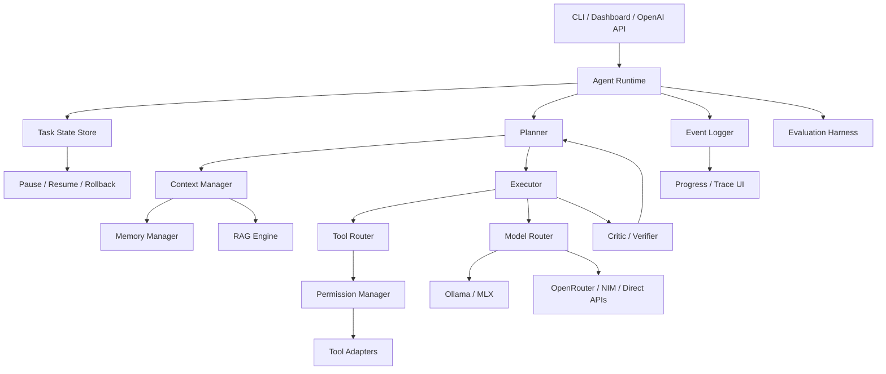

# Antigravity-K 프로젝트 진단 보고서

작성 기준: 현재 작업 트리와 실행 가능한 Python 환경, `config.yaml`, `src/antigravity_k`, `tests`를 직접 확인한 결과.

## 1. 한 줄 결론

Antigravity-K는 30B급 로컬 모델을 보완할 핵심 부품은 대부분 갖췄지만, 여러 실험 경로가 하나의 정식 런타임 계약으로 수렴하지 않아 현재는 “기능이 많은 연구용 플랫폼”에 가깝고, 안정적인 프론티어 근접형 범용 에이전트로 보기에는 실행 상태·권한·평가·모델 정책의 통합이 부족하다.

## 2. 현재 완성도 점수

총점: **69/100**

| 영역 | 점수 | 근거 |
|---|---:|---|
| Agent Core | 12/18 | `OrchestratorAgent`, StateGraph, `GoalRunner`, `CognitiveLoop`, `TaskRunner`가 있고 canonical stream은 model-aware hard context budget과 background/direct restart context reconstruction을 제공한다. direct task ID의 CLI/API 조회·재개는 완료됐고 dashboard 통합은 남아 있다. |
| Tool Use | 12/15 | `ToolRegistry`, `ToolLoopEngine`, `ToolExecutor`, guardrail, approval 흐름이 존재한다. Ollama/OpenRouter/NIM native function calling을 우선하고 XML fallback을 유지한다. |
| Memory | 9/12 | 세션, working/project/global/episodic memory, Vault, GBrain, SQLite memory가 있다. keyed identity, 핵심 사용자 선호, project decision/general fact는 authority 기반으로 범위와 충돌을 제어하며 보편적 기술 alias와 operator-defined project alias를 canonical key로 통합한다. 명시적 schema 없는 자유 텍스트 key 간 semantic dedupe는 남아 있다. |
| Model Orchestration | 12/15 | 다중 provider, fallback, cascading, collective, 20B+ qwen 평가기가 연결되어 있다. static generation benchmark와 모델별 task success/tool accuracy/retry artifact가 routing eligibility에 함께 반영되며, 알려진 70B 초과 모델과 20B 미만 로컬 모델을 제외하고 로컬 후보를 우선한다. 역할별 품질 정책과 장기 운영 sample은 더 보강해야 한다. |
| RAG | 8/10 | AST/file indexing, Chroma/vector, keyword fallback에 provenance, freshness, citation marker/validator가 연결됐다. authority ranking과 동일 주제의 시간·명시 지표 충돌 감지는 연결됐고, 의미 기반 충돌 해결은 남아 있다. |
| Evaluation | 8/10 | `BenchmarkHarness`, `QualityGate`, CoV, amplification benchmark에 task success/tool accuracy/retry/latency/token/cost 계약과 영속화가 추가됐고, 모델별 task calibration artifact가 router eligibility와 status telemetry에 연결됐다. TaskRunner와 ToolLoop terminal 계측, `TaskThresholds` CI contract, 2-case live search baseline이 있으며 recall threshold와 평가 case 확대는 남아 있다. |
| UX/Product | 6/8 | FastAPI, CLI, dashboard, approval/status API가 있다. legacy route와 dashboard 변형이 공존한다. |
| Security/Reliability | 6/7 | PIN/JWT, secret scanner, permission gate, bounded sandbox quota, task rollback, audit가 있다. shell side effect는 canonical permission과 fail-closed sandbox로 수렴했지만 외부 connector와 cross-platform quota matrix가 남아 있다. |

### 실제 상태

- 실행 진입점: `src/antigravity_k/api/server.py`, `src/antigravity_k/cli.py`, `src/antigravity_k/engine/orchestrator/agent.py`
- 모델 경로: `ModelRegistry` -> `ModelRouter` -> `ModelManager` -> provider adapters. Local capability probe가 Ollama/LM Studio/MLX의 native tool calling 상태를 모델 API·router status·LLM trace로 전달하고 ToolLoop protocol 선택에 재사용한다.
- 기본 로컬 평가기: `qwen3.6:latest`, 36B, Ollama native stream 경로
- 도구 경로: `ToolRegistry` -> `ToolLoopEngine` -> `ToolExecutor` -> permission/guardrail
- 장기 작업: `BackgroundTaskRunner` + SQLite checkpoint + optional worktree/Vault
- 메모리: `SessionManager`, memory providers, Vault/GBrain, `MemoryService`
- RAG: `RAGIndexer`, `VectorStore`, ChromaDB, AST code intelligence
- 검증 결과: 서버가 없는 상태에서 E2E fixture가 OS 할당 임시 포트로 로컬 API를 자동 기동해 `tests/` 전체 `3214 passed, 4 skipped, 7 warnings`를 통과했다. 포트 `8000`이 비대상 서버로 점유된 상태에서도 E2E smoke `9 passed`를 확인했고, `AGK_TEST_URL`을 명시하면 기존 서버를 재사용하고 종료하지 않는다. 수동 smoke는 `/v1/health 200`, `/openapi.json 200`, 비인증 보호 route `401`, 인증 filesystem/Git route `200`으로 확인했다. qwen3.6:latest live grounding mode는 controlled positive 2개를 3회 반복해 claim-level `6/6 passed`, all-pass run rate `1.0`을 기록했고, 실제 DuckDuckGo evidence를 넣은 cache-allowed live search도 `6/6 passed`였다. Forced-refresh provider artifact는 `1/2 passed`로 DuckDuckGo `202`와 empty result를 정확히 기록했다. 별도 simple stability artifact는 2회 반복 4개 결과 모두 `excellent`, benchmark 표준편차 `0.000`, all-excellent run rate `1.000`이었다. capability matrix는 qwen3.6을 로컬 `30B` multi-role(reasoning/coding/vision), deepseek-r1을 로컬 `70B`로 CLI와 API에서 일관되게 표시한다. 최신 configured self-hosted live search 2-case는 `error_count=0`, P@3 `0.167`, Recall@3 `0.167`, MRR `0.500`, nDCG@3 `0.210`이었고, 확장 6-case는 error `0`, P@3 `0.056`, Recall@3 `0.083`, MRR `0.167`, nDCG@3 `0.117`였다. configured self-hosted load는 6 samples에서 error `0`, P50 `52.2ms`, P95/P99 `1805.8ms`를 기록했다. `make audit-egress`는 guarded egress inventory를 갱신했다.
- 전체 `src` basedpyright 진단은 `0 errors`로 통과했다. 저장소 전체 Ruff는 `712` legacy/style findings를 보고하며 별도 유지보수 과제로 남아 있다.

## 3. 핵심 문제 Top 10

| 우선순위 | 문제 | 영향 | 원인 | 개선 방향 | 난이도 |
|---:|---|---|---|---|---:|
| P0 | 로컬 품질 증폭 경로가 기본값이 아니었음 | 로컬 모델을 먼저 활용하지 못하고 원격 모델 의존도가 커질 수 있다. | 전역 기본 모델은 MLX/OpenRouter였고 reasoning 콤보는 원격 대형 모델부터 시작했다. | `qwen3.6:latest`를 기본 모델로 두고, 신뢰도 평가·CoV·로컬 상위 모델 재생성을 기본 경로로 사용한다. | 중 |
| P0 | side-effect connector 경계가 여러 개다 | 동일한 요청이 legacy connector에서 다른 권한·관측을 가질 수 있다. | shell/Git/web fetch/external-brain API는 canonical permission과 fail-closed 경계로 통합됐지만 모든 direct connector inventory가 끝나지 않았다. | `TaskState`와 canonical `AgentRuntime`을 남은 side-effect 진입점의 어댑터로 확장한다. | 상 |
| P0 | tool permission이 호출 경로마다 다를 수 있다 | file, browser, osascript, git 자동화가 승인 없이 우회될 위험이 있다. | registry와 agent/system/filesystem/git/legacy API helper는 `ToolSpec -> ToolInvocation -> PermissionDecision`으로 수렴했지만, 모든 legacy connector inventory는 아직 끝나지 않았다. | 남은 side effect를 공용 permission decision과 audit result로 연결한다. | 상 |
| P1 | 모델 매니저가 너무 크고 많은 책임을 가진다 | provider 오류, 메모리, 라우팅, 추론, tracking 변경이 서로 영향을 준다. | `model_manager.py`에 provider와 orchestration 로직이 누적되었다. | `InferenceGateway`, `ModelLifecycle`, `UsageRecorder`, `ConfidenceEvaluator`로 분리한다. | 상 |
| P1 | checkpoint resume가 실제 재개가 아니었다 | 재개 시 단계 번호가 0으로 돌아가고 이전 출력이 최종 결과에서 사라졌다. | `_run_task()`가 checkpoint step/output을 전달받지 않았다. | 이번 작업에서 step과 output을 이어받도록 수정하고 회귀 테스트를 추가했다. | 완료 |
| P1 | 컨텍스트와 메모리 저장소가 중복된다 | 별칭 설정 없이 비정형 저장소에 의미상 같은 사실이 남으면 중복 주입될 수 있다. | provider와 durable store는 공유 manager/compliance contract로 연결됐고 identity/사용자 선호/project fact는 typed key와 authority resolver로 stale·exact duplicate를 제거한다. 보편적 기술 alias와 project-local operator alias schema도 canonicalize한다. | operator alias로 명시된 key는 해소됐다. 남은 자유 텍스트에는 provenance를 보존하는 안전한 semantic dedupe가 필요하며 Vault consent flow는 독립적으로 유지한다. | 부분 해소 |
| P1 | tool calling이 기본적으로 텍스트 파싱에 의존한다 | 30B 모델의 포맷 흔들림이 도구 선택 실패로 이어질 수 있다. | 기존에는 `native_function_calling`이 false였고 Ollama native 응답을 버렸다. | Ollama/OpenRouter/NIM에 native schema를 우선하고, native 거부 시 XML protocol로 재시도한다. | 부분 해소 |
| P1 | RAG 검색 결과를 신뢰할 출처 계약이 없다 | 잘못된 문서가 답변에 섞여 환각을 강화할 수 있다. | 검색은 되지만 freshness, authority, conflict resolution 점수가 없다. | chunk provenance, source priority, freshness, citation validator를 추가한다. | 중 |
| P2 | 평가가 품질 대용 지표에 치우쳤다 | keyword coverage가 실제 완수율을 충분히 설명하지 못한다. | runtime TaskOutcome은 모델별 artifact로 export되어 calibration과 routing status에 반영되지만, 장기·리서치·문서 task의 human-labeled sample 수와 relevance coverage가 부족하다. | coding/research/long-horizon/search golden set을 human label과 provider baseline까지 확장한다. | 부분 해소 |
| P2 | API와 문서 구조가 어긋난다 | 새 개발자가 실제 진입점을 잘못 선택한다. | README는 `engine/orchestrator.py`를 가리키지만 실제 구현은 `engine/orchestrator/agent.py`다. | 실행 경로를 하나로 정리하고 README를 smoke-tested command 기준으로 갱신한다. | 하 |

## 4. 목표 아키텍처

| 구성요소 | 현재 구현 | 부족한 점 | 개선 파일/인터페이스 | 우선순위 |
|---|---|---|---|---:|
| Agent Runtime | `AgentRuntime`, `OrchestratorAgent`, `run_stream` | 비스트림 executor와 plugin 확장 호출의 지속 감사 필요 | background task, direct stream/MAX, browser/agent/parallel subagent stream이 task-local ContextVar binding과 durable task ID를 사용 | P0 |
| Planner | `ceo_analyzer`, state handlers, `GoalRunner` | step별 실행 결과 모델 부족 | `GoalRunner` plan을 `AgentRuntime.submit_task()` context로 전달 | P0 |
| Executor | `ToolLoopEngine`, `MaxEngine`, `TaskRunner` | 비스트림 executor 직접 호출 감사 필요 | ToolLoop checkpoint와 StateGraph execution event, subagent lifecycle event를 bound task에 기록하고 direct terminal 상태를 저장 | P0 |
| Tool Router | `ToolRegistry`, parser, tool loop | capability/risk/cost 기반 선택 부족 | `ToolRouter.select()` | P1 |
| Memory Manager | `EngineContext.memory_manager`, providers, Vault | 저장소별 책임 중복 | `MemoryManager.write/read/delete(scope)` | P1 |
| Context Manager | `ContextShaper`, compressors, session | 토큰 예산과 provenance가 분리 | `ContextManager.build(request, budget)` | P1 |
| Model Router | `ModelRouter`, `ModelManager`, provider adapters, `ModelRoutingPolicy` | 역할별 품질 정책과 provider telemetry 부족 | `ModelRouter.route()`의 공용 후보 정책과 calibration | P0 |
| Critic/Verifier | CoV, quality gate, confidence evaluator | 검증 결과가 실행 상태와 강하게 연결되지 않음 | `VerificationResult` | P1 |
| RAG Engine | `RAGIndexer`, `VectorStore`, GBrain | 출처/최신성/충돌 해결 부족 | `RetrievalResult` with provenance | P1 |
| Task State Store | SQLite task history/checkpoints/execution events, state graph | 비스트림 alternate executor 감사 필요 | `paused/failed -> resuming -> running`, ToolLoop approval checkpoint, StateGraph transition ledger, direct/subagent task terminal state | P0 |
| Event Logger | audit logger, event bus, tracing | 모든 단계의 correlation id가 일관되지 않음 | `AgentEvent(trace_id, task_id, ...)` | P1 |
| Permission Manager | `PermissionGate`, `ToolSpec`, approval API, sandbox | 남은 connector 우회 경로 감사 필요 | `ToolInvocation -> PermissionDecision` 공용 경계 확장 | P0 |
| Evaluation Harness | `BenchmarkHarness`, cases, QualityGate, TaskThresholds | live search golden set과 claim-level score 부족 | `ScenarioRunner`, `EvalReport` | P1 |
| UI Layer | FastAPI, CLI, dashboard | route/legacy 변형 공존 | API/CLI를 runtime client로 통합 | P2 |
| Plugin System | skills/market/MCP loader | trust metadata와 lifecycle 부족 | `PluginManifest`, capability declaration | P2 |

## 5. 개발 로드맵

### Phase 0. 진단 및 정리

- 목표: 실행 명령, 의존성, canonical entrypoint를 고정한다.
- 구현: README 실행 명령 검증, `uv.lock` 해결, server smoke fixture, legacy route 목록화.
- 산출물: `docs/project_diagnostic_report.md`, clean-start script, dependency matrix.
- 성공 기준: 새 환경에서 server import, CLI help, quick test가 한 명령씩 성공.
- 테스트: `pytest -q`, `uv run agk --help`, `curl /v1/health`.
- 리스크: 의존성 정리는 사용자 환경의 Python 버전 제약을 드러낼 수 있다.
- 우선순위/난이도: P0 / 중.

### Phase 1. Agent Core 안정화

- 목표: 모든 작업을 `TaskRequest -> Plan -> Step -> Result`로 추적한다.
- 구현: `TaskState` schema, durable transitions, idempotency key, real resume, pause/cancel/approval.
- 산출물: `engine/runtime/`, `engine/task_state_store.py`, state transition tests.
- 성공 기준: 프로세스를 중단해도 마지막 완료 step 이후에만 재개되고 중복 side effect가 없다.
- 테스트: fake executor crash/resume, cancellation, duplicate submission, SQLite recovery.
- 리스크: 기존 `TaskRunner`와 API compatibility.
- 우선순위/난이도: P0 / 상.

### Phase 2. Tool System 고도화

- 목표: 모든 도구 호출을 permission과 typed result를 거치는 단일 경로로 만든다.
- 구현: `ToolSpec`, capability/risk/cost, native function calling, retry classification, audit event.
- 성공 기준: 승인 없는 shell/file/git side effect가 0건이고 실패 원인이 사용자에게 구조화된다.
- 테스트: allow/deny/prompt, timeout, malformed args, rollback, tool retry.
- 우선순위/난이도: P0 / 상.

### Phase 3. Memory & Context

- 목표: turn/session/task/project/user memory를 분리하고 삭제 가능하게 한다.
- 구현: canonical `MemoryManager`, TTL/importance, conflict resolution, redaction, token budget.
- 성공 기준: 같은 기억이 중복 주입되지 않고 project/user scope를 넘지 않는다.
- 테스트: scope isolation, deletion, compression fidelity, restart persistence.
- 우선순위/난이도: P1 / 상.

### Phase 4. Model Orchestration

- 목표: 로컬 모델을 중심으로 품질·비용·지연 정책을 조정한다.
- 구현: qwen3.6 local-first, deepseek-r1:70b 품질 에스컬레이션, coding/reasoning/critic roles, context budget, confidence calibration.
- 성공 기준: Mac 기본 smoke에서 qwen local path가 먼저 선택되고, 낮은 신뢰도 응답은 검증된 상위 경로로 재생성된다.
- 테스트: policy matrix, provider outage, memory pressure, quality/cost benchmark.
- 우선순위/난이도: P0 / 중.

### Phase 5. RAG & Knowledge

- 목표: 검색 결과가 근거와 최신성을 갖춘 답변으로만 사용되게 한다.
- 구현: provenance, source ranking, freshness, query rewrite, retrieval verifier, citation enforcement.
- 성공 기준: 답변의 모든 외부 사실이 source id로 추적되고 충돌 결과가 표시된다.
- 테스트: stale document, conflicting sources, empty retrieval, prompt injection document.
- 우선순위/난이도: P1 / 상.

### Phase 6. Evaluation Harness

- 목표: “프론티어 근접”을 재현 가능한 task success로 측정한다.
- 구현: coding/research/document/long-horizon suites, success schema, retry rate, tool accuracy, cost/latency.
- 성공 기준: commit별 회귀 리포트와 quality threshold가 CI에서 차단한다.
- 테스트: deterministic fixtures, real provider smoke, golden task set.
- 우선순위/난이도: P1 / 중.

### Phase 7. UX/Productization

- 목표: 사용자가 진행 상태, 승인, 실패 원인, 재개 위치를 이해하게 한다.
- 구현: canonical task API, trace viewer, model/memory/tool policy settings, install doctor.
- 성공 기준: 첫 실행부터 task 제출, 승인, 완료, resume을 UI/CLI에서 수행한다.
- 테스트: API contract, CLI smoke, dashboard e2e.
- 우선순위/난이도: P2 / 상.

### Phase 8. Experimental Frontier Features

- 목표: 안정된 runtime 위에서만 debate, multi-agent, reflexion, prompt optimization을 실험한다.
- 구현: feature flag, reproducible seeds, budget caps, experiment registry.
- 성공 기준: baseline 대비 quality gain과 cost delta가 리포트에 남는다.
- 테스트: A/B benchmark, ablation, failure replay.
- 우선순위/난이도: P2 / 상.

## 6. 개발 체크리스트

- [x] 현재 Python/FastAPI/CLI/model/provider 구조 확인
- [x] `ModelRouter`와 `ModelManager`의 qwen3.6 36B 우선 정책 확인
- [x] 기본 모델·엔진을 qwen3.6:latest·Ollama로 정렬
- [x] reasoning/coding 콤보를 qwen3.6 → deepseek-r1:70b cascading으로 정렬
- [x] CoV 검증기에 qwen3.6 재작성·재검증 루프 연결
- [x] ToolRegistry, ToolLoop, PermissionGate, approval API 위치 확인
- [x] Session/working/global/episodic/Vault/GBrain 저장소 확인
- [x] RAGIndexer, VectorStore, Chroma fallback 확인
- [x] BenchmarkHarness, QualityGate, CoV, amplification benchmark 확인
- [x] `BackgroundTaskRunner.resume_task()`의 checkpoint continuity 회귀 테스트 추가
- [x] checkpoint step/output을 실제 resume 실행에 전달
- [x] `TaskStateStore` 상태 전이·checkpoint·idempotency 계약 정의 및 TaskRunner 연결
- [x] `ToolExecutor`의 읽기 도구 우회 경로 제거 및 `allow/deny/prompt` 감사 결과 기록
- [x] Ollama/OpenRouter/NIM native function calling 우선화 및 Ollama XML fallback 연결
- [x] Planner/Executor를 Orchestrator의 state graph와 단일 계약으로 통합: `AgentRuntime.submit_task()`가 GoalRunner 계획을 executor context와 step-0 checkpoint에 저장하고, `TaskStateStore`가 failed/paused recovery transition을 관리한다. task-local binding이 있는 ToolLoop는 tool step·approval state를 같은 checkpoint에 기록하고 StateGraph는 MAX/pipeline transition을 별도 execution event ledger에 기록한다. canonical direct stream/MAX와 browser/agent/parallel subagent stream도 durable task ID 또는 부모 task lifecycle event를 생성하며 SSE/CLI가 direct task ID를 노출한다.
- [x] provider capability와 로컬 품질 정책 matrix 추가: 알려진 70B 초과 모델 제외, 로컬 20B 최소선, 로컬 우선 정렬을 모든 router 전략과 직접 선택에 적용
- [x] `ToolSpec -> ToolInvocation -> PermissionDecision` 공용 계약을 ToolRegistry와 agent/system/filesystem/git/legacy API helper에 연결
- [x] memory scope/TTL/delete 계약 추가: provider·durable store의 scope purge/export/redaction/retention과 global identity lifecycle, Vault 기본 asset 제외·redacted opt-in export, 작업별 확인 토큰을 쓰는 Vault active-corpus redact/purge/restore 완료
- [x] `MemoryFact` authority 계약과 provider 순서에 독립적인 keyed identity conflict resolution 연결: current user > durable global > unstructured recall
- [x] 핵심 사용자 선호를 typed fact로 영속화하고 global/profile prompt를 같은 authority winner로 통합: current explicit > durable explicit > inferred profile
- [x] project decision/general fact를 typed key로 workspace-local 저장하고 current user > durable project 순으로 충돌 해결; project scope lifecycle과 manager/path isolation 연결
- [x] RAG 검색 결과에 source id/라인/hash/freshness provenance 및 citation validator 추가
- [x] 기본 `WebSearchTool`에 query relevance/authority 검증, fallback query 보강, canonical 재랭킹, Qwen3.6 공식 출처 rescue 연결
- [x] `TaskOutcome`/`TaskBenchmarkReport`와 task success/tool accuracy/retry/cost 지표 영속화 및 모델별 task calibration artifact export/routing eligibility 연결
- [x] TaskRunner 성공·실패·취소 terminal path의 `TaskOutcome` 자동 기록 및 BenchmarkHarness binding
- [x] ToolLoop terminal path의 `TaskOutcome` 자동 기록 및 BenchmarkHarness binding
- [x] long-horizon task success benchmark 추가
- [x] E2E fixture 임시 포트 자동 서버 기동 및 `AGK_TEST_URL` 외부 서버 재사용 계약 추가
- [x] README의 실제 entrypoint와 설치 명령을 smoke test: `uv run agk --help`, `uv run agk model list`, `uv run agk doctor`, `make smoke-cli`, 그리고 module entrypoint subprocess regression을 확인

## 7. 즉시 착수할 작업 5개

1. **Tool permission 단일화**: 파일/쉘/브라우저/깃 side effect의 보안 경계를 먼저 고정해야 한다.
2. **RAG provenance와 citation 검증**: 기본 marker와 validator까지 완료. authority ranking과 충돌 해결이 다음 보강 대상이다.
3. **native function calling 우선화**: qwen3.6 Ollama native 경로와 XML fallback까지 완료했다.
4. **task-level benchmark**: 계약, TaskRunner/ToolLoop terminal 계측, long-horizon suite, deterministic CI threshold 연결은 완료했고, live golden set을 추가해야 한다.
5. **실행 경로 통합**: 여러 Orchestrator/GoalRunner 경로를 canonical runtime 계약으로 수렴시킨다.

## 8. 실제 수정 내역

### 이번 작업

- 파일: `src/antigravity_k/engine/task_runner.py`
- 변경: `resume_task()`가 checkpoint의 step과 누적 output을 `_run_task()`에 전달하도록 수정했다. 재개된 작업은 기존 step 번호와 출력 버퍼를 이어간다.
- 이유: 기존 구현은 checkpoint 내용을 프롬프트에만 삽입해 실제 실행 카운터와 최종 output이 초기화됐다.
- 테스트: `tests/test_task_runner_resume.py`; 수정 전 실패, 수정 후 통과.
- 파일: `src/antigravity_k/engine/task_state_store.py`
- 변경: 기존 SQLite history/checkpoint를 상태 전이, terminal 상태, legacy migration, idempotency의 단일 저장소로 정리했다.
- 파일: `src/antigravity_k/engine/agent_runtime.py`, `src/antigravity_k/engine/task_runner.py`, `src/antigravity_k/engine/task_state_store.py`, `src/antigravity_k/api/routes/agent_api.py`
- 변경: background task는 GoalRunner의 구조화된 계획을 `task_plan` context로 executor에 전달하고 step-0 checkpoint에 저장한다. `TaskStateStore.prepare_resume()`는 paused/failed task를 `resuming`으로 원자적으로 전이시킨 뒤 `running`으로 복구하며, 두 task resume API 모듈은 canonical runtime을 호출한다.
- 테스트/QA: `tests/test_agent_runtime.py`, `tests/test_task_runner_resume.py`, `tests/test_task_state_store.py`; transient provider failure 뒤 동일 task ID의 계획 보존·`resuming -> running -> done` 복구를 local driver로 확인했다.
- 파일: `src/antigravity_k/engine/orchestrator/agent.py`, `src/antigravity_k/engine/tool_loop.py`, `src/antigravity_k/engine/task_runner.py`, `src/antigravity_k/engine/task_state_store.py`
- 변경: Orchestrator는 task-local `ContextVar`로 task ID와 state store를 바인딩한다. ToolLoop는 바인딩된 background task의 tool round와 approval-required 상태를 checkpoint에 기록하고, TaskRunner는 승인 대기를 완료로 덮어쓰지 않으며 resume을 위해 worktree를 유지한다.
- 테스트/QA: `tests/test_tool_loop.py`, `tests/test_task_runner_resume.py`, `tests/test_task_state_store.py`; `write_file` approval 대기에서 task plan, `write_file`, step 1, `paused` 상태가 동일 SQLite record에 남는 local driver를 확인했다.
- 파일: `src/antigravity_k/engine/task_state_store.py`, `src/antigravity_k/engine/state_graph.py`
- 변경: resume checkpoint와 독립적인 append-only `task_execution_events` ledger를 추가했다. bound background StateGraph는 transition과 checkpoint를 `trace_id`, task type, delegate, retry/error metadata와 함께 기록하므로 MAX/pipeline 단계를 재개 state와 경쟁시키지 않는다.
- 테스트/QA: `tests/test_task_state_store.py`; 실제 `BackgroundTaskRunner`의 MAX state graph가 `state_transition -> state_checkpoint -> state_transition` 순서와 `done` terminal 상태를 SQLite에서 반환하는 local driver를 확인했다.
- 파일: `src/antigravity_k/engine/agent_runtime.py`, `src/antigravity_k/engine/direct_task_execution.py`, `src/antigravity_k/api/routes/agent_api.py`, `src/antigravity_k/api/routes/legacy.py`, `src/antigravity_k/cli.py`
- 변경: canonical direct stream은 `direct_*` task를 생성해 ContextVar binding 안에서 실행하고 완료·실패·소비자 취소 상태를 저장한다. direct MAX는 기존 binding을 재사용하거나 별도 task에 시작·완료·실패 event를 기록한다. SSE 첫 이벤트와 CLI가 task ID를 노출한다.
- 테스트/QA: `tests/test_agent_runtime.py`; direct stream의 output/terminal state, direct MAX의 event, bound StateGraph MAX의 중첩 task 방지와 local driver의 stream/MAX task 조회를 확인했다.
- 파일: `src/antigravity_k/engine/task_state_store.py`, `src/antigravity_k/engine/orchestrator/agent.py`, `src/antigravity_k/engine/subagent_execution.py`, `src/antigravity_k/engine/subagent_spawner.py`, `src/antigravity_k/tools/agent_spawn.py`, `src/antigravity_k/tools/browser_subagent_tool.py`
- 변경: Orchestrator binding을 process-local execution ContextVar에도 연결했다. browser/agent/parallel subagent stream은 부모 task가 있으면 동일 task에 `subagent_started/completed/failed/cancelled` event를 저장하고, 단독 실행이면 `direct_*` task를 생성한다.
- 테스트/QA: `tests/test_subagent_execution.py`, `tests/test_subagent_spawner.py`; 실제 `SubagentSpawner`의 `asyncio.to_thread` 경로가 부모 task context와 SQLite event ledger를 유지하고, 동기 `spawn()`이 새 `asyncio.run()` 경계에서 standalone `direct_*` task를 완료하는 local driver를 확인했다. 실행 중 event loop 경로는 coroutine 생성 전 명시적으로 거부한다.
- 파일: `src/antigravity_k/engine/harness.py`, `src/antigravity_k/engine/harness_models.py`, `tests/test_harness.py`
- 변경: `Test*` 접두사의 harness 도메인 타입에 pytest 수집 제외 표식을 추가해 API 이름은 유지하면서 test-class 오인을 제거했다.
- 테스트/QA: `tests/test_harness.py`, `tests/test_healing_loop.py`; `PytestCollectionWarning`을 오류로 승격한 전체 수집이 3,243개 test를 경고 없이 반환하는 것을 확인했다.
- 파일: `src/antigravity_k/engine/model_manager.py`, `tests/test_model_manager_generate.py`
- 변경: streaming inference도 non-stream과 같은 success/failure telemetry 경로를 사용한다. LLM trace span에 combo와 fallback depth, provider, local 여부, 유효 파라미터 수를 기록해 qwen3.6 local-first 선택과 실패를 runtime에서 구분한다.
- 테스트/QA: `tests/test_model_manager_generate.py`, `tests/test_model_router.py`, `tests/test_model_calibration.py`, `tests/test_usage_tracker.py`; local Qwen streaming 성공·실패 span과 실제 router/tracer local driver를 확인했다.
- 파일: `src/antigravity_k/api/routes/legacy.py`
- 변경: task submit API가 idempotency key를 받아 중복 제출을 같은 task로 수렴시킨다.
- 테스트: `tests/test_task_state_store.py`; 상태 전이, legacy migration, 중복 제출, 취소 race를 검증한다.
- 파일: `src/antigravity_k/engine/tool_executor.py`
- 변경: 읽기 전용 도구도 `ToolRegistry.execute_with_permission()`을 통과하게 해 보호 경로 우회를 제거하고, 허용·거부·승인 대기 결정을 호출 이력에 기록한다.
- 테스트: `tests/test_tool_executor.py`; 보호 파일 거부, permission boundary 사용, deny/prompt 감사 결과를 검증한다.
- 파일: `src/antigravity_k/engine/rag_indexer.py`
- 변경: 청크 metadata에 source hash/index timestamp를 저장하고, 검색 결과에 source id·라인·node·freshness를 담은 provenance를 추가한다. context에는 `[citation:<source_id>]` marker를 주입하고 누락·unknown·unverified citation을 구조화해 검증한다.
- 테스트: `tests/test_rag_provenance.py`; index-file metadata, fresh 검색, 파일 변경 후 stale 검색, citation marker/validator를 검증한다.
- 파일: `src/antigravity_k/engine/tool_loop.py`, `src/antigravity_k/engine/provider_adapters/inference_providers.py`, `config.yaml`
- 변경: `qwen3.6:latest` Ollama 경로에서 native tools를 기본 활성화하고, Ollama `message.tool_calls`를 canonical XML parser 입력으로 변환한다. native tools가 거부되면 tools 없는 재요청으로 XML fallback한다.
- 테스트/QA: `tests/test_tool_loop.py`, `tests/test_inference_providers.py`; fake HTTP payload/응답 및 fallback을 검증했고 실제 Ollama 0.32.6 + qwen3.6:latest에서 `read_file(README.md)` native tool call을 확인했다.
- 파일: `src/antigravity_k/engine/benchmark_harness.py`, `src/antigravity_k/engine/slash_commands_workflow.py`
- 변경: 작업 성공 여부, completion reason, expected/used tools, tool recall/precision, retry, latency, tokens, cost를 `TaskOutcome`으로 기록·복원하고 `TaskBenchmarkReport`와 `/benchmark task-report`로 집계한다.
- 테스트: `tests/test_task_benchmark.py`, `tests/test_benchmark_harness.py`; aggregate 계산, JSON persistence/legacy 호환, command surface를 검증한다.
- 파일: `src/antigravity_k/engine/task_runner.py`
- 변경: 성공·실패·취소 terminal path에서 기존 `ToolCallParser`로 사용 도구를 추출해 `TaskOutcome` recorder에 자동 전달하고, `BenchmarkHarness.bind_task_runner()`로 저장소에 연결한다.
- 테스트: `tests/test_task_runner_outcome.py`; 성공/실패/취소 outcome과 도구·토큰·오류 정보를 검증한다.
- 파일: `src/antigravity_k/engine/tool_loop.py`, `src/antigravity_k/engine/benchmark_cases.py`
- 변경: ToolLoop의 성공·모델 미로드·capacity halt·승인 대기·재시도·오류·step limit terminal path에서 `TaskOutcome`을 기록하고, `long_horizon` checkpoint/recovery 과제를 기본 스위트에 추가했다.
- 테스트: `tests/test_tool_loop.py`, `tests/test_task_benchmark.py`, `tests/test_long_horizon_benchmark.py`; ToolLoop sink, 도구 정확도, recorder 격리, 장기 과제 필터링을 검증한다.
- 파일: `src/antigravity_k/tools/web_search_quality.py`, `src/antigravity_k/tools/web_search_engine.py`, `src/antigravity_k/tools/web_search_tool.py`, `src/antigravity_k/tools/web_search_models.py`, `src/antigravity_k/tools/web_search_cache.py`
- 변경: URL canonicalization, authority/source id, duplicate winner selection, domain diversity, multi-source cross-validation, citation formatting, untrusted web content boundary, literal/DNS/private redirect SSRF guard, UTC cache timestamp를 연결했다. 실제 기본 등록 표면인 동기 `WebSearchTool`도 관련성·권위가 부족한 non-empty 결과를 fallback query로 보강하고 공유 ranking contract로 재정렬하며 Qwen3.6 공식 출처를 provider 실패 시 보존한다.
- 테스트: `tests/test_web_search_quality.py`, `tests/test_web_search.py`, `tests/test_web_search_candidate_augmentation.py`; 검색 quality contract와 provider fallback 회귀를 검증한다. `ToolExecutor.register_default_tools()` 수동 드라이버에서 재작성 호출, 관련 결과 1위, citation id 출력을 확인했다.
- 파일: `.github/workflows/ci.yml`, `Makefile`, `docs/01_CURRENT_STATE_ASSESSMENT.md` ~ `docs/10_FINAL_READINESS_REPORT.md`
- 변경: agent/search quality contract를 CI와 `make search-quality`/`make quality-contract`로 노출하고 첨부 요구사항의 현재 상태, 검색 품질, 목표 아키텍처, roadmap, checklist, security, test plan, changelog, operation, readiness 문서를 추가했다.
- 파일: `src/antigravity_k/tools/search_quality_evaluator.py`, `tests/fixtures/search_quality_cases.json`, `tests/test_web_search_quality.py`
- 변경: 2개 결정론적 검색 golden case에서 P@K/Recall@K/MRR/nDCG/domain diversity를 측정하고, canonical source id와 title/snippet evidence를 기준으로 claim-level citation coverage, unknown citation, unsupported claim을 평가한다. `WebSearchEngine.evaluate_response()`와 `make search-quality`에 연결했다.
- 파일: `src/antigravity_k/engine/agent_runtime.py`, `src/antigravity_k/api/dependencies.py`, `src/antigravity_k/api/routes/chat.py`, `src/antigravity_k/api/routes/legacy.py`
- 변경: 모델 해석, agent streaming, `/api/stream_agent`, background task submit/resume을 `AgentRuntime` singleton facade로 수렴했다. 7개 runtime contract와 chat/task route regression test를 추가했다.
- 파일: `src/antigravity_k/tools/tool_registry.py`, `src/antigravity_k/tools/system_tools.py`, `src/antigravity_k/engine/sandbox.py`, `src/antigravity_k/tools/permission_gate.py`, `src/antigravity_k/api/routes/agent_tools.py`, `tests/test_command_execution_boundary.py`, `tests/test_agent_tools_api.py`, `tests/test_sandbox.py`
- 변경: 승인된 도구도 permission/capability gate를 재검증하도록 수정하고, shell direct-call permit, project cwd/timeout boundary, SandboxRunner fail-closed 정책을 추가했다. browser action과 autonomous QA는 side effect 전에 deny를 적용한다. 위험 명령, direct shell 우회, sibling-prefix/symlink 경로, sandbox backend 부재 회귀를 검증한다.
- 파일: `src/antigravity_k/tools/tool_contracts.py`, `src/antigravity_k/tools/permission_gate.py`, `src/antigravity_k/tools/tool_registry.py`, `src/antigravity_k/api/routes/{agent_tools,system_api,filesystem,git_api,legacy}.py`, `tests/test_tool_contracts.py`
- 변경: ToolRegistry가 등록 도구의 metadata를 `ToolSpec`으로 고정하고, `ToolInvocation`을 `PermissionGate.decide()`와 capability policy에 전달해 구조화된 `PermissionDecision`을 만든다. hard deny는 capability prompt보다 먼저 적용하며, 다섯 API helper도 같은 decision contract를 사용한다. 기존 `PermissionGate.check()`와 `execute_with_permission()` 반환 형식은 호환성 래퍼로 유지한다.
- 테스트: `tests/test_tool_contracts.py`, `tests/test_command_execution_boundary.py`, `tests/test_tool_executor.py`, `tests/test_agent_tools_api.py`, `tests/test_api_server.py`, `tests/test_git_api_boundary.py`; project write allow와 dangerous shell deny, 승인 재검증, API side-effect gate를 검증한다.
- 파일: `src/antigravity_k/engine/model_policy.py`, `src/antigravity_k/engine/model_router.py`, `config.yaml`
- 변경: `ModelRoutingPolicy`가 알려진 70B 초과 모델과 20B 미만 로컬 모델을 자동 routing 및 직접 선택에서 제외하고, 로컬 후보를 설정 순서를 보존한 채 우선시한다. fallback, round-robin, load-balance, cascading, escalation, 상태/summary가 같은 후보 목록을 사용한다. 기본 설정은 `qwen3.6:latest` 36B 로컬 경로를 우선한다.
- 테스트: `tests/test_model_router.py`, `tests/test_model_calibration.py`, `tests/test_model_registry.py`; Qwen 우선 선택, 70B 초과 직접 선택 거부, calibration 회귀를 검증한다.
- 파일: `src/antigravity_k/engine/memory_provider.py`, `src/antigravity_k/engine/session_manager.py`, `src/antigravity_k/api/routes/system_api.py`, `tests/test_memory_scope.py`, `tests/test_api_server.py`
- 변경: 초기 session/working/global/all scope별 provider 삭제와 SessionManager 영속 purge를 구현하고, 인증된 `DELETE /api/memory`가 provider별 삭제 건수와 `memory_purge` audit event를 반환하도록 연결했다. 후속 단계에서 project scope와 durable store redaction/export/retention 및 Vault 원문 asset policy도 연결했다.
- 파일: `src/antigravity_k/api/dependencies.py`, `src/antigravity_k/engine/engine_context.py`, `src/antigravity_k/engine/orchestrator/agent.py`, `src/antigravity_k/engine/durable_memory.py`
- 변경: API dependency, Orchestrator, EngineContext, legacy/system route가 하나의 4-tier `MemoryManager`를 공유하도록 연결하고, durable purge provider를 추가했다.
- 파일: `src/antigravity_k/knowledge/memory_service.py`, `src/antigravity_k/engine/vector_store.py`, `src/antigravity_k/knowledge/wiki.py`, `src/antigravity_k/engine/gbrain.py`, `tests/test_durable_memory_purge.py`
- 변경: SQLite knowledge/snapshot, vector collection, wiki DB/생성 Markdown, GBrain graph/vector, search-cache를 `all` purge에서 삭제하고 provider별 건수와 audit report로 노출했다. Vault 원문과 export/redaction/retention은 후속 정책 범위다.
- 파일: `src/antigravity_k/engine/memory_provider.py`, `src/antigravity_k/engine/session_manager.py`, `src/antigravity_k/knowledge/memory_service.py`, `src/antigravity_k/knowledge/wiki.py`, `src/antigravity_k/engine/gbrain.py`, `src/antigravity_k/engine/vector_store.py`
- 변경: provider/durable export, secret redaction, age-based retention 계약을 연결했다. export는 재귀 secret redaction을 적용하고 Vault 원문 asset은 기본 제외한다.
- 파일: `src/antigravity_k/api/routes/system_api.py`, `src/antigravity_k/engine/vault.py`, `tests/test_memory_compliance.py`
- 변경: 인증된 memory export/redact/retention API와 Vault redacted opt-in export policy를 추가했다.
- 테스트: memory compliance, provider persistence, Vault asset exclusion/redaction contract.
- 파일: `src/antigravity_k/engine/memory_contracts.py`, `src/antigravity_k/engine/global_memory_provider.py`, `src/antigravity_k/engine/memory_provider.py`, `tests/test_memory_compliance.py`
- 변경: `GlobalMemoryProvider.identity.json`이 global/all export·redact·clear·retention에서 누락돼 이름과 keyed identity가 삭제 후 재시작에도 남던 문제를 수정했다. 공용 provider/scope 계약과 global provider를 분리해 순환 없이 기존 import 경로를 유지하고, JSON 저장 경계는 Pydantic으로 파싱한다.
- 테스트/QA: identity export, persistent redaction, restart-safe purge, old/recent retention 3개 red→green 회귀와 memory/API/orchestrator 영향 171 passed/2 skipped를 확인했다. 실제 system API lifecycle에서 export secret masking, redact/retention/purge의 재시작 영속성, 네 audit event를 확인했다. 새 두 모듈은 basedpyright 0 errors/0 warnings, Ruff/no-excuse/LSP clean이다.
- 파일: `src/antigravity_k/api/routes/vault_privacy.py`, `src/antigravity_k/engine/vault_privacy.py`, `src/antigravity_k/engine/vault_privacy_contracts.py`, `src/antigravity_k/engine/vault_privacy_git.py`, `src/antigravity_k/engine/vault_privacy_derivatives.py`, `src/antigravity_k/knowledge/wiki_privacy.py`, `tests/test_vault_privacy_api.py`, `tests/test_vault_privacy_service.py`, `tests/test_wiki_vault_privacy.py`
- 변경: 일반 메모리 purge와 분리된 Vault active-corpus redact/purge/restore API를 추가했다. Pydantic 요청이 작업별 확인 토큰과 Git SHA를 파싱하고, 선택 Markdown 경로만 사전 snapshot·mutation·restore commit에 포함한다. commit/파생 동기화 실패는 선택 원문과 RAG/LLM Wiki mirror를 snapshot으로 되돌리며 관련 없는 staged/tracked/untracked 파일은 보존한다. purge는 현재 HEAD에서만 원문을 제거하고 Git history는 rollback을 위해 유지한다.
- 테스트/QA: 인증/동의 누락, 빈 redact 값, path traversal·case-variant 내부 경로, exact Wiki source 삭제, RAG/Wiki 재색인, commit 실패 rollback, 위험 Vault root, snapshot path 사전검증, 기본 memory purge 비간섭을 실제 임시 Git 저장소와 HTTP 표면에서 검증했다. 새 모듈은 basedpyright 0 errors/0 warnings, Ruff/no-excuse/LSP clean이다.
- 파일: `src/antigravity_k/engine/memory_conflicts.py`, `src/antigravity_k/engine/memory_contracts.py`, `src/antigravity_k/engine/global_memory_provider.py`, `src/antigravity_k/engine/memory_provider.py`, `tests/test_memory_conflicts.py`
- 변경: provider가 구조화된 authoritative fact를 노출하는 `MemoryFact` 계약을 추가하고, `MemoryManager.prefetch_all()`이 현재 사용자 정정과 provider fact를 authority/관측 시각으로 조정한 뒤 충돌 record를 모델 주입 전에 제거하도록 연결했다. resolver는 provider 등록 순서와 무관하며 비충돌 컨텍스트의 기존 형식을 보존한다.
- 테스트/QA: durable identity 대 stale episodic, sync 이전 사용자 정정, provider 순서 독립성, 비충돌 보존, metadata의 stale 값 비노출을 5개 회귀로 고정했다. 별도 프로세스 재로딩 QA에서 최신 identity만 출력됨을 확인했고, 영향 영역 120 passed, 전체 비벤치마크 3360 passed/4 skipped/16 deselected, 새 모듈 정적 검사가 통과했다.
- 파일: `src/antigravity_k/engine/preference_memory.py`, `src/antigravity_k/engine/identity_memory.py`, `src/antigravity_k/engine/global_memory_provider.py`, `src/antigravity_k/engine/memory_conflicts.py`, `src/antigravity_k/engine/memory_provider.py`, `src/antigravity_k/engine/user_model.py`, `src/antigravity_k/engine/orchestrator/stream.py`, `src/antigravity_k/engine/orchestrator_handlers.py`, `tests/test_preference_memory.py`, `tests/test_user_profile_preference_precedence.py`, `tests/test_memory_compliance.py`
- 변경: response language/detail, explanation level, task domain을 keyed preference fact로 영속화하고 explicit/inferred authority를 분리했다. current user correction은 sync 전에도 durable/profile 값을 이기며, conflict와 exact duplicate record는 모델 컨텍스트에서 제거된다. structured profile metadata, legacy migration, export/redact/clear/retention을 같은 계약에 연결했다.
- 테스트/QA: explicit latest-wins, inferred replacement, explicit-over-inferred, global/episodic dedupe, 영어 false-positive, user-profile prompt precedence, privacy lifecycle을 회귀로 고정했다. 별도 프로세스 QA에서 최신 `concise` 1회와 stale 값 0회를 확인했고 영향 영역 152 passed, 전체 비벤치마크 3373 passed/4 skipped/16 deselected, Ruff/basedpyright/no-excuse/LSP가 통과했다.
- 파일: `src/antigravity_k/engine/project_memory.py`, `src/antigravity_k/engine/memory_contracts.py`, `src/antigravity_k/engine/memory_conflicts.py`, `src/antigravity_k/engine/memory_provider.py`, `src/antigravity_k/engine/engine_context.py`, `src/antigravity_k/engine/cognitive_loop.py`, `src/antigravity_k/api/dependencies.py`, `tests/test_project_memory.py`
- 변경: project decision/general fact를 typed key와 provenance로 workspace-local 저장하고 latest-wins/current-user authority를 연결했다. project lifecycle API, one-manager-one-workspace 바인딩, episodic/Cavemem project path와 심볼릭 링크 외부 탈출 차단을 같은 경계로 통합했다.
- 테스트/QA: 두 project 격리, sync 이전 정정, 재시작 영속성, privacy lifecycle, manager 재바인딩 차단, 외부 path 무쓰기 보안 회귀를 고정했다. 별도 두 프로세스 QA에서 A의 최신 `sqlite`와 B의 `mysql`만 각각 재호출했고 영향 영역 112 passed, 새 모듈 basedpyright 0 errors/0 warnings, Ruff clean이다.
- 파일: `src/antigravity_k/engine/project_memory_keys.py`, `src/antigravity_k/engine/project_memory.py`, `src/antigravity_k/engine/memory_provider.py`, `src/antigravity_k/engine/orchestrator/stream.py`, `src/antigravity_k/engine/tool_loop.py`, `tests/test_project_memory_aliases.py`
- 변경: database/framework/package/deployment 계열의 보편적 key alias를 canonical key로 통합하고 legacy store를 최신 관측값으로 마이그레이션한다. read-only authoritative project query는 tool-free direct response로 보내고, 정확한 값을 반환한 짧은 답변을 generic prose revision이 덮어쓰지 않게 했다.
- 테스트/QA: alias latest-wins, migration, typed metadata, kind/unknown-key 보존, mutation 오분류 방지, recalled marker prompt 전달, verified value revision skip을 회귀로 고정했다. 실제 `qwen3.6:latest` CLI 응답은 `sqlite`, tool/capacity/quality revision 0회였다.
- 파일: `src/antigravity_k/engine/project_memory_keys.py`, `src/antigravity_k/engine/project_memory_paths.py`, `src/antigravity_k/engine/project_memory.py`, `src/antigravity_k/engine/memory_provider.py`, `src/antigravity_k/cli.py`, `tests/test_project_memory_aliases.py`, `tests/test_cli_smoke.py`
- 변경: project-local typed alias schema와 관리 CLI를 추가하고 사용자 alias를 저장·legacy migration·현재 턴 conflict resolution·episodic marker·typed metadata·direct recall에 적용했다. alias snapshot은 provider 시작 시 고정되고 purge는 설정을 보존한다. 중복, 내장 key 재정의, chain, malformed JSON, symlink 탈출은 fail-closed한다.
- 테스트/QA: project isolation, restart 적용, 최신값 migration, current correction, typed metadata, purge 보존, schema/path 오류와 CLI subprocess를 회귀로 고정했다. 실제 `qwen3.6:latest` CLI의 `primary_store -> database` 조회는 `sqlite`, tool/capacity/quality revision 0회였고 focused 21 passed, CLI 4 passed, 영향 영역 297 passed, 전체 3442 passed/4 skipped를 확인했다.
- 파일: `src/antigravity_k/engine/context_budget_enforcer.py`, `src/antigravity_k/engine/context_compressor.py`, `src/antigravity_k/engine/trajectory_compressor.py`, `src/antigravity_k/engine/orchestrator/stream.py`, `tests/test_context_shaper.py`, `tests/test_trajectory_compressor.py`, `tests/test_orchestrator.py`
- 변경: 단일 oversized 목표의 trajectory 중복을 제거하고, recent-message fast return을 포함한 모든 ContextCompressor 초과 경로에 model-aware hard final budget을 적용했다. deterministic head/tail compaction은 caller input을 변경하지 않고 최신 사용자 목표, system context, structured provenance를 우선 보호한다. 실제 trajectory 축소가 없으면 사용자 알림도 내보내지 않는다.
- 테스트/QA: 단일 oversized goal, structured evidence/verified tail, input immutability, canonical stream 전달을 red→green으로 고정했다. focused 59 passed, 영향 영역 182 passed, 전체 3446 passed/4 skipped, 새 모듈 basedpyright 0 errors/0 warnings와 Ruff/LSP clean이다. native Ollama `think=false`에서 128-token context의 양쪽 제약을 읽은 `qwen3.6:latest`가 `CONTEXT_OK`만 반환했다.
- 파일: `src/antigravity_k/engine/task_context_snapshot.py`, `src/antigravity_k/engine/orchestrator/stream.py`, `src/antigravity_k/engine/task_runner.py`, `tests/test_task_context_snapshot.py`, `tests/test_orchestrator.py`, `tests/test_task_runner_resume.py`
- 변경: canonical compression 결과를 versioned Pydantic snapshot으로 task execution ledger에 기록하고 process restart 후 background resume가 동일 task ID의 최신 snapshot만 복원한다. transient recalled memory와 transport metadata를 제외하고 corrupt latest event는 stale fallback 없이 fail-closed한다.
- 테스트/QA: persistence/reopen, task isolation, corruption, transport metadata, canonical stream 저장과 runner resume를 회귀로 고정해 영향 영역 191 passed, 전체 3451 passed/4 skipped를 확인했다. 두 Python process의 alpha/beta 격리 QA에서 alpha 양쪽 제약만 복원됐고 native `qwen3.6:latest`가 `RESTART_CONTEXT_OK`를 반환했다. 새 93 pure LOC 모듈은 basedpyright 0 errors/0 warnings, Ruff/LSP clean이다. direct interactive arbitrary-ID resume는 별도 UX 범위다.
- 파일: `src/antigravity_k/tools/web_search_engine.py`, `src/antigravity_k/tools/web_search_quality.py`, `tests/test_web_search_quality.py`
- 변경: DNS 결과를 public address로 검증하고 PageScraper의 TCP 연결을 검증된 주소로 pin했다.
- 파일: `src/antigravity_k/engine/agent_runtime.py`, `src/antigravity_k/engine/multiplexer.py`, `src/antigravity_k/engine/orchestrator_handlers.py`, `src/antigravity_k/api/routes/agent_api.py`, `src/antigravity_k/cli.py`
- 변경: SSE, MAX, multiplexer, CLI `run`을 canonical AgentRuntime adapter로 연결했다.
- 파일: `src/antigravity_k/engine/agent_runtime.py`, `src/antigravity_k/engine/slash_commands_base.py`, `src/antigravity_k/engine/slash_commands_workflow.py`, `src/antigravity_k/api/routes/legacy.py`, `src/antigravity_k/api/routes/system_api.py`
- 변경: slash `/goal`과 자연어 실행을 canonical `AgentRuntime`으로 연결하고 standalone registry의 injected `GoalRunner` contract를 검증했다. `CognitiveLoop`/`MaxEngine`/CLI alternate loop 통합은 남아 있다.
- 테스트: `tests/test_agent_runtime.py`와 API slash route targeted tests, live `/api/slash` HTTP smoke.

### 이전 고도화 결과

- `ModelRouter`/`ModelManager`: qwen3.6 36B 우선, 20B+ confidence evaluator, native Ollama evaluator, cascade escalation.
- `config.yaml`: qwen3.6:latest·Ollama를 기본으로 지정하고 reasoning/coding 콤보의 로컬 cascading을 활성화했다.
- `scripts/run_local_model_benchmark.py`: qwen3.6:latest를 기본 target으로 simple/algorithm/long-horizon suite를 실행하고 quality/keyword/latency 결과를 JSON으로 저장한다. `--repeats N`은 반복별 결과와 case별 안정성 통계를 함께 저장한다. 최신 simple 2-case × 2 repeats는 target-aware sampling과 반복 수정 anchoring 보정 후 4개 결과 모두 `excellent`, 평균·최솟값 benchmark/quality `1.000`, benchmark 표준편차 `0.000`, all-excellent run rate `1.000`으로 기록됐다. 최신 frontier 5-case × 2 repeats도 10개 결과 모두 `excellent`이었다. benchmark는 내부 사고·외국어 오염·가독성 게이트와 최대 2회 품질 재생성을 사용하며 live grounding은 남은 병목이다.
- `ToolLoopEngine`: QualityGate를 turn 단위로 초기화하고 품질 미달 시 동일 라우팅 타깃으로 피드백 기반 수정 응답을 재생성한다. 개선된 결과는 사용자 출력, AgentTurnCompleted event, TaskOutcome에 동일하게 반영되며 74개 targeted test로 회귀를 확인했다.
- `orchestrator_handlers.py`: CoV에 qwen3.6 생성 함수를 연결하고 수정 응답을 실제 컨텍스트에 반영하도록 수정했다.
- `tests/test_integration_rag_cov.py`: CoV가 검증·재작성·재검증을 수행하는 통합 회귀 테스트를 추가했다.
- `ChainOfVerification`: revise/re-verify loop.
- `BenchmarkHarness`: cascade on/off amplification comparison.
- `GBrain`/`VectorStore`: Chroma import failure graceful degradation.

## 9. 남은 리스크

- E2E smoke는 기본적으로 OS 할당 임시 포트에서 API를 자동 기동하고, `AGK_TEST_URL`이 지정된 경우에만 외부 서버를 재사용한다.
- 서버 시작 시 invalid `.agent/skills` YAML recovery, duplicate OpenAPI operation ID, 선택적 `email-validator` 미설치 경고가 남는다. recovery 경로는 회귀 테스트로 보호된다.
- `uv run`은 현재 `textual>=8`과 `rich<14` 의존성 충돌을 Python split 해석 중 발견한다. `.venv/bin/pytest`는 실행되지만 lock 정리가 필요하다.
- 원격 후보 중 파라미터 수를 알 수 없는 모델은 오탐 차단을 피하기 위해 정책에서 제외하지 않는다. provider catalog metadata와 품질·비용 telemetry를 보강해 이 불확실성을 줄여야 한다.
- 글로벌 메모리와 Vault의 개인정보 lifecycle은 연결됐다. Vault purge는 현재 활성 코퍼스에서만 제거하고 Git 이력은 명시적으로 복구용으로 남기므로, 법적·운영상 영구 삭제가 필요하면 별도 승인된 history rewrite/백업 폐기 절차가 필요하다.
- keyed identity, 핵심 사용자 선호, 같은 typed key와 operator-defined alias로 연결된 프로젝트 결정/사실 충돌은 모델 주입 전에 제거된다. 별칭 설정 없이 서로 다른 자유 텍스트 key로 표현된 레코드는 오삭제를 피하기 위해 아직 보수적으로 그대로 둔다.
- `subprocess`, shell, browser, osascript, git 자동화가 넓게 존재한다. shell/Git/web fetch/external-brain API는 canonical permission과 fail-closed sandbox로 보강됐지만 browser/QA/legacy connector의 명시적 승인 실행 경로를 전수 점검하는 security matrix가 필요하다.
- DNS 해석 결과는 fetch 직전에 private/link-local 여부를 검사하지만, DNS rebinding race와 system resolver 정책까지 운영 환경에서 검증한 것은 아니다.
- 검색 provider별 live P@K/Recall/MRR/nDCG와 실제 provider evidence를 넣은 Qwen claim-level grounding을 측정했다. cache-allowed 반복은 통과했지만 forced-refresh에서는 DuckDuckGo `202`와 PEP query empty result가 발생했으며 SearXNG/Jina fallback availability와 healthy-provider recall은 여전히 부족하다.
- 서버 시작 시 invalid `.agent/skills` YAML은 scalar metadata fallback으로 복구되지만 recovery warning은 남고, duplicate OpenAPI operation ID, optional `email-validator`/`code-server` 관련 경고도 남는다.
- Native tool calling은 모델·runtime 버전에 따라 지원 편차가 있다. Ollama `/api/show`와 LM Studio `/v1/models` probe를 ToolLoop protocol 선택과 LLM span에 연결했지만, 현재 LM Studio endpoint는 `401 Unauthorized`여서 해당 서버의 native tool capability는 `unknown`으로 남는다. 인증된 LM Studio와 추가 local runtime의 운영 rehearsal이 필요하다.
- ToolLoop와 StateGraph는 task-local binding이 있는 background task에서 계획·도구 단계·approval state 및 MAX/pipeline transition을 각각 checkpoint/event ledger에 기록한다. canonical direct interactive/MAX와 현재 `src`의 browser/agent/parallel subagent `run_stream` 호출도 동일 binding 또는 durable terminal state를 사용한다. 비스트림 executor와 향후 plugin 확장 호출은 별도 audit이 남아 있다.
- 많은 모듈이 broad exception과 untyped dict를 사용해 작은 모델의 실패 원인과 시스템 오류가 섞일 수 있다.

## 10. 다음 단계 제안

다음 개발 세션에서는 Qwen frontier 반복 실행 분산과 live provider 결과를 더 큰 human-labeled search golden set에 기록하며, `model_policy`의 실제 qwen3.6 품질/비용 기준선을 확장하고 P95/load와 egress matrix를 측정한다. 현재 2-case live baseline은 P@3 0.833, Recall 0.633, MRR 1.0, nDCG@3 0.883이다.
